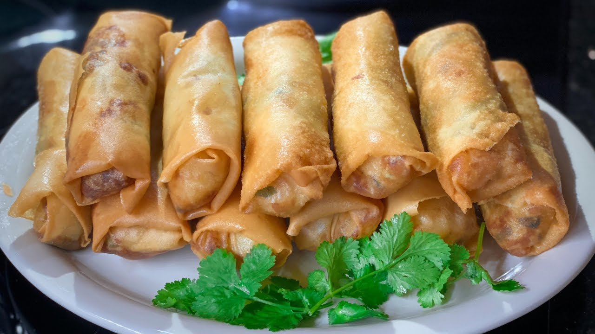

# Boureks

*Crisp fried cigars of warqa pastry around spiced minced beef, soft cheese or potato; the Algerian Ramadan snack folded by the hundreds in a single afternoon.*

**Serves:** 4 (16 cigars)

**Prep Time:** 30 minutes

**Cook Time:** 15 minutes

## Overview
Boureks (the plural of bourek; from the Ottoman börek) are the fried savoury cigars that arrive on the Algerian iftar table alongside the chorba and the brick, the trio that opens almost every Ramadan meal in the country. The pastry is warqa, a paper-thin North African sheet brushed lightly with butter; the filling is most often spiced minced beef with onion, parsley and a softening of beaten egg, or a vegetarian potato-and-cheese mix for variety. The cigars are rolled tight, sealed with flour-and-water glue, and shallow-fried until deeply gold and shatter-crisp. They keep their crunch for an hour, which is just long enough to eat them.

## Ingredients

### Pastry and assembly
- 16 sheets warqa pastry or filo (cut into 25 by 15 cm rectangles)
- 2 tbsp plain flour mixed with 3 tbsp water (sealing glue)
- 1 litre sunflower oil for frying

### Meat filling (most traditional)
- 300 g minced beef (or lamb)
- 1 medium onion, very finely chopped
- 1 tbsp olive oil
- 1 tsp ground cinnamon
- 1 tsp ground black pepper
- 0.5 tsp ground cumin
- 1 tsp salt
- 1 small bunch flat-leaf parsley, finely chopped
- 1 egg, lightly beaten
- 80 g grated mozzarella or kashkaval cheese (optional but very common in modern Algiers boureks)

## Method

### Stage 1 - Cook the filling
1. Heat the olive oil in a frying pan over medium heat.
1. Add the chopped onion; cook 5 minutes until soft.
1. Add the minced beef; break up with a wooden spoon; cook 8 minutes until cooked through and any liquid has evaporated.
1. Stir in the cinnamon, black pepper, cumin and salt; cook 1 minute.
1. Off the heat, stir in the parsley.
1. Let the mixture cool 10 minutes (it must not be hot for the next step).
1. Mix in the beaten egg and grated cheese (if using). The egg binds the filling as it fries.

### Stage 2 - Roll the cigars
1. Lay a sheet of warqa on the worktop with a short edge towards you.
1. Place 1 heaped tablespoon of filling along the short edge, leaving 1 cm clear at the sides.
1. Fold the sides in over the filling.
1. Roll up firmly from the short edge into a tight cigar.
1. Brush the final edge with the flour-water glue; press to seal.
1. Place seam-side down on a tray.
1. Repeat with the remaining sheets.

### Stage 3 - Fry
1. Heat the oil to 180 C in a wide deep pan.
1. Fry the cigars in batches of 4 or 5, seam side down first, for about 2 minutes per side until deeply gold and crisp.
1. Lift out with a slotted spoon onto kitchen paper.

## Notes
- **Filling cool before egg.** If the filling is hot when you add the egg, the egg scrambles. Cool it first, then bind.
- **Roll tight.** A loose cigar opens in the oil and the filling escapes. Press as you roll.
- **The flour-and-water glue.** This is non-optional. It keeps the seam closed during frying.

## Variations
- **Cheese and potato.** Mash 300 g boiled potato with 100 g grated mozzarella, 1 chopped spring onion, 1 tsp black pepper and 0.5 tsp salt. Use as filling.
- **Tuna and capers.** Use the brick filling above (without the egg in the centre); roll as cigars instead.
- **Spinach and ricotta.** 200 g cooked, drained spinach with 150 g ricotta, 1 egg, salt and nutmeg.

## Serving
- Serve immediately while crisp, on a warm plate with lemon wedges and a small bowl of harissa. The opening course of the Ramadan iftar, alongside chorba frik and a small salad. Eat with the fingers.

## Storage
- Eat within an hour of frying; the pastry softens otherwise
- Uncooked rolled cigars keep 1 day refrigerated; fry to order
- Uncooked rolled cigars freeze 2 months; fry from frozen, adding 1 extra minute per side
