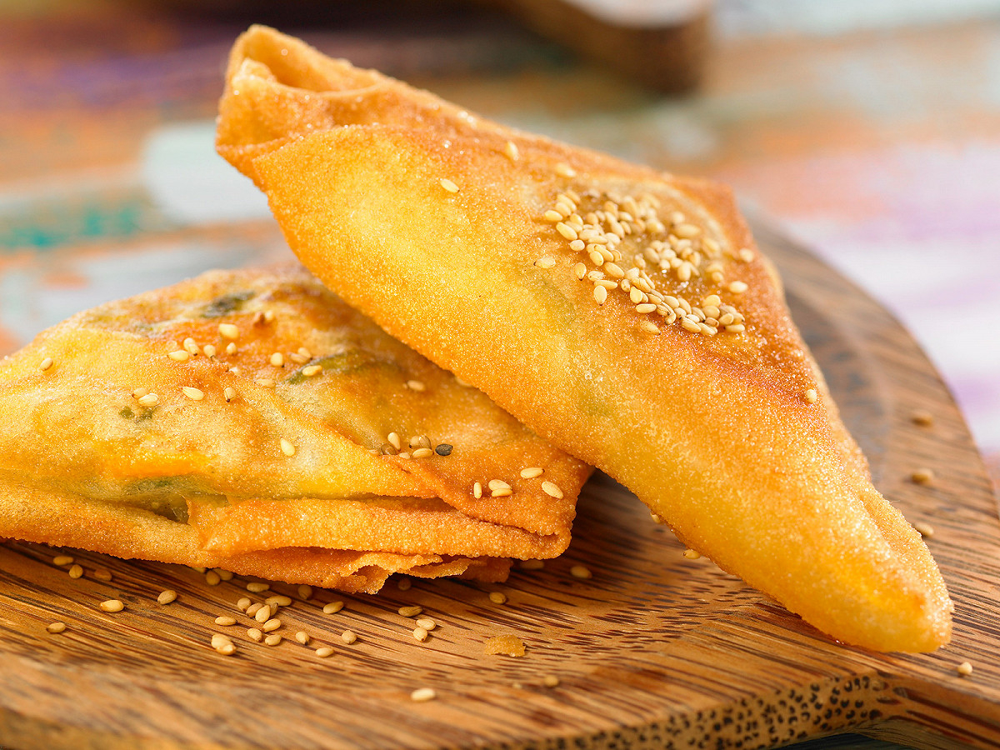

# Brick Algérien

*Crisp triangles of fried filo around a soft egg yolk, tuna, capers and parsley; the snack that opens almost every Algerian Ramadan iftar.*

**Serves:** 4 (8 triangles)

**Prep Time:** 15 minutes

**Cook Time:** 10 minutes

## Overview
Brick (the French spelling of the Arabic "burik") is the crisp, fried filo parcel that opens almost every Ramadan iftar table in Algeria and Tunisia. The classic filling is tuna, capers, chopped onion, parsley and a whole raw egg cracked into the centre at the last second; the parcel is folded into a triangle, slipped into hot oil and fried for less than a minute, just enough to crisp the pastry while leaving the yolk soft and the white set in webs. The bite is dramatic: the shatter of the pastry, the burst of warm yolk, the salt of the tuna and capers. Eat with a wedge of lemon and harissa on the side. Make them one at a time; this is not a sheet-pan job.

## Ingredients

- 8 sheets warqa pastry or filo (round if you can find it, square cut to a circle if not)
- 1 tin (160 g) tuna in olive oil, drained and flaked
- 1 small onion, very finely chopped
- 2 tbsp capers, drained and roughly chopped
- 1 small bunch flat-leaf parsley, finely chopped
- 1 tbsp lemon juice
- 0.5 tsp ground black pepper
- 0.25 tsp ground cumin
- 8 small eggs (one per brick)
- 1 litre sunflower oil for shallow frying
- 1 lemon, cut in wedges
- 2 tbsp harissa, to serve

## Method

### Stage 1 - Make the filling
1. In a bowl, mix the flaked tuna, chopped onion, capers, parsley, lemon juice, black pepper and cumin.
1. Taste; do not add salt unless needed (the tuna and capers carry the salt).
1. Set aside.

### Stage 2 - Fold the bricks (one at a time)
1. Heat the oil in a wide deep pan to 180 C.
1. Lay a sheet of warqa on the worktop.
1. Spoon a generous tablespoon of the tuna mixture into the centre of the lower half.
1. Make a small well in the filling with the back of the spoon; crack an egg into it (the egg stays raw at this stage).
1. Quickly fold the pastry into a triangle, bringing one corner up to enclose the filling completely; press the edges gently to seal.

### Stage 3 - Fry immediately
1. Slide the brick straight into the hot oil, sealed edge down.
1. Fry for 30 seconds; flip carefully with a slotted spoon; fry another 30 seconds. The pastry should be deeply gold and crisp; the egg yolk inside should still be soft.
1. Lift out onto kitchen paper.
1. Repeat with the remaining sheets, working one at a time so the eggs do not break the wrappers.

## Notes
- **Warqa is the right pastry.** Warqa is the round, very thin North African pastry made by patting a dough onto a hot dome. Filo is the closest substitute; spring roll wrappers also work at a pinch.
- **Speed at the egg stage.** The raw egg sits on the pastry only seconds before it goes into the oil; if it lingers the pastry softens and the brick tears.
- **One at a time.** Resist the urge to assemble a tray of them. The pastry must be crisp from the second the egg meets the oil.

## Serving
Serve immediately on a warm plate with lemon wedges and a small spoonful of harissa. The first brick of an iftar table is often paired with a small bowl of chorba on the side. Eat with the fingers; cut through with a fork to let the yolk run.

## Storage
- Eat fresh, within minutes of frying; bricks do not store
- Filling alone keeps 2 days refrigerated; assemble and fry to order
- Do not freeze
