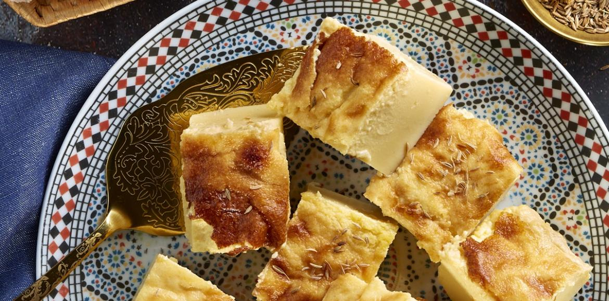

# Karantita

*Oran's chickpea-flour flatbread, baked in a wide tray until the top crisps and the centre stays soft; the street snack of western Algeria, cut warm and dusted with cumin.*

**Serves:** 6

**Prep Time:** 10 minutes (plus 1 hour resting)

**Cook Time:** 35 minutes

## Overview
Karantita (also called calentita; from the Spanish caliente, "hot") is the chickpea-flour flatbread of western Algeria, especially Oran, where it is sold by street vendors who slice it warm and serve it on a square of paper with a sprinkle of cumin, salt and harissa. The batter is a simple slurry of chickpea flour, water, olive oil and salt, whisked smooth and rested an hour so the chickpea flour fully hydrates; then poured into a wide oiled tray and baked at a high heat until the surface forms a crisp golden skin while the centre stays soft and creamy. It belongs to a family of chickpea bakes that runs along the western Mediterranean: socca in Nice, farinata in Liguria, panisse in Marseille, all of them brought by Genoese and Spanish traders and absorbed into the local kitchen. Karantita is the Oran version, eaten standing up for breakfast or as an afternoon snack.

## Ingredients

- 300 g chickpea (gram) flour
- 750 ml warm water
- 80 ml olive oil (plus extra for the tray)
- 1 large egg
- 1.5 tsp salt
- 0.5 tsp ground black pepper
- 1 tsp ground cumin (plus extra for serving)
- [Harissa](../../../base-ingredients/sauces/harissa.md), to serve
- A sprinkle of flaky sea salt, to serve

## Method

### Stage 1 - Make the batter
1. Sift the chickpea flour into a wide bowl to break up the lumps.
1. Pour in the warm water in stages, whisking continuously, until you have a smooth pourable batter (the consistency of single cream).
1. Whisk in the olive oil and salt.
1. Cover; rest at room temperature for 1 hour. The flour fully hydrates and the bubbles settle.

### Stage 2 - Finish the batter
1. Heat the oven to 220 C (200 fan).
1. Whisk the egg, black pepper and cumin into the rested batter.
1. Brush a 30 by 25 cm metal or ceramic baking tray generously with olive oil.

### Stage 3 - Bake
1. Pour the batter into the tray; the layer should be about 2 cm deep.
1. Bake on the middle shelf for 30 to 35 minutes, until the top is deeply golden, crisp at the edges and the centre is just set when pressed.
1. The surface should have a few cracks and dark blistered spots; this is right.

### Stage 4 - Serve hot
1. Lift out of the tray with a wide spatula; cut into rough squares.
1. Sprinkle with extra cumin, flaky salt and a drizzle of harissa.

## Notes
- **The hour's rest is non-negotiable.** Chickpea flour needs time to hydrate fully; without it the karantita is gritty and the surface does not crisp.
- **The tray must be properly oiled.** A dry tray sticks badly. Brush the tray with olive oil and pour the oil-puddle from the tray back into the batter; that is the right level.
- **The egg.** Some Oran cooks include the egg, some do not. With egg the texture is softer and more set; without it the centre is creamier. Both are correct.

## Serving
- Eat hot or warm, never cold. Wrap a square in paper and eat standing up; that is the proper Oran way. Cumin, salt and harissa on the side. A small glass of strong black qahwa to wash it down.

## Storage
- Best eaten within an hour of baking; the crisp surface goes soft otherwise
- Reheats poorly; better to use leftover batter cold from the fridge (keeps 2 days) and bake fresh
- Do not freeze; the chickpea texture goes mealy
