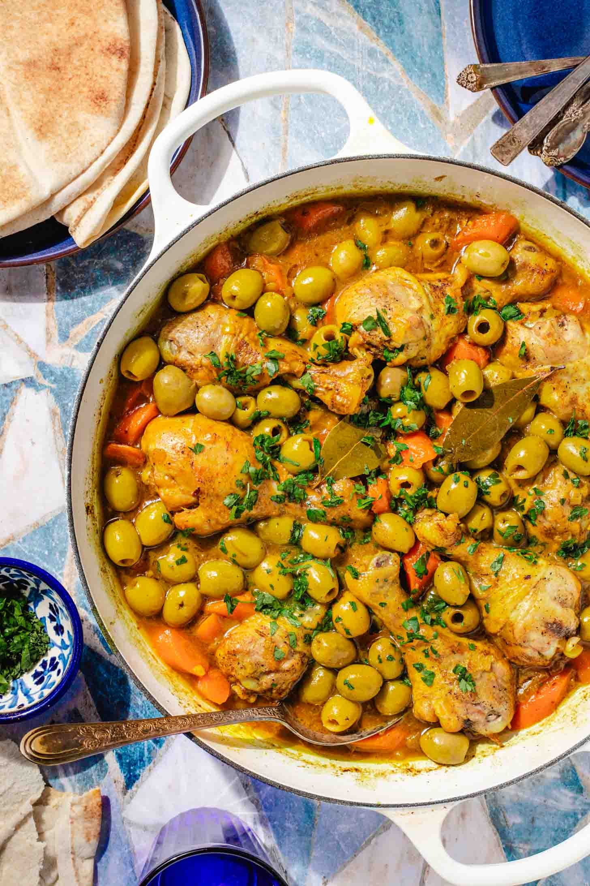

# Tajine Zitoune

*Algerian chicken and green olive tajine in a velvety almond and preserved-lemon sauce, the Algiers wedding-table classic and the dish most often asked of the family cook for guests.*

**Serves:** 4

**Prep Time:** 20 minutes

**Cook Time:** 1 hour 15 minutes

## Overview
Tajine zitoune is the Algerian cousin of the Moroccan chicken-and-olive tajine, but the personality is different: where Morocco leans saffron and ginger, Algiers leans cinnamon, white pepper, blanched almonds and preserved lemon, with the sauce reduced to a pale ivory and not the deep yellow of its neighbour. It is a special-occasion dish, frequently served at weddings and at the Aid feast that follows Ramadan, and it has the soft, refined character of the Andalusian-influenced cooking of the capital. The olives must be the green Algerian kind (Sigoise are the right cultivar), blanched twice in clean water to draw off the brine, and the preserved lemon is sliced into thin half-moons that go in near the end. Serve over plain steamed rice or with fresh bread; the sauce is the dish.

## Ingredients

- 1 chicken (about 1.5 kg), cut into 8 pieces, skinned
- 2 tbsp olive oil
- 50 g unsalted butter
- 1 large onion, very finely grated
- 3 cloves garlic, minced
- 1 cinnamon stick
- 1 tsp ground white pepper
- 0.5 tsp ground ginger
- 1 small bunch flat-leaf parsley, finely chopped
- 600 ml water or light chicken stock
- 250 g pitted green olives (Sigoise or Picholine)
- 1 preserved lemon, rind only, thinly sliced
- 100 g blanched whole almonds
- Juice of 1 fresh lemon
- 1 tsp salt (taste before adding; the olives bring saltiness)

## Method

### Stage 1 - Blanch the olives
1. Tip the olives into a small pan, cover with cold water, bring to a boil, drain.
1. Repeat once more with fresh water. This removes the harsh brine and leaves a clean olive flavour.
1. Set aside.

### Stage 2 - Brown the chicken
1. Heat the olive oil and half the butter in a wide heavy pan or tagine base over medium heat.
1. Add the chicken pieces; cook for 8 minutes, turning, until pale gold (do not deeply brown; this is a pale sauce).
1. Lift the chicken out and set aside.

### Stage 3 - Build the sauce
1. To the same pan add the grated onion; cook gently for 10 minutes until soft and translucent (do not let it colour).
1. Stir in the garlic, cinnamon stick, white pepper and ginger; cook for 1 minute.
1. Return the chicken to the pan; add half the parsley and the water or stock.
1. Cover; simmer gently for 35 minutes.

### Stage 4 - Toast the almonds
1. While the chicken cooks, melt the remaining butter in a small pan; add the almonds; toast over low heat for 5 minutes, shaking the pan, until lightly gold.
1. Set aside.

### Stage 5 - Finish the dish
1. Add the blanched olives and the preserved lemon rind to the chicken pan; simmer uncovered for 15 minutes to reduce the sauce by a third.
1. Stir in the lemon juice and most of the toasted almonds; check the salt.
1. The sauce should coat the back of a spoon; if too thin, simmer a few more minutes.
1. Discard the cinnamon stick.

### Stage 6 - Serve
1. Transfer to a warm serving dish; pour the sauce over the chicken.
1. Scatter with the remaining almonds and the rest of the parsley.

## Notes
- **The colour.** This is a pale ivory tajine, not a golden one. Resist the urge to brown the chicken deeply or to add saffron; that is the Moroccan version.
- **The olives.** Sigoise (a small green Algerian olive) is the right choice. Picholine is the best European substitute. Avoid black olives entirely.
- **Preserved lemon.** Use only the rind, sliced thin; the flesh is too salty. If you cannot find preserved lemon, the dish loses a key note but a strip of fresh lemon zest is a passable stand-in.

## Serving
- Serve hot with plain steamed rice (Algerian-style, separate grains rinsed twice before cooking) or with crusty French bread to mop the sauce. A simple cucumber and tomato salad alongside is the usual partner. Mint tea afterwards.

## Storage
- Keeps 3 days refrigerated; the flavour deepens overnight
- Reheat gently with a splash of water; do not boil hard or the chicken dries out
- Not recommended for freezing (the almonds soften unpleasantly on thawing)
