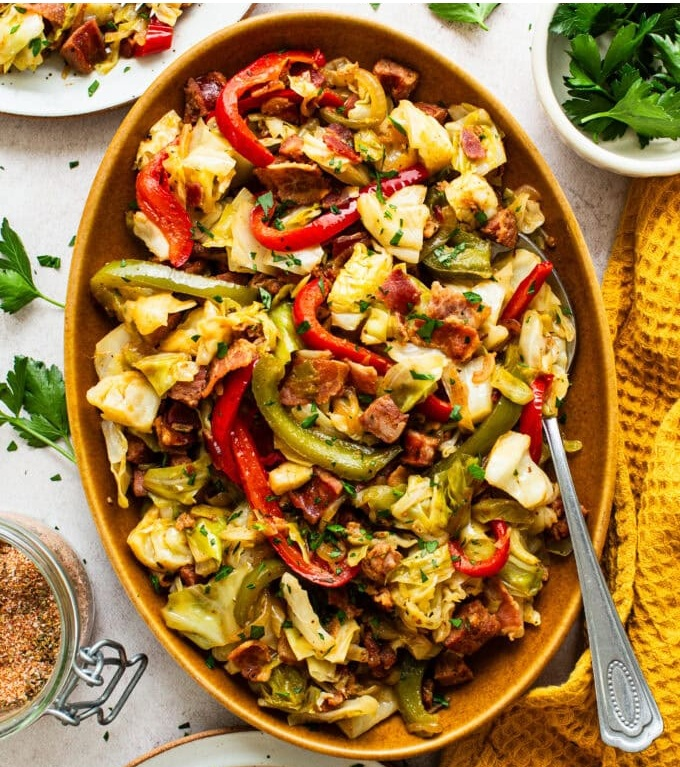

# Bacon Fried Cabbage and Sausage

*A meatier Southern fried cabbage: bacon crisps first, andouille and peppers brown in the fat, cabbage joins with brown sugar, garlic and Cajun seasoning.*

**Serves:** 6

**Prep Time:** 15 minutes

**Cook Time:** 35 minutes

## Overview
A heartier descendant of Southern fried cabbage and its more substantial sibling, this version is a complete dinner rather than a side. Bacon fat is the carrier through every step: it crisps first, then andouille browns in the rendered fat, then onion and bell peppers caramelise, then cabbage steams down. The result tastes deeply smoked and just slightly sweet (from the brown sugar and the caramelised onion), with a sharp Dijon-and-vinegar tang cutting through the richness and Cajun seasoning bringing warmth across the back. Texturally it's a stir-up: tender cabbage with crisp bacon edges, andouille bite-pieces with their snap intact, peppers softened but not collapsed. Smell when the bacon hits the pan starts the dish off correctly. Not difficult but a 35-minute project that wants the pan to stay hot throughout. A Southern weeknight dinner across the Carolinas and Georgia, traditionally with cornbread on the side to mop the bacon juices; the dish lives in the same neighbourhood as Hoppin' John and red beans and rice without being either.

## Ingredients

- 450 g bacon (chopped)
- 340 g pre-cooked andouille (diced)
- 1 yellow onion (medium, sliced)
- 1 green bell pepper (sliced)
- 1 red bell pepper (sliced)
- 1 medium head green cabbage (~900 g, roughly chopped)
- 2 tablespoons brown sugar
- 2 tablespoons garlic paste
- 1 tablespoon Dijon mustard
- 1 tablespoon apple cider vinegar
- 1 tablespoon Creole Cajun seasoning
- Fresh chopped parsley, to garnish (optional)

## Method

### Stage 1 - Bacon
1. Cook the chopped bacon in a wide skillet over medium heat 10-15 minutes until crisp.
1. Lift to paper towels with a slotted spoon.
1. Keep 2-3 tablespoons of bacon fat in the pan; pour off the excess.

### Stage 2 - Sausage
1. Add the diced andouille to the bacon fat; brown 3-4 minutes.
1. Transfer to a plate.

### Stage 3 - Vegetables
1. Add the sliced onion and bell peppers to the pan.
1. Sauté 10-12 minutes until tender and golden, scraping the fond up.

### Stage 4 - Cabbage
1. Add the chopped cabbage.
1. Stir in the brown sugar, garlic paste, Dijon and vinegar.
1. Cover; steam 3-4 minutes.

### Stage 5 - Combine
1. Return the bacon and andouille to the pan.
1. Season with the Cajun seasoning.
1. Cook 2-3 minutes more, stirring, until everything is hot and unified.

### Stage 6 - Serve
1. Transfer to a platter.
1. Garnish with fresh parsley.

## Notes
- **Bacon fat is the base flavour:** don't pour all of it off. The fat carries the seasoning into everything else.
- **Different from the simpler version:** [southern-fried-cabbage-and-sausage.md](southern-fried-cabbage-and-sausage.md) is the lighter, faster sibling. This one's a main course.
- **Andouille is the right sausage:** smoked, Cajun-spiced. Kielbasa works as a milder substitute.

## Storage
- Keeps 3-4 days refrigerated; reheats on the stovetop over medium-low heat or in the microwave.
- Don't freeze - the cabbage and bacon textures both suffer.
