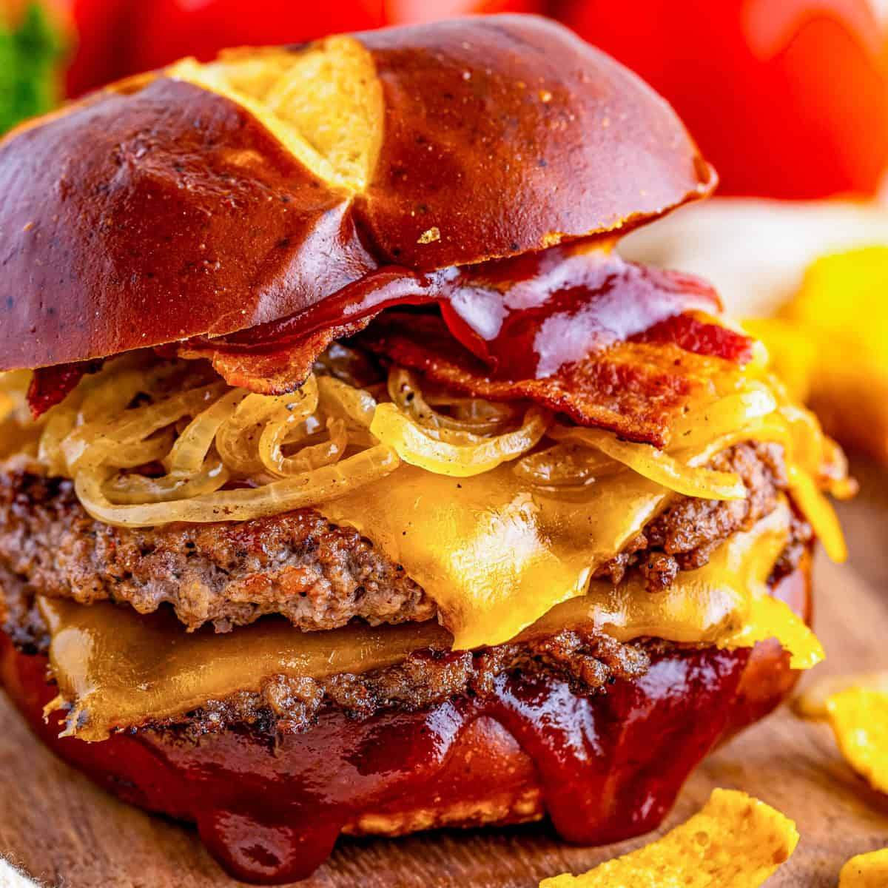

# BBQ Burgers

*Smash-style beef burgers grilled over hot coals, draped in melted cheddar, crowned with maple-bourbon candied bacon and a slick of barbecue sauce on a toasted bun.*

**Serves:** 6

**Prep Time:** 20 minutes

**Cook Time:** 30 minutes

## Overview
The summer-cookout burger that earns its place at every American backyard grill: ground beef seasoned just enough to taste of beef rather than salt, char-marked over direct heat, melted with sharp Cheddar in the last minute on the grill, and stacked with strips of bacon glazed in maple syrup, brown sugar and a splash of bourbon. The bacon is the centrepiece - you brush it with the sweet-sticky syrup, lay it on a wire rack and slow-bake it in the oven while the grill heats, so it crisps to a deep mahogany lacquer instead of frying flat. The buns toast over the dying heat once the patties are pulled. Barbecue sauce, sharp Cheddar, candied bacon, beef. Nothing else needed, except maybe a cold beer.

## Ingredients

### Maple-bourbon bacon
- 60 ml maple syrup
- 2 tablespoons light brown sugar (packed)
- 2 tablespoons bourbon
- 12 slices thick-cut bacon

### Burgers
- 1 kg ground beef (chuck, 20% fat)
- 1 large onion (finely chopped)
- 2 tablespoons country-style Dijon mustard
- 1 tablespoon Worcestershire sauce
- 1 teaspoon kosher salt
- ½ teaspoon freshly ground black pepper
- 6 large slices sharp Cheddar
- 6 burger buns
- Barbecue sauce, for serving

## Method

### Stage 1 - Candied bacon
1. Preheat the oven to 180°C.
2. In a small saucepan over medium heat, stir the maple syrup, brown sugar and bourbon together until the sugar dissolves.
3. Set a wire rack over a rimmed baking sheet; lay the bacon strips on the rack in a single layer.
4. Brush both sides of each strip generously with the maple-bourbon syrup.
5. Bake until crisp and deeply lacquered, 15-30 minutes depending on thickness. Set aside.

### Stage 2 - Build the patties
1. In a large bowl, combine the ground beef, onion, mustard, Worcestershire, salt and pepper.
2. Mix gently with your hands, just enough to bring it together; over-working makes a dense burger.
3. Divide into 6 equal portions and shape each into a patty about 2 cm thick and 10 cm across. Press a shallow thumbprint into the centre of each (it stops them doming as they cook).

### Stage 3 - Grill
1. Prepare a grill for direct cooking over high heat; brush the grates clean.
2. Grill the patties 4-5 minutes per side for medium, turning once.
3. In the last minute, lay a slice of Cheddar on each patty so it melts on the burger.
4. Transfer the patties to a tray; toast the buns cut-side down on the grill until lightly golden.

### Stage 4 - Build and serve
1. Place a patty on each bottom bun.
2. Spoon over barbecue sauce.
3. Divide the candied bacon between the burgers (2 strips each).
4. Top with the bun lid; serve at once.

## Notes
- **20% fat:** Lean beef gives a dry burger. Chuck at around 80/20 is the sweet spot for juiciness without a grease puddle.
- **Don't over-work the mince:** A few gentle turns to mix is enough. Pressing or kneading develops the proteins and the patty turns tight and bouncy on the grill.
- **Bacon ahead:** The candied bacon keeps a day in an airtight container. Re-crisp briefly in a low oven before serving.

## Storage
- Best fresh from the grill.
- Leftover patties refrigerate 3 days; reheat in a pan or warm oven.
- Candied bacon keeps 2 days at room temperature in a tin.
