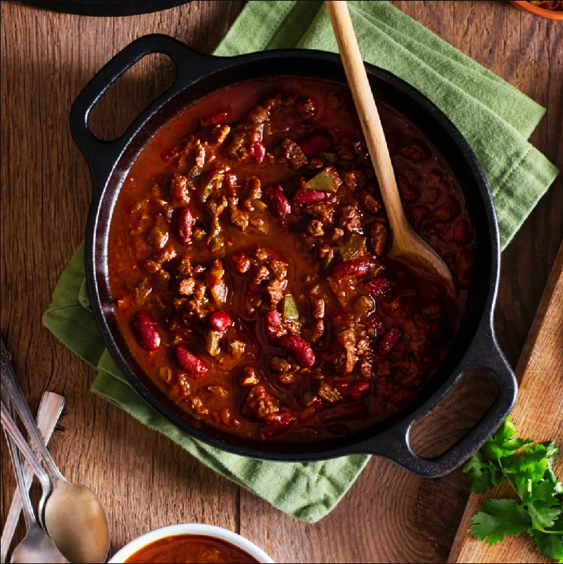

# Beef Chili

*Tex-Mex-ish home chili: ground beef, peppers, kidney beans, fire-roasted tomatoes and a generous Tex-Mex spice rack (chili powder, cumin, smoked paprika, chipotle). Comes together in 45 minutes; sits well overnight and deepens. Bowl food for cold weeks.*

**Serves:** 8-10

**Prep Time:** 10 minutes

**Cook Time:** 35 minutes

## Overview
The American household chili, sitting somewhere between Texas-style "no beans" purism and Cincinnati-style "chili over spaghetti" eccentricity, this one has beans, isn't sweetened with cinnamon, and lands solidly in the middle of the bell curve. The flavour is a Tex-Mex spice rack working in concert: chili powder (the broad warmth), cumin (the earthy backbone), smoked paprika (the deep smoke), chipotle powder (the slow-burn heat), brown sugar (a quiet balance), garlic powder (the savoury underline). Fire-roasted tomatoes are the technical detail that lifts this above a generic chili, charring the tomatoes before canning adds a roasted note that ordinary diced tomatoes can't supply. Texture is chunky and brothy rather than thick-and-pasty (this isn't a chili-mac chili), with kidney beans giving substance and pieces of bell pepper still holding their bite. Smell is cumin and smoked paprika on browned beef. Genuinely easy and incredibly forgiving, chili is one of the few dishes that's better the day after it's made, so it tolerates a longer simmer if you have it. American cold-weather bowl food, eaten across every state from Texas to New York, with regional toppings (sour cream, cheese, raw onion, cornbread, oyster crackers) that say more about the cook than the dish.

## Ingredients

- 1 tablespoon extra-virgin olive oil
- 1 white onion (medium, finely chopped)
- 1 red bell pepper (medium, chopped)
- 1 green bell pepper (medium, chopped)
- 900 g (2 lbs) lean ground beef
- 2 tablespoons tomato paste
- 4 garlic cloves (minced)
- 2 tablespoons chili powder
- 2 teaspoons ground cumin
- 2 teaspoons smoked paprika
- 2 teaspoons brown sugar
- 1 teaspoon garlic powder
- ½ teaspoon chipotle powder
- 1 teaspoon salt (plus more to taste)
- 1 teaspoon black pepper
- 1 can (115 g) mild green chiles
- 1 can (400 g) fire-roasted diced tomatoes
- 720 ml beef broth
- 2 cans (430 g each) red kidney beans (drained and rinsed)

## Method

### Stage 1 - Sauté
1. Heat the oil in a large pot over medium heat.
1. Add the onion and bell peppers; cook 5-7 minutes until tender.

### Stage 2 - Brown the beef
1. Add the ground beef; break up with a wooden spoon.
1. Brown 6-7 minutes.

### Stage 3 - Spices
1. Stir in the tomato paste, garlic, chili powder, cumin, smoked paprika, brown sugar, garlic powder, chipotle powder, salt and pepper.
1. Cook 1-2 minutes until fragrant.

### Stage 4 - Liquid
1. Add the green chiles, fire-roasted tomatoes and beef broth.
1. Bring to a gentle boil; cover; cook 10 minutes.

### Stage 5 - Beans and reduce
1. Reduce heat to the lowest setting.
1. Add the kidney beans.
1. Simmer uncovered at least 30 minutes (longer the better for depth).

### Stage 6 - Serve
1. Ladle into bowls.
1. Top with sour cream, grated cheese, sliced spring onions, cornbread on the side.

## Notes
- **Thicker chili:** drop to 2 cups beef broth (instead of 3) and simmer uncovered.
- **Slow cooker:** brown the beef and aromatics first, then transfer all ingredients to a slow cooker. Low 6-8 hours; high 3-4 hours.
- **Instant Pot:** 20 minutes high pressure, natural release 10 minutes.

## Storage
- Keeps 1 week refrigerated; deepens spectacularly overnight.
- Freezes 3 months. Thaw overnight; reheat gently.
