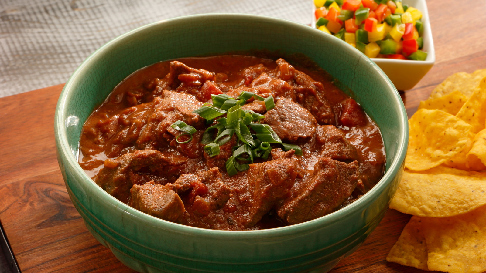

# Texas-Style Chunked Beef Chili

*Big-flavour Texas-leaning chili: chuck cubes seared dark, slow-braised with peppers, beer and a generous spice rack, finished with cornmeal for body. No beans, no apology. Two and a half hours of unattended cook.*

**Serves:** 8

**Prep Time:** 20 minutes

**Cook Time:** 3 hours

## Overview
The Texas-leaning answer to ground-beef chili: 1.8 kg of chuck, cut into thumb-size cubes, seared hard in batches until each face is the colour of dark cocoa, then braised in beer and beef stock with onion, bell pepper, poblano and a jalapeño for backbone. The spice rack is generous, with chili powder doing the heavy lifting and dried oregano and cumin filling in around it. After two and a half hours of low simmer the beef collapses under a spoon and the broth has reduced to a rich rust-red. A whisk of yellow cornmeal slurry at the end thickens the sauce to spoon-coat without flour or roux. The toppings are American and personal: shredded Cheddar or Monterey Jack, chopped raw onion, sour cream, pickled jalapeños, fresh coriander. Better the next day, like every braise worth making.

## Ingredients

### Beef and aromatics
- 1800 g boneless beef chuck
- Kosher salt
- Freshly ground black pepper
- 3 tablespoons olive oil, plus more as needed
- 1 large yellow onion (chopped)
- 1 large red bell pepper (seeded and chopped)
- 1 poblano chile (seeded and chopped)
- 1 jalapeño chile (seeded and finely chopped)
- 4 large garlic cloves (minced)

### Spices and liquid
- 3 tablespoons chili powder
- 2 teaspoons dried oregano
- 2 teaspoons ground cumin
- 350 ml lager
- 240 ml beef stock (chicken stock or water if needed)
- 2 tablespoons yellow cornmeal

### For serving (optional)
- Shredded Cheddar or Monterey Jack
- Chopped red onion
- Sour cream
- Chopped fresh coriander
- Pickled jalapeño rings

## Method

### Stage 1 - Prep and season
1. Trim the chuck of large pieces of fat; cut into 2.5 cm cubes.
2. Season the beef generously with salt and pepper.

### Stage 2 - Sear in batches
1. Heat 2 tablespoons of the oil in a heavy Dutch oven or cast-iron pot over high heat until shimmering.
2. Working in 3 or 4 batches (don't crowd the pot), sear the beef in a single layer until well browned on one side, about 5 minutes.
3. Lift the seared cubes to a plate with a slotted spoon; add more oil as needed between batches.

### Stage 3 - Sweat the aromatics
1. Reduce the heat to medium-high; add the last 1 tablespoon of oil.
2. Tip in the onion, bell pepper, poblano, jalapeño and garlic.
3. Cook 7 minutes, stirring occasionally and scraping up the browned bits stuck to the bottom of the pot, until the vegetables soften and the fond lifts.

### Stage 4 - Build the braise
1. Stir in the chili powder, oregano, cumin, 1 teaspoon salt and 1 teaspoon pepper; cook 30 seconds until fragrant.
2. Pour in the beer and stock; bring to a boil, scraping the base.
3. Return the seared beef and any juices on the plate to the pot.
4. Bring back to a simmer.

### Stage 5 - Slow braise
1. Reduce the heat to low; partially cover the pot.
2. Simmer gently 2 ½ hours, stirring every 30 minutes or so, until the beef is meltingly tender.

### Stage 6 - Thicken with cornmeal
1. Scoop about 120 ml of the cooking liquid into a small bowl.
2. Whisk in the cornmeal until smooth.
3. Stir the cornmeal slurry back into the pot; cook 5 minutes, stirring, until the chili thickens slightly.
4. Taste; adjust salt and pepper.

### Stage 7 - Serve
1. Ladle into deep bowls.
2. Bring the toppings to the table so each diner builds their own.

## Notes
- **Chuck, not stewing beef:** Chuck has the marbling that braises into tenderness. Leaner cuts dry out over the long cook.
- **Sear hard, sear dry:** Pat the beef dry before searing; a damp surface steams in the pan instead of browning, and the depth of colour at this stage is what makes the broth deep later.
- **Cornmeal not flour:** Cornmeal thickens without going pasty and adds a faint corn sweetness that suits the Tex-Mex spice rack.

## Storage
- Refrigerates 5 days; the flavour deepens overnight.
- Freezes 3 months; thaw in the fridge before reheating gently on the hob.
