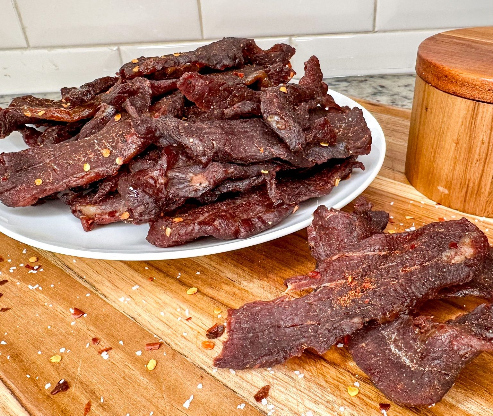

# Beef Jerky

*Oven-dried beef jerky from thin-sliced sirloin: soy, Worcestershire, brown sugar and chilli flake; six hours marinade and two hours in a low oven for a chewy, lacquered, deeply seasoned bite.*

**Serves:** Makes about 115 g jerky (4-6 snack portions)

**Prep Time:** 20 minutes (plus 1 hour freeze, plus 5 hours marinade)

**Cook Time:** 2 hours

## Overview
The American glove-compartment, hiking-pack and road-trip snack at its most honest: a single piece of trimmed sirloin sliced thin, marinated in soy and Worcestershire with brown sugar and a hit of chilli flake, then hung in a slow oven until dry but still pliable. The freezer step is the trick that makes it work at home; an hour in the freezer firms the meat enough to slice paper-thin against the grain. The marinade does the seasoning, the long low heat does the drying, and the result is a chewy, glossy, deeply savoury jerky that costs a fraction of the supermarket version and tastes considerably better. Keep an eye on it toward the end; a few minutes too long and it turns from chewy to leather.

## Ingredients
- 450 g sirloin steak (trimmed of all fat)
- 60 ml soy sauce
- 3 tablespoons Worcestershire sauce
- 1 tablespoon light brown sugar (packed)
- 2 teaspoons freshly ground black pepper
- 1 teaspoon red pepper flakes (or to taste)
- ½ teaspoon garlic powder
- ½ teaspoon onion powder

## Method

### Stage 1 - Freeze and slice
1. Wrap the steak in cling film and freeze for about 1 hour. The firmed meat slices much thinner than fridge-cold beef.
2. Unwrap and slice the steak across the grain into thin strips, about 3-4 mm thick. Transfer to a wide dish.

### Stage 2 - Marinate
1. In a bowl, whisk the soy sauce, Worcestershire, brown sugar, black pepper, red pepper flakes, garlic powder and onion powder together.
2. Pour the marinade over the sliced beef; turn each piece to coat.
3. Cover and refrigerate at least 5 hours, ideally overnight.

### Stage 3 - Prep the oven
1. Remove the oven racks; line the bottom of the oven with aluminium foil to catch any drips.
2. Heat the oven to 80°C.

### Stage 4 - Blot and skewer
1. Lift the beef out of the marinade and lay the strips on paper towels.
2. Blot thoroughly with more paper towels - the dryer the surface, the faster the jerky cures.
3. Thread 4-6 strips onto each wooden skewer, about 1.5 cm from one end, spacing them 2-3 cm apart.

### Stage 5 - Hang and dry
1. Position the skewers across an oven rack so the strips hang down through the bars (you may need to balance the rack on two oven shelves for clearance).
2. Slide the rack into the upper third of the oven.
3. Bake at 80°C for 1 ½ - 2 hours, depending on slice thickness, until the jerky is dried but still pliable when bent.
4. Check frequently in the last 20 minutes; over-dried jerky turns brittle.

### Stage 6 - Cool and store
1. Cool completely on the rack.
2. Pack into an airtight container or zip-lock bag.

## Notes
- **Slice across the grain:** This is what makes the jerky chewable rather than stringy. Look at the lines of muscle fibre on the steak and slice perpendicular to them.
- **Lean cut, no fat:** Fat doesn't dry; it goes rancid. Trim every visible white edge before slicing.
- **Pliable, not brittle:** The jerky should bend without snapping. If it snaps, it's been in too long. Pull it earlier next time.

## Storage
- Refrigerates 3 weeks in an airtight container.
- Freezes 3 months.
- Don't leave at room temperature long term; even dried beef will eventually spoil.
