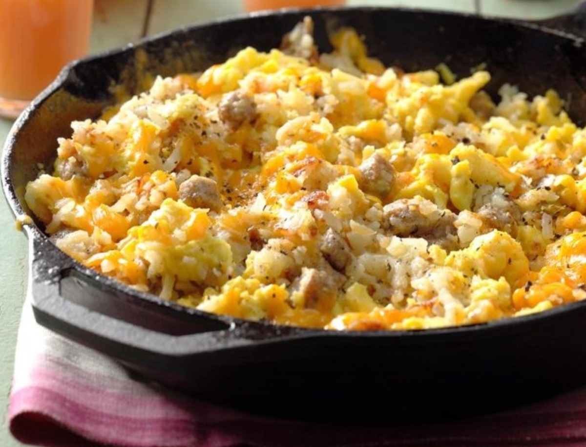

# Big Breakfast

*The all-in-one American diner skillet: par-boiled Yukon gold potatoes, smoky bacon, linguiça sausage and ten scrambled eggs finished with melted Cheddar. Served with baked beans, biscuits and a strong pot of coffee.*

**Serves:** 6

**Prep Time:** 15 minutes

**Cook Time:** 30 minutes

## Overview
The American weekend breakfast that earns its name. Yukon gold potatoes boil to just-tender, then crisp in rendered bacon fat alongside diced onion and smoky linguiça. Ten eggs whisked with milk pour in at the end and set just before the Cheddar melts through. The dish lands at the table in a single cast-iron skillet, and the side plates have warm biscuits and a ladleful of baked beans. The trick is to par-boil the potatoes first - they fry crisp on the outside without ever going floury through the middle, and the whole skillet cooks fast once the eggs go in. Pour the coffee strong and start the day properly.

## Ingredients
- 450 g Yukon gold potatoes (cut into 1.5 cm pieces)
- Kosher salt
- Freshly ground black pepper
- 225 g thick-cut bacon (chopped)
- ½ yellow onion (chopped)
- 170 g smoked sausage (linguiça or kielbasa, cut into 1.5 cm pieces)
- 10 large eggs
- 60 ml whole milk
- 115 g sharp Cheddar (shredded)

### To serve
- 6 portions [Baked Beans](side-dishes/baked-beans.md) (warm)
- 8 [Biscuits](side-dishes/biscuits.md) (warm)
- Plenty of strong coffee

## Method

### Stage 1 - Par-boil the potatoes
1. In a saucepan, combine the potatoes, 1 tablespoon salt and enough water to cover by 2.5 cm.
2. Bring to a boil over high heat, stirring once or twice.
3. Reduce to medium-low and simmer gently 10 minutes, until just tender.
4. Drain thoroughly and set aside.

### Stage 2 - Render the bacon
1. In a large cast-iron frying pan over medium heat, cook the chopped bacon, stirring, until crisp - about 6 minutes.
2. Lift the bacon to paper towels with a slotted spoon.
3. Pour off all but 2 tablespoons of the bacon fat.

### Stage 3 - Brown the potatoes and sausage
1. Return the pan to medium heat.
2. Add the onion, smoked sausage and the par-boiled potatoes.
3. Season with salt and pepper.
4. Cook, stirring, until everything is browned and the potatoes have crisp edges - about 5 minutes.

### Stage 4 - Scramble the eggs in
1. In a large bowl, whisk the eggs, milk, ½ teaspoon salt and ¼ teaspoon pepper together.
2. Reduce the heat under the skillet to low.
3. Pour the egg mixture over the potato-and-sausage hash.
4. Return the crisp bacon to the pan.
5. Cook gently, stirring every 20 seconds or so, until the eggs are just starting to firm up - about 1 minute.
6. Scatter the Cheddar over the surface; stir gently until the cheese melts through and the eggs reach the doneness you like.

### Stage 5 - Plate
1. Serve straight from the skillet at the table.
2. Pass the warm baked beans, biscuits and coffee alongside.

## Notes
- **Par-boil the potatoes:** Skipping this gives potatoes that are still raw when the eggs are done. Ten minutes in salted water gets them to just-tender; the pan finishes the crisping.
- **Don't over-scramble:** Eggs continue to set in the hot pan after the heat is off. Pull them when they're slightly looser than you want; they'll firm up in the time it takes to reach the table.
- **Smoky sausage matters:** Linguiça brings the smoky depth that ties the dish together. Chorizo, kielbasa or any other smoked sausage substitutes well; sweet breakfast sausage is too mild here.

## Storage
- Best fresh from the skillet.
- Leftovers refrigerate 2 days; reheat in a pan over low heat with a splash of milk to loosen the eggs.
