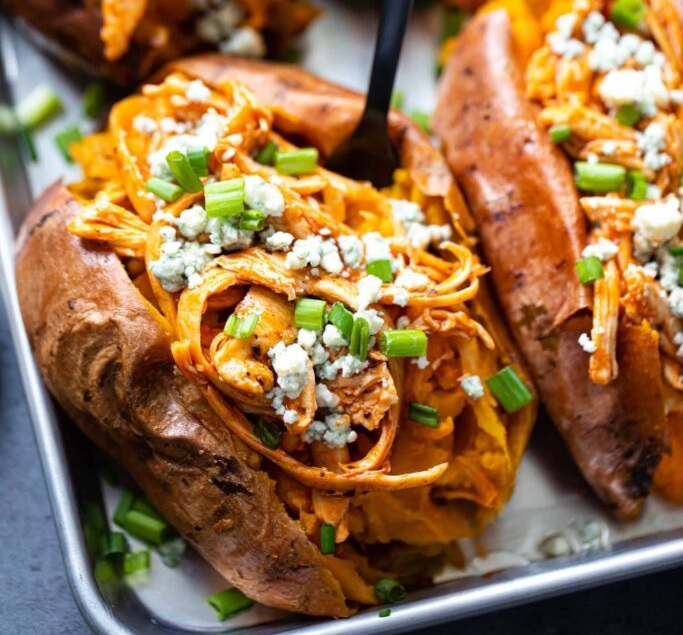

# Buffalo Chicken Stuffed Sweet Potatoes

*Sweet potatoes baked till tender then split and stuffed with shredded chicken tossed in buffalo sauce and crumbled blue cheese. The sweet potato base balances the fire of the sauce; the blue cheese adds the funky-cool counterpoint. Lighter than a traditional buffalo chicken plate without losing the spice.*

**Serves:** 4

**Prep Time:** 10 minutes

**Cook Time:** 1 hour

## Overview
A lighter remix of the classic Buffalo wings format: the same flavour trio (Frank's RedHot, chicken, blue cheese) without the deep-fryer and without the celery sticks. The sweet potato is the smart move - the natural sugar in a roasted sweet potato is exactly the right counter to Frank's sharp vinegar heat, where a plain baked Russet would just be neutral background. The blue cheese plays its usual cooling-funky role, providing salt and creaminess to bridge the sweet potato underneath and the fiery chicken on top. Three textures stacked: soft caramelised sweet potato flesh, juicy shredded chicken in sauce, cool crumbled blue cheese. Smell is roasted sweet potato hitting Frank's. Genuinely easy weeknight cooking, and even easier with the rotisserie-chicken shortcut: 10 minutes of active work, an hour of mostly-passive oven time. A modern American casual-dinner dish (no traditional roots; it emerged from food blogs and meal-prep culture in the 2010s), and one of the cleaner examples of remixing a bar food into a weeknight meal without losing the flavour identity.

## Ingredients

- 4 medium-large sweet potatoes (washed)
- 2 boneless skinless chicken breasts
- 120 ml buffalo sauce (Frank's RedHot recommended)
- 100 g blue cheese crumbles
- Salt and pepper
- Olive oil, for drizzling
- Sliced spring onions, to garnish (optional)

## Method

### Stage 1 - Heat the oven and prep
1. Preheat oven to 220°C / 425°F.
1. Wash and dry the sweet potatoes; pierce each several times with a fork.
1. Drizzle with olive oil; rub to coat.
1. Wrap each individually in foil.

### Stage 2 - Roast
1. Place the sweet potatoes on the oven rack; roast 1 hour.
1. Season the chicken with salt and pepper; place on a baking tray.
1. After the sweet potatoes have been in 30 minutes, add the chicken tray to the oven.
1. Cook the chicken 30 minutes until 75°C / 165°F internal.
1. Remove both from the oven.

### Stage 3 - Buffalo chicken
1. Shred the chicken with two forks.
1. Toss with the buffalo sauce.

### Stage 4 - Assemble
1. Cool the sweet potatoes 10-15 minutes (they continue cooking).
1. Cut a slit lengthways down each; press the ends to open up.
1. Pile the buffalo chicken in.
1. Crumble blue cheese over each.
1. Garnish with spring onions.
1. Serve immediately.

## Notes
- **Frank's RedHot is the buffalo:** plain Frank's, not the "wing sauce" variant (which is creamier). Hot sauce + a little melted butter is the classic blend.
- **Rotisserie chicken hack:** skip the chicken roast and use ~280 g of pulled rotisserie chicken instead. Cut prep time in half.
- **Blue cheese substitutes:** ranch crumbles, feta, goat cheese all work as cool counterpoints.

## Storage
- Components keep separately 3 days; build to order.
- Pre-stuffed potatoes go soggy on standing; don't make ahead.
