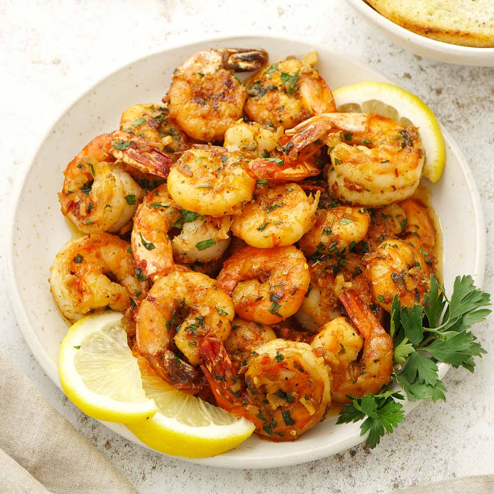

# Butter-Roasted Shrimp

*Cast-iron-roasted jumbo shrimp swimming in white wine, garlic butter and cracked pepper, finished under a hot grill until the shells crackle. Hot French bread alongside for sopping up the pan juices.*

**Serves:** 4-6

**Prep Time:** 10 minutes

**Cook Time:** 20 minutes

## Overview
The Gulf Coast supper dish that you cook in a single cast-iron pan and bring to the table whole. A puddle of butter melts on the hob with a couple of cloves of garlic, a splash of dry white wine reduces briefly, and a generous heap of jumbo shrimp goes in head-on. The whole pan transfers to a moderate oven for fifteen minutes, turned once, then finishes under a hot grill to crackle the shells. The juices that pool in the bottom of the pan are the point; a basket of warm crusty bread sits next to the skillet for tearing and dipping. Eat with fingers; lemon wedges for squeezing; flat-leaf parsley for the green.

## Ingredients
- 115 g unsalted butter (cut into pieces)
- 2 garlic cloves (minced)
- 60 ml dry white wine
- 680 g jumbo shrimp (deveined)
- 1 teaspoon cracked black peppercorns
- Kosher salt

### To serve
- A small handful of chopped fresh flat-leaf parsley
- Lemon wedges
- Warm crusty French bread

## Method

### Stage 1 - Heat the oven
1. Preheat the oven to 165°C.

### Stage 2 - Build the butter sauce
1. Set a cast-iron pan over medium heat; melt the butter.
2. Add the minced garlic and cook 30 seconds until fragrant (don't let it brown).
3. Pour in the white wine; bring to a simmer; cook 1 minute to take the alcohol edge off.

### Stage 3 - Add the shrimp and roast
1. Add the shrimp and the cracked peppercorns to the pan.
2. Season with salt; stir gently to coat each shrimp in the butter-wine sauce.
3. Transfer the pan straight to the oven.
4. Roast 13-15 minutes, turning the shrimp once halfway through, until just cooked through and the shells are turning crisp.

### Stage 4 - Crackle under the grill
1. Lift the pan out of the oven.
2. Heat the grill (broiler) to high.
3. Slide the pan under the grill for about 4 minutes, until the shells begin to crackle and brown at the edges.

### Stage 5 - Serve family-style
1. Scatter chopped parsley over the pan.
2. Bring the cast-iron pan straight to the table with a folded tea towel under it.
3. Plenty of crusty bread to mop up the butter-wine juices.
4. Lemon wedges for squeezing.

## Notes
- **Head-on shrimp:** The heads carry flavour that seeps into the butter as they roast. If you can't find head-on, peeled-and-deveined work but the broth is thinner.
- **Cast iron retains heat:** A heavy pan stays hot from hob to oven to table; the shrimp keep cooking gently as you serve, so pull them just shy of done.
- **The bread is the side dish:** Don't bother with rice or pasta. The point is the bread soaking up the butter-wine puddle.

## Storage
- Best fresh, straight from the pan.
- Leftover shrimp refrigerate 1 day; eat cold or warm gently in the leftover butter sauce - reheating in the oven toughens them.
