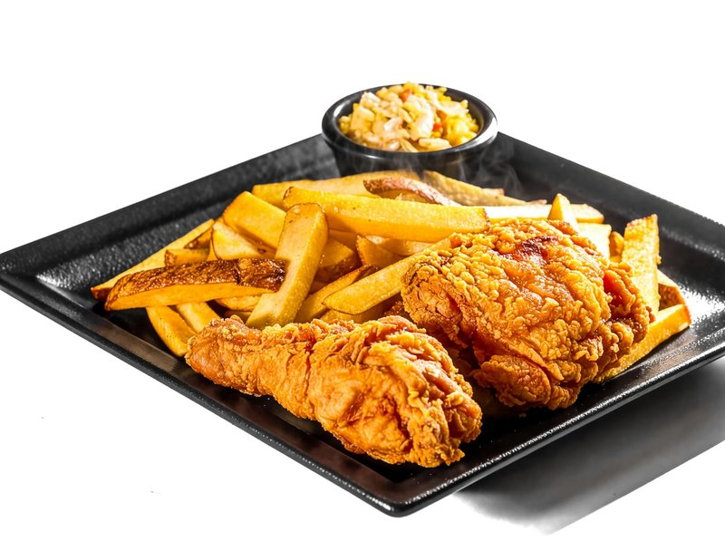

# Buttermilk Fried Chicken

*The American Southern classic: chicken brined overnight in buttermilk, double-dredged in seasoned flour, fried till the crust shatters and the meat stays moist.*

**Serves:** 4

**Prep Time:** 15 minutes (plus overnight brine)

**Cook Time:** 25 minutes

## Overview
The Southern Sunday dinner that defined a region. You start the night before, sinking bone-in chicken pieces into a buttermilk brine spiked with hot sauce and garlic so the acid tenderises the meat and the seasoning works its way deep. The next day comes the double-dredge: a roll through heavily-seasoned flour, a brief dip back in the buttermilk, then another roll through the flour, which is what gives the finished bird its craggy, almost lacy crust. Into 175°C oil for twelve to fifteen minutes per piece, turned every few minutes so the crust browns evenly. You're done when the coating is deep mahogany and a thermometer in the thigh reads 75°C. Drain on a wire rack rather than paper so the steam escapes and the crust stays shattering. Eat hot with a stack of pickles, a soft biscuit and a bottle of hot sauce on the table; cold the next day at the kitchen counter is its own justified American ritual.

## Ingredients

### Brine
- 8 chicken pieces (drumsticks, thighs, wings, breasts cut in half, bone-in, skin-on)
- 600 ml buttermilk
- 4 garlic cloves (crushed)
- 2 tablespoons hot sauce (Crystal or Frank's)
- 2 teaspoons salt
- 1 teaspoon black pepper
- 1 teaspoon paprika

### Dredge
- 400 g plain flour
- 4 tablespoons cornflour
- 2 tablespoons paprika
- 1 tablespoon onion powder
- 1 tablespoon garlic powder
- 1 tablespoon salt
- 2 teaspoons black pepper
- 1 teaspoon cayenne pepper
- 1 teaspoon dried oregano
- 1 teaspoon dried thyme

### Frying
- 1 ½ litres Vegetable oil (or peanut oil)

## Method

### Stage 1 - Brine
1. Whisk all the brine ingredients in a wide bowl or zip-lock bag.
1. Add the chicken; turn to coat.
1. Refrigerate at least 4 hours; ideally overnight.

### Stage 2 - Dredge
1. Whisk all the dredge ingredients in a wide shallow bowl.
1. Lift each chicken piece out of the brine, letting excess drip off, but don't shake clean. The brine on the chicken is what binds the first coat.
1. Roll each piece in the seasoned flour, pressing firmly so the flour clings.
1. Place on a wire rack; rest 10 minutes (lets the coating hydrate).

### Stage 3 - Heat the oil
1. Pour 5 cm of oil into a heavy deep pot or cast-iron skillet.
1. Heat to 175°C - a kitchen thermometer is the reliable check. As a backup, the handle of a wooden spoon dipped in should give a steady stream of small bubbles, and a small piece of dredge should sizzle vigorously.

### Stage 4 - Fry
1. Working in 2-3 batches (don't crowd):
1. Lower chicken pieces in carefully, large bone-in pieces first; thighs and breasts at the bottom of the pan, smaller wings and drumsticks at the top.
1. Fry 12-15 minutes, turning every 3-4 minutes, maintaining oil temperature at 165-175°C.
1. The chicken is done when deep mahogany brown, the coating is crisp, and a probe in the thickest part reaches 75°C.
1. Drain on a wire rack (not paper, which traps steam and softens the crust).

### Stage 5 - Rest and serve
1. Rest 5 minutes (carry-over cooking finishes any borderline pieces).
1. Serve hot with hot sauce, pickles, and biscuits.

## Notes
- **Buttermilk brine matters:** The acid tenderises the meat and adds tang. Plain water doesn't season; yogurt-water mix is the next best substitute.
- **Wire rack drain, not paper:** Paper traps steam underneath the chicken and softens the crust. A rack lets air circulate.
- **Don't crowd the pan:** Too much chicken crashes the oil temperature; the result is greasy, pale fried chicken.

## Storage
- Best fresh; reheat at 200°C for 10-12 minutes to re-crisp.
- Cold next-day fried chicken is a justified American obsession.
