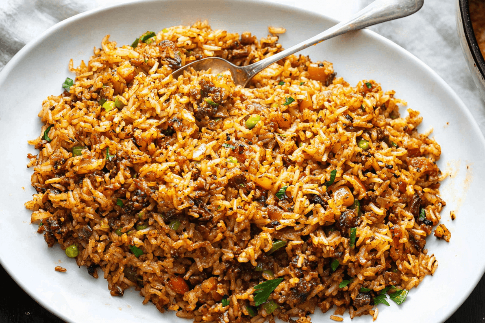

# Cajun Dirty Rice

*Louisiana's classic dirty rice: ground beef and pork browned with chicken liver and the holy trinity, dusted with Cajun spice and folded through hot white rice. Dark, deeply seasoned, the colour the dish is named for.*

**Serves:** 6-8

**Prep Time:** 15 minutes

**Cook Time:** 45 minutes

## Overview
Dirty rice is the Cajun dish that takes its name from the colour the rice turns when you fold it through a deeply browned ground meat mixture spiked with chicken liver - the "dirty" part isn't an aesthetic problem, it's the point. The holy trinity (onion, celery, bell pepper) softens slowly in butter alongside a couple of jalapeños and minced garlic, with the browned ground beef and pork returned to the pan along with finely minced chicken livers for the dark, mineral depth that distinguishes a real Cajun dirty rice from a generic seasoned-rice side. A spoon of flour and Cajun seasoning thickens the pan juices into a brief gravy; the cooked rice goes in last to soak up everything. Spring onions and parsley fold through at the end. Eat with grilled chicken, fried fish or a bowl of gumbo on the side.

## Ingredients
- 225 g ground beef
- 225 g ground pork
- Kosher salt and freshly ground black pepper
- 3 tablespoons unsalted butter
- 1 onion (finely chopped)
- 1 red bell pepper (finely chopped)
- 1 celery rib (finely chopped)
- 2 jalapeño chiles (finely chopped)
- 115 g chicken livers (trimmed and finely minced)
- 2 garlic cloves (minced)
- 4 tablespoons plain flour
- 2 teaspoons Cajun seasoning
- 240 ml chicken stock (or beef stock)
- 4 spring onions (thinly sliced, white and green parts)
- A small handful of fresh flat-leaf parsley (chopped)
- 310 g cooked long-grain white rice

## Method

### Stage 1 - Brown the ground meat
1. Crumble the ground beef and ground pork into a large heavy sauté pan or Dutch oven over medium heat.
2. Cook 3 minutes, stirring, until the meat is lightly browned.
3. Season generously with salt and pepper.
4. Tip the meat into a large bowl and set aside.

### Stage 2 - Sweat the trinity
1. Return the pan to medium heat; melt the butter.
2. Add the onion, bell pepper, celery, jalapeños, garlic and minced chicken livers.
3. Season with salt and pepper.
4. Reduce the heat to medium-low and cook 10 minutes, stirring occasionally, until the vegetables soften and the livers darken and break down into the trinity.

### Stage 3 - Marry the meat back in
1. Return the browned beef and pork to the pan.
2. Cook 20-30 minutes more, stirring occasionally, until the vegetables are very soft and the flavours have melded. Reduce the heat to low if anything starts to catch.

### Stage 4 - Build the gravy
1. Sprinkle the flour and Cajun seasoning over the meat and vegetables; stir well.
2. Pour in the stock; stir until the mixture thickens slightly - about 1 minute.
3. Stir in the spring onions and parsley; simmer 5 minutes until the spring onions soften.

### Stage 5 - Fold in the rice
1. Add the cooked rice; cook 3-5 minutes, stirring frequently, until heated through and uniformly dark.
2. Taste; adjust salt and pepper.

### Stage 6 - Serve
1. Tip into a warm serving dish.
2. Scatter a little extra parsley.

## Notes
- **Chicken liver is the dish:** It's where the dark colour and mineral depth come from. Mince it as finely as you can; it dissolves into the dish and contributes flavour rather than texture.
- **Cooked rice goes in last:** Tipping raw rice into the meat would soak up the gravy and turn pasty. The cooked rice folds through in the last few minutes to absorb the seasoning, not the structure.
- **Hot Cajun seasoning is personal:** Tony Chachere's or Slap Ya Mama brands are good off-the-shelf options. Start with 2 teaspoons; some blends are saltier than others, so taste before adding more.

## Storage
- Refrigerates 3 days; reheats well in a covered pan with a splash of stock.
- Freezes 2 months; thaw in the fridge before reheating.
