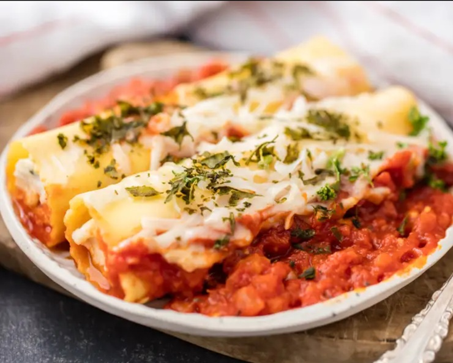

# Three-Cheese Spinach Manicotti

*Italian-American baked pasta: manicotti shells stuffed with ricotta, mozzarella, parmesan, blanched spinach, garlic, parsley, basil and oregano, laid on tomato basil sauce in a baking dish, topped with more sauce and the reserved mozzarella, baked until bubbling and golden. Restaurant vibes; weeknight effort.*

**Serves:** 4-6

**Prep Time:** 15 minutes

**Cook Time:** 25 minutes

## Overview
Italian-American baked pasta in the same family as stuffed shells and lasagna, with manicotti's particular advantage: each diner gets clean, individual tube-portions rather than a slice of communal layered bake. The filling is the heart of the dish, ricotta as the soft base, mozzarella for stretch, parmesan for salt and umami, blanched spinach folded through to keep it from going one-note, and fresh herbs (parsley, basil) plus garlic paste, oregano and a pinch of red pepper flakes to lift the whole thing off "white-cheese". Tomato basil sauce underneath and on top, more mozzarella scattered to brown. The bake comes out bubbling around the edges and lightly browned on the cheese top. Smell is the Italian-American canon: tomato, oregano, melted mozzarella. Easy weeknight assembly once you've cooked the shells, with a piping bag making the filling step substantially less frustrating. A staple of red-sauce restaurant menus and Italian-American family dinners since the postwar era; the technique came across with southern Italian immigrants, but the ricotta-and-mozzarella-heavy filling and the jarred tomato basil sauce make this the American version rather than something you'd order in Naples.

## Ingredients

- 1 box (225 g / 8 oz) manicotti pasta shells
- 1 carton (140 g / 5 oz) fresh baby spinach
- 400 g (14 oz) whole ricotta
- 225 g (1 package) shredded mozzarella (about 2 cups; reserve ½ for topping)
- ½ cup freshly grated parmesan cheese
- ¼ cup freshly chopped parsley
- 2 tablespoons fresh chopped basil
- 1 tablespoon garlic paste
- 1 teaspoon dried oregano
- ½ teaspoon red pepper flakes (optional)
- salt
- pepper
- 1 jar (680 g / 24 oz) tomato basil sauce

## Method

### Stage 1 - Prep
1. Preheat oven to 175°C / 350°F.
1. Lightly oil or spray a 9×13 inch baking dish.

### Stage 2 - Pasta and spinach
1. Bring a large pot of salted water to a rolling boil.
1. Cook the manicotti shells to al dente per the packet; drain; lay flat on paper towels to dry.
1. Blanch the spinach in the same boiling water 1 minute; lift to a bowl of ice water; squeeze thoroughly dry with paper towels.

### Stage 3 - Filling
1. Combine the spinach, ricotta, two-thirds of the mozzarella (set aside the rest for topping), parmesan, parsley, basil, garlic paste, oregano, red pepper flakes, salt and pepper in a wide bowl.
1. Mix thoroughly until uniform.

### Stage 4 - Assemble
1. Spread half the tomato sauce on the bottom of the baking dish.
1. Transfer the filling to a piping bag (or use a small spoon); fill each manicotti shell.
1. Arrange the stuffed shells on the sauce in the baking dish.
1. Pour the remaining sauce over the top.
1. Scatter the reserved mozzarella.

### Stage 5 - Bake
1. Bake uncovered 20-25 minutes until bubbly and lightly golden on top.
1. Rest 5 minutes before serving.
1. Garnish with extra parsley if you like.

## Notes
- **Piping bag for filling:** the easiest way to fill manicotti shells without breaking them. A zip bag with the corner cut off is a quick substitute.
- **Drain the spinach hard:** wet spinach makes wet filling makes wet pasta. Squeeze with kitchen towel until barely-damp.
- **Make ahead:** assemble through stage 4; refrigerate covered overnight. Bake from cold for 30-35 minutes.

## Storage
- Refrigerated 4 days; reheat in the microwave 7-8 minutes or oven at 165°C / 325°F for 20-25 minutes.
- Freezes 2 months UNCOOKED. Thaw overnight; bake from cold.
