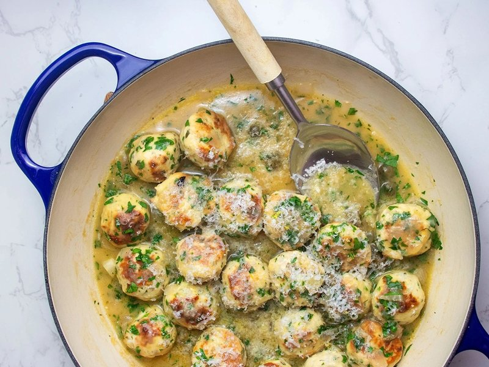

# Chicken Piccata Meatballs

*An Italian-American twist: chicken piccata reimagined as meatballs. Ground chicken with ricotta and panko, simmered in lemon-butter-caper sauce.*

**Serves:** 4

**Prep Time:** 15 minutes

**Cook Time:** 30 minutes

## Overview
Chicken piccata, the Italian-American mid-century classic of pounded chicken cutlets in a lemon-butter-caper pan sauce, reshaped into meatball form, which trades the precise look of cutlets for a juicier, more forgiving texture. The flavour is unmistakably piccata: butter as the body of the sauce, lemon as the brightness, capers as the salty-vinegary punctuation. Underneath sits a chicken meatball lightened by ricotta (it keeps the lean ground chicken from going dry and dense) and parmesan, with parsley, garlic, smoked paprika and a pinch of red pepper flakes lifting the seasoning. The meatballs themselves stay tender because the mix isn't overworked and because they finish cooking in the sauce rather than the pan. Smell is melted butter, lemon and capers, the same smell every Italian-American restaurant kitchen has on a Tuesday lunch service. Easy enough for a weeknight, restrained enough not to feel like a stand-in dish; the technique is essentially "make meatballs, build pan sauce, return meatballs". Serves over pasta, rice or crusty bread to mop the sauce.

## Ingredients

### Meatballs
- 1 egg (large)
- 4 garlic cloves (minced)
- 2 tablespoons fresh chopped parsley
- 1 tablespoon whole ricotta
- ⅓ cup grated parmesan cheese
- ⅓ cup panko breadcrumbs
- ½ teaspoon smoked paprika
- ½ teaspoon red pepper flakes
- salt
- pepper
- 450 g (1 lb) ground chicken
- 1-2 tablespoons olive oil

### Pan sauce
- 4 tablespoons unsalted butter
- 1 shallot (large, chopped)
- 2 garlic cloves (minced)
- 1 tablespoon plain flour
- 240 ml chicken broth
- 60 ml fresh lemon juice
- 2 tablespoons capers (rinsed)

### To serve
- Chopped parsley
- Pasta, rice, or crusty bread

## Method

### Stage 1 - Base
1. Whisk the egg in a wide bowl.
1. Add the minced garlic, parsley, ricotta, parmesan, panko, paprika, red pepper flakes, salt and pepper. Mix thoroughly.

### Stage 2 - Meatballs
1. Add the ground chicken; mix gently until just combined, don't overwork.
1. Roll into about 20 meatballs. Wet hands help.

### Stage 3 - Brown
1. Heat the oil in a wide skillet over medium heat.
1. Brown the meatballs in batches, 5-6 minutes per batch, turning for even colour.
1. Set aside on a plate.

### Stage 4 - Pan sauce
1. Melt the butter in the same skillet.
1. Sauté the chopped shallot 2-3 minutes until translucent.
1. Add the minced garlic; 1 minute until fragrant.
1. Sprinkle the flour over; stir 30 seconds.
1. Slowly stream in the chicken broth, whisking.
1. Add the lemon juice and capers.

### Stage 5 - Simmer
1. Return the meatballs to the skillet.
1. Simmer 10-15 minutes on low, swirling occasionally; the sauce thickens, flavours meld.

### Stage 6 - Serve
1. Plate with fresh parsley over.
1. Serve on pasta, rice, or with crusty bread to mop the sauce.

## Notes
- **Don't overmix:** kneaded meatball mix gets tough and dense. Combine just until uniform.
- **Wet hands for rolling:** chicken mince is sticky; damp fingers shape clean balls.
- **Capers can swap for chopped green olives** if capers aren't loved.

## Storage
- Keeps 3-4 days refrigerated.
- Freezes 1 month. Reheat gently in a pan; add a splash of broth if the sauce has thickened too much.
