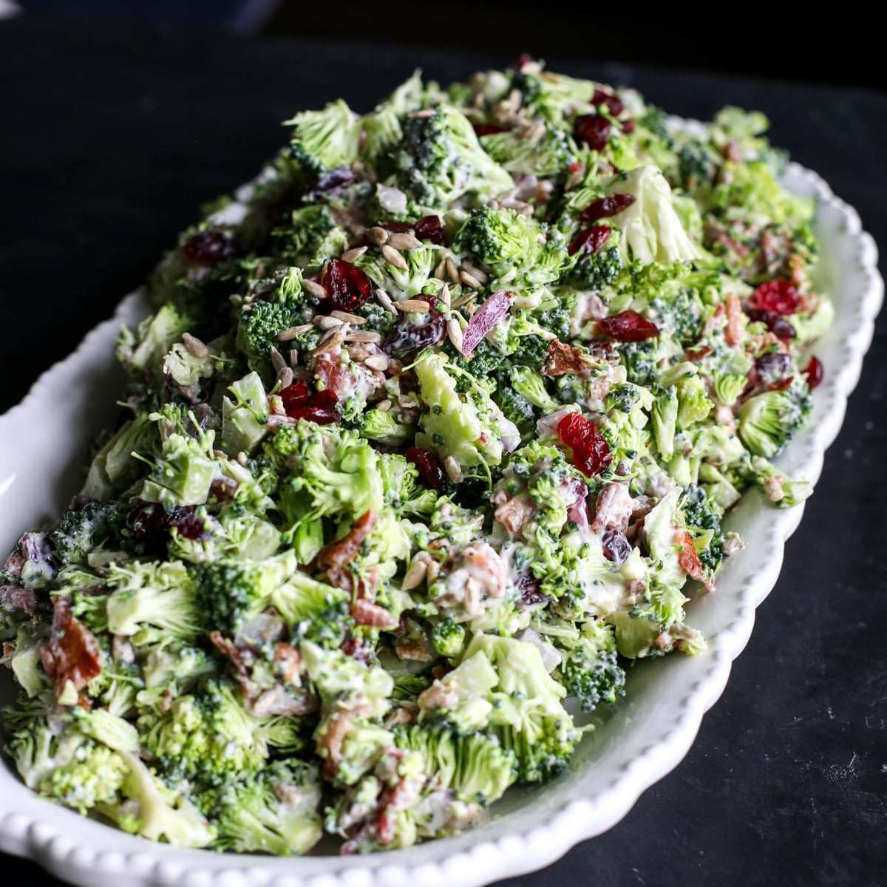

# Chopped Salad with Buttermilk Ranch

*The American chopped salad: blanched broccoli, sweet apple, shredded carrot, salted cashews and currants over mixed greens, tossed with a creamy buttermilk ranch dressing. Lunch on a desk or a side at a BBQ.*

**Serves:** 4-6

**Prep Time:** 20 minutes

**Cook Time:** 5 minutes

## Overview
A proper American chopped salad isn't fancy but it earns its place at the lunch table: small uniform pieces of crunchy raw and lightly cooked vegetables tossed with a tangy creamy dressing, where every forkful has a bit of everything. The broccoli gets a brief blanch so it goes vivid green and just-tender; the apple stays raw for the sharp crunch; shredded carrot lifts the colour; salted cashews and dried currants add sweet-salty bites. The dressing is a from-scratch ranch built on buttermilk, mayonnaise, lemon juice and a handful of fresh herbs (dill, chives, parsley) - far better than the bottled supermarket version. Toss the components with a little dressing to dress the heavier vegetables, then add the mixed greens and toss again. The remainder of the dressing goes to the table for anyone who wants more.

## Ingredients

### Buttermilk ranch
- 120 ml buttermilk
- 2 teaspoons fresh lemon juice
- 1 teaspoon finely minced fresh dill
- 1 teaspoon finely minced fresh chives
- 1 teaspoon finely minced fresh flat-leaf parsley
- ½ teaspoon onion powder
- ¼ teaspoon garlic powder
- Kosher salt and freshly ground black pepper
- 180 ml mayonnaise

### Salad
- Kosher salt
- 150 g broccoli florets (cut into 1.5 cm pieces)
- 1 large apple (cored and cut into 1.5 cm pieces)
- 1 large carrot (peeled and shredded)
- 40 g roasted salted cashews (chopped)
- 2 tablespoons dried currants or raisins
- 210 g mixed salad greens

## Method

### Stage 1 - Mix the dressing
1. In a bowl, whisk together the buttermilk, lemon juice, dill, chives, parsley, onion powder, garlic powder and ¼ teaspoon pepper until smooth.
2. Stir in the mayonnaise.
3. Taste; season with salt as needed.
4. Set aside (the dressing improves with 15 minutes of resting time).

### Stage 2 - Blanch the broccoli
1. Fill a large bowl with cold water and ice.
2. Fill a saucepan half full of salted water; bring to a boil over high heat.
3. Add the broccoli to the boiling water; cook 1 minute, stirring once, until barely tender-crisp.
4. Drain in a sieve; transfer immediately to the ice water to stop the cooking.
5. Drain again; pat dry with paper towels.
6. Tip into a large salad bowl.

### Stage 3 - Assemble
1. Add the chopped apple, shredded carrot, cashews and currants to the bowl with the broccoli.
2. Drizzle with a little of the ranch dressing; toss gently to combine.
3. Add the mixed greens; toss again with a touch more dressing.

### Stage 4 - Serve
1. Tip into a serving bowl or onto plates.
2. Pass the remaining dressing alongside.

## Notes
- **Dress in stages:** Dress the heavier vegetables first so they pick up the seasoning, then add the greens last with just enough dressing to coat. Tossing the leaves with too much wilts them.
- **Apple stays raw:** Don't be tempted to soften the apple in any way; the crunch is half the point. A firm sweet-tart apple (Honeycrisp, Pink Lady, Braeburn) works best.
- **Make the ranch ahead:** The dressing keeps a week refrigerated and improves after 4 hours as the herbs and onion powder infuse.

## Storage
- Dressing refrigerates 7 days in a sealed jar.
- Undressed salad components refrigerate 1 day; dressed salad doesn't keep - the leaves wilt within 2 hours.
