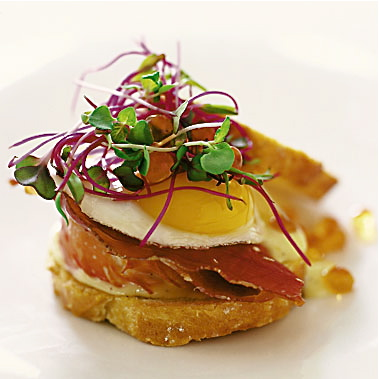

# Club Sandwich

*The American diner triple-decker: three slices of toasted white bread layered with chicken or turkey, bacon, lettuce, tomato and mayo.*

**Serves:** 2

**Prep Time:** 15 minutes

## Overview
The diner triple-decker reworked with a poached egg sitting on top, what an American sandwich shop would call a club with eggs, and what a French brunch menu would simply serve as the house club. Two slices of buttered, toasted bread layered with sliced grilled chicken, crisp smoked bacon, shredded iceberg dressed in mayo and a sharp pinch of onion, ripe tomato brightened with vinaigrette, and the soft poached eggs draped over the top so the yolks break into everything underneath. The pleasure is in the layering: a different texture in every bite, the bread crisp enough to hold structure but soft enough to give. You build it carefully, slice it on the diagonal, and pin the halves together with toast picks so the whole tower stays upright on the plate. Lunch counter at noon, light supper after a long afternoon, eaten with chips on the side and an extra napkin within reach.

## Ingredients
- 2 slices of bread
- soft butter
- 1 chicken breast fillet
- salt
- pepper
- 1 tablespoon olive oil
- 2 smoked bacon rashers (rinded)
- ½ iceberg lettuce (shredded)
- 1 tablespoon onion (very finely chopped)
- 2 tablespoons mayonnaise (fresh)
- 2 tomatoes (thinly sliced)
- 2 tablespoons vinaigrette
- 1 teaspoon parsley (freshly chopped)
- 2 poached eggs

## Method

### Stage 1 - Prepare Components
1. Preheat the grill to hot.
1. Butter the bread on both sides then toast it under the grill until golden brown.
1. Split the chicken breast length-ways through the middle and season with salt and pepper.
1. Grill or fry the chicken in olive oil, for a few minutes on each side until cooked.
1. Grill the bacon until crisp.

### Stage 2 - Assemble Sandwich
1. Mix the shredded lettuce and onion with the mayonnaise and season with salt and pepper.
1. Lay the tomato slices on top of the two pieces of toast and sprinkle with some of the vinaigrette.
1. Divide the lettuce mixture between the two and top with the bacon and chicken breast halves.
1. Sit the warmed poached eggs on the chicken breasts.
1. Mix the chopped parsley with the remaining vinaigrette, and sprinkle over the eggs.

## Notes
- **Chicken doneness:** Cook the chicken through but don't dry it out, test with a meat thermometer (74°C internal temperature) for perfect results.
- **Poached egg timing:** Cook the eggs just before serving so they're still warm and the yolks are runny.
- **Component temperature:** Keep all components warm until assembly, toast the bread last for maximum crispness.
- **Breadcrumbs vs. crust:** Use good quality bread with a firm crumb that can support the fillings without tearing.

## Serving
- **Serve with:** A crisp salad or french fries
- **Garnish with:** Fresh parsley sprigs and a lemon wedge
- **Accompaniment:** Toast picks to hold the sandwich together while eating

## Storage
- Best served immediately while all components are warm
- Individual components can be prepared ahead but should be assembled just before serving
- Leftovers not recommended as bread becomes soggy
- Not suitable for freezing
