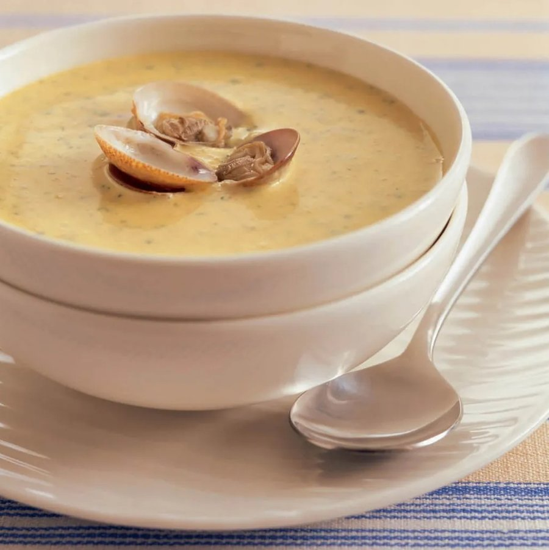

# Creamy Clam Soup

*An American creamy clam soup: fresh clams steamed open, the broth thickened with cream and potato.*

**Serves:** 4

**Prep Time:** 20 minutes

**Cook Time:** 40 minutes

## Overview
A creamy clam soup that takes the New England chowder format and smooths it out into something closer to a French bisque. You steam fresh clams open in a covered pot, strain the briny liquor (which is half the dish's flavour), then soften onion, leek, carrot and swede in butter before pouring the stock back in with a handful of short-grain rice. The rice cooks down to nothing visible but thickens the soup naturally, which is why this version comes out velvet-smooth after a turn in the blender. Cream goes in last, off the heat so it doesn't split, and the reserved clam meat drops back into the pan along with chopped parsley. You finish each bowl with a few clams left in their shells balanced on the surface for the look of it. Crusty bread on the side, a sharp white wine in the glass, and a small bowl of black pepper to grind over.

## Ingredients

### Base
- 50 grams butter

### Aromatics
- 1 onion (chopped)
- 1 leek (large, sliced)

### Vegetables
- 1 carrot (large, chopped)
- 250 grams swede (diced)
- 75 grams medium (or short grained rice)

### Protein
- 1 ¾ kg clams

### Seasonings
- 1 bay leaf

### Liquid/Broth
- 800 ml fish stock

### Garnishes
- 200 ml whipping cream
- 3 tablespoons flat leaf parsley (chopped)

## Method

### Stage 1 - Prepare clams
1. Wash the clams thoroughly, discarding any that have broken shells or fail to close when you tap them.
2. Put the clams and 250 ml water in a large saucepan.
3. Bring to the boil, then immediately reduce the heat to medium and cover with a tight fitting lid.
4. Cook for 3 - 4 minutes, or until the shells open.
5. Strain into a bowl, reserving the liquid.
6. Add enough stock to the reserved liquid to make up to 1 litre.
7. Discard any clams that have failed to open.
8. Remove meat from eight of the clams, keeping shells for garnish.

### Stage 2 - Cook vegetables
1. Melt the butter in a saucepan.
2. Add the vegetables and cook, covered, over a medium heat for 10 minutes, stirring occasionally.
3. Add the stock mixture and the bay leaf, and bring to the boil.
4. Immediately reduce the heat to low and simmer for 10 minutes.
5. Add the rice, and bring back to the boil, cover and cook over a medium heat for 15 minutes, or until the rice and vegetables are tender.

### Stage 3 - Puree and finish
1. Remove from the heat and stir in the clam meat.
2. Remove the bay leaf and allow to cool for 10 minutes.
3. Pour the soup in a blender and purée until smooth.
4. Return the soup to the pan, and stir in the cream.
5. Taste for seasoning.
6. Gently reheat the soup.
7. Add the parsley and two of the clams in their shells to each bowl.

## Notes
- **Clams:** Use fresh clams; discard any that don't open during cooking.
- **Pureeing:** Allow to cool slightly before blending to avoid splatters.
- **Cream:** Add just before serving to prevent curdling.
- **Rice:** Short-grain rice helps thicken the soup naturally.

## Serving
Serve hot in bowls, garnished with clams in shells and parsley. Pair with crusty bread.

## Storage
- Refrigerate up to 2 days; reheat gently without boiling.
- Freezes well for up to 1 month (without cream; add fresh when reheating).
- Best eaten fresh for optimal clam texture.
