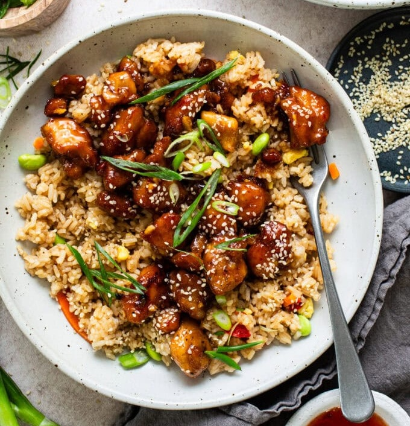

# Crispy Honey Garlic Chicken

*Asian-American takeout standard, made better at home. Boneless chicken thighs cube, season, dust with cornstarch, pan-fry crisp, then bathe in a sauce of honey + sweet chilli + soy + 10 cloves of chopped garlic. Sticky, glossy, fast. Eats over hibachi-style rice with sesame seeds and scallions.*

**Serves:** 4

**Prep Time:** 15 minutes (plus 1 hour marinating)

**Cook Time:** 15 minutes

## Overview
An Asian-American takeout standard reimagined for the home kitchen, with one specific upgrade: 10 cloves of garlic, chopped rather than minced, so the pieces stay visible and bite back. The flavour is the canonical sweet-salty-spicy balance of American Chinese cookery - honey for sweetness, soy for salt and umami, sweet chilli sauce (Mae Ploy or similar Thai bottled brand) for vinegared chilli warmth, garlic for sharpness across the back. Crisp comes from a cornstarch dust on the chicken, which gives a more even, lacier crust than flour does and stays crisp longer once the sauce hits it. The chicken thighs themselves stay juicy because they're cubed, not pounded; the small pieces cook fast and the seasoning penetrates. Smell when the chicken hits the sauce is honey-and-soy hitting hot oil, which is one of the more universally appealing kitchen smells. Easy and fast - active cooking under 20 minutes once the marinade has rested. The dish has no claim to traditional Chinese cookery; it's the product of decades of evolution in American Chinese restaurants and the home-cook adaptations that followed.

## Ingredients

### Chicken
- 900 g (2 lbs) boneless skinless chicken thighs (cut into bite-sized pieces)
- Salt and freshly ground black pepper
- 2 teaspoons garlic powder
- 1 teaspoon onion powder
- 1 teaspoon smoked paprika
- 1 teaspoon sesame oil
- ¼ cup cornstarch
- 2-3 tablespoons vegetable oil

### Honey garlic sauce
- ½ cup honey
- ¼ cup sweet chilli sauce
- ¼ cup soy sauce
- 10 garlic cloves (chopped, not minced)

### To serve
- Hibachi-style rice (or steamed white rice)
- Sesame seeds
- Sliced spring onions

## Method

### Stage 1 - Marinate
1. Combine the chicken with salt, pepper, garlic powder, onion powder, paprika and sesame oil in a sealable bag.
1. Shake well; refrigerate 1 hour minimum (overnight OK).

### Stage 2 - Cornstarch and rest
1. Add the cornstarch; toss thoroughly to coat.
1. Rest 20 minutes at room temperature.

### Stage 3 - Pan-fry
1. Heat the oil in a large skillet over medium-high heat.
1. Working in batches without crowding, cook the chicken 3-4 minutes per side until golden and crisp.
1. Transfer to a plate.
1. Return all the chicken to the skillet.

### Stage 4 - Sauce
1. Reduce heat to medium.
1. Add the honey, sweet chilli sauce, soy sauce and chopped garlic.
1. Stir to coat the chicken.
1. Simmer 4-5 minutes so the flavours meld and the sauce thickens around the chicken.

### Stage 5 - Serve
1. Plate over hibachi-style rice.
1. Scatter sesame seeds and sliced spring onions.

## Notes
- **Chopped, not minced garlic:** the chunks bite back. Minced disappears into the sauce.
- **Cornstarch coating gives the crisp:** more even and crispier than flour at the same depth.
- **Sweet chilli sauce specifically:** Mae Ploy or similar Thai-style sweet chilli has the right balance of sugar, vinegar and chilli flake.

## Storage
- Keeps 3 days refrigerated.
- Reheat in a hot pan; cornstarch coating crisps back. Microwave makes it gummy.
