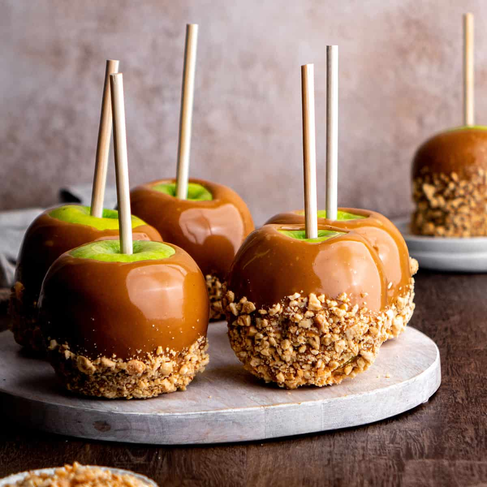

# Caramel Apples

*The Halloween fairground sweet. Tart apples on sticks, dunked in a dark glossy caramel, rolled in chopped peanuts or set plain. The bite is the point: tart, crisp apple under sweet, chewy caramel.*

**Serves:** 6 (one apple each)

**Prep Time:** 15 minutes

**Cook Time:** 15 minutes (plus 30 minutes setting)

## Overview
A short-cook caramel: butter, brown sugar, cream and a splash of vanilla, brought to soft-ball stage and dropped to a temperature where it coats and clings. Sticks pushed into the stem ends of cold, dry apples. Each apple gripped by the stick and lowered into the caramel, swirled to coat, lifted clear, and set on a buttered tray. The toppings, if you want them (chopped peanuts, sprinkles, crushed pretzels), go on while the caramel is still tacky.

## Ingredients

- 6 small tart apples (Granny Smith ideal; smaller is easier to handle)
- 6 wooden skewers or lollipop sticks
- 200 g soft dark brown sugar
- 80 g unsalted butter
- 200 ml double cream
- 80 g golden syrup (or light corn syrup)
- 1 teaspoon vanilla extract
- A small pinch of fine sea salt
- 80 g salted peanuts (chopped, optional, for rolling)

## Method

### Stage 1 - Prepare the apples
1. Wash and dry the apples thoroughly. Any wax on the skin (most supermarket apples have a thin coat) will repel the caramel; rub each apple briskly under hot water with a clean cloth, then dry completely.
2. Pull out the stem and push a skewer firmly into the top, almost to the bottom but not through.
3. Set the apples in the fridge for 30 minutes. Cold dry apples take the caramel best.
4. Line a tray with baking paper and butter it lightly. Put the chopped peanuts in a wide shallow bowl if using.

### Stage 2 - Make the caramel
1. In a medium heavy saucepan, combine the brown sugar, butter, cream, syrup and salt. Set over a medium heat, stirring with a wooden spoon until the sugar dissolves and the mixture is uniformly smooth.
2. Clip a sugar thermometer to the side. Bring to a steady boil and cook, stirring occasionally and scraping the sides, for 8-10 minutes until the mixture reaches 118-120°C (soft-ball stage). The caramel will deepen from milky-brown to glossy mahogany.
3. Off the heat, stir in the vanilla. The caramel will hiss.

### Stage 3 - Dip
1. Take an apple by its stick. Tilt the pan so the caramel pools at one side, and lower the apple in. Swirl to coat all the way up the shoulders, lift clear, and let the excess drip back into the pan for 10 seconds. Run the bottom of the apple along the rim of the pan to scrape the drip.
2. If using peanuts, immediately roll the still-tacky bottom half through the peanuts to coat.
3. Stand the apple stick-up on the buttered tray. Repeat with the rest.

### Stage 4 - Set
1. Let the apples set at room temperature for 30 minutes; the caramel firms to a chewy coat that pulls cleanly off the apple when bitten.
2. If the caramel in the pan thickens too much while you work, set it briefly over a low heat to loosen.

## Notes
- Bigger apples need more caramel and a longer dip. Six small-to-medium apples is the comfortable batch size for this quantity.
- For a deeper colour and bitter edge, take the caramel another minute past soft-ball stage, to 125°C — it sets firmer and snappier rather than chewy.
- A coat of melted chocolate drizzled in lines over the set caramel is the "gourmet" finish; do it once the caramel has cooled completely.

## Serving
On a wide platter at a Halloween party, sticks angled up. Set out napkins; this is a face-and-fingers sweet.

## Storage
Best the day they are made. Loosely covered at room temperature for up to 24 hours; the caramel slowly softens in the fridge if you must store longer.
