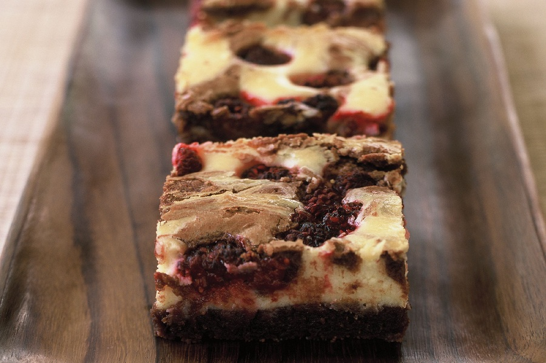

# Cheesecake Brownies

*The marbled brownie. A rich dark-chocolate brownie batter under-meets a sweetened cream-cheese ribbon swirled through the top, baked until the cheesecake layer is just-set with the slightest tan on the high points. Cool, slice; eat from the fridge.*

**Serves:** 16 squares

**Prep Time:** 20 minutes

**Cook Time:** 35 minutes (plus 4 hours chilling)

## Overview
Two mixtures, one tin. The brownie batter goes in first: dark chocolate and butter melted, sugar and eggs whisked light, folded together with flour and cocoa. The cheesecake topping is full-fat cream cheese beaten with sugar, an egg yolk, vanilla and a squeeze of lemon - the lemon keeps the white layer bright against the brown. Spooned over the brownie in dollops, then dragged through with a knife to make figure-eight ribbons. Baked low and slow so the cheesecake sets without browning much; cooled fully before slicing.

## Ingredients

### The brownie batter
- 175 g dark chocolate (70%)
- 150 g unsalted butter (cubed)
- 200 g caster sugar
- 3 large eggs
- 1 teaspoon vanilla extract
- 80 g plain flour
- 25 g cocoa powder
- A pinch of fine sea salt

### The cheesecake topping
- 300 g full-fat cream cheese (Philadelphia or similar, softened at room temperature)
- 80 g caster sugar
- 1 large egg yolk
- 1 teaspoon vanilla extract
- ½ teaspoon lemon juice
- A small pinch of fine sea salt

## Method

### Stage 1 - Make the brownie batter
1. Heat the oven to 150°C fan / 170°C / 340°F. Line a 23 cm square tin with baking paper.
2. Melt the chocolate and butter in a heatproof bowl over a pan of barely simmering water (bowl not touching the water). Stir until smooth. Cool for 5 minutes.
3. In a separate bowl, whisk the sugar and eggs with an electric mixer for 4 minutes, until pale, thick and ribbon-trail consistency.
4. Fold the cooled chocolate mixture into the eggs in three additions. Fold in the vanilla.
5. Sift the flour, cocoa and salt over the top. Fold gently until just combined - stop the second no streaks remain.
6. Pour the batter into the prepared tin and smooth the top with a spatula.

### Stage 2 - Make the cheesecake topping
1. In a wide bowl, beat the softened cream cheese with a wooden spoon (or hand mixer) until completely smooth and lump-free. Skipping the lump-eradication step here gives you spotty cheesecake.
2. Beat in the sugar until fully incorporated.
3. Add the egg yolk, vanilla, lemon juice and salt. Stir until uniform. The mixture should look like thick custard.

### Stage 3 - Marble
1. Dollop the cream-cheese mixture in large spoonfuls across the brownie batter - about 8-10 spaced piles.
2. With a butter knife or skewer, drag through the dollops in long figure-eights, pulling some cheesecake into the brownie and some brownie up into the cream. Stop when you see a marbled pattern; over-swirling muddies the colours.

### Stage 4 - Bake
1. Bake for 32-38 minutes. The cheesecake layer should be set on top - no wet wobble - but the brownie underneath should still be slightly tender. The very faintest pale-gold tan on the high points of the cheesecake is the visual signal. A skewer pushed through a brownie-only patch should come out with moist crumbs (not wet batter).
2. Cool in the tin to room temperature, then chill in the fridge for at least 4 hours. The cold chill is what gives the cheesecake layer its proper set texture and the brownie its fudge.

### Stage 5 - Slice
1. Lift out using the baking-paper overhang. With a long sharp knife dipped in hot water and wiped dry, cut into 16 squares. Wipe the knife between every cut - the cheesecake sticks.

## Notes
- **Cream cheese must be full-fat and at room temperature**. Cold cheese seizes when beaten and stays lumpy; reduced-fat cheese weeps and won't set firmly.
- **Don't over-marble**: 3-4 figure-eight passes is enough. Beyond that, the swirls blend into a beige overall colour.
- **Lemon optional**: traditional cheesecake-brownie recipes skip the lemon. I find it brightens the cream cheese without tasting lemony. Half a teaspoon, no more.
- **Variation: raspberry**: scatter a small handful of fresh raspberries over the brownie batter before adding the cheesecake. The raspberries break down in the bake and give bright red pockets through the slab.

## Serving
A square cold from the fridge, with a single fresh raspberry on top if you have one. Strong coffee. The slab is rich; one square is plenty.

## Storage
- In an airtight container in the fridge for up to 5 days. The cheesecake layer needs the cold to stay set.
- Freezes well for up to 2 months - cut into squares, wrap each in cling film, freeze in a bag. Defrost in the fridge overnight.
