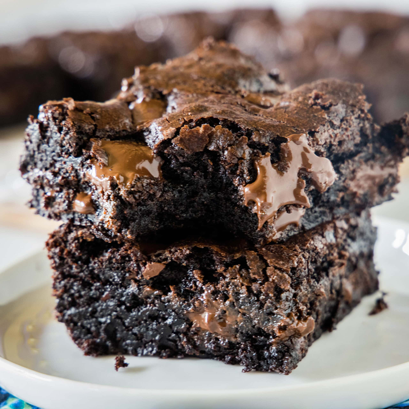

# Chocolate Brownies

*Fudgy, dense, glossy-topped chocolate brownies. The middle should be slightly underdone - set but still gooey; the edges should pull away from the tin. The crackly top is from sugar dissolved fully into the batter; whisk the eggs and sugar long enough to thicken before folding in everything else.*

**Makes:** 16 brownies

**Prep Time:** 15 minutes

**Cook Time:** 25 minutes

## Overview
The American fudgy brownie at its most uncompromising: dense, glossy-topped, crackle-skinned squares of dark-chocolate batter whose middle stays just-set and slightly gooey while the edges pull cleanly from the tin. The crackly top is the test of a properly made brownie; it comes from sugar fully dissolved into the eggs by long ribboning, not from any leavening or trick. Whisk the eggs and sugar past ribbon stage before the melted chocolate joins, and the surface bakes glossy and shattering. Flour and cocoa go in at the very end and only just long enough to combine; over-mixed batter gives a cakey crumb, not the dense fudge that defines the American version. The middle must wobble slightly when the tin leaves the oven, and the brownies must cool fully in the tin before cutting, or the bottom collapses into fudge soup.

## Ingredients

- 250 g unsalted butter
- 250 g dark chocolate (70%, broken into pieces)
- 4 eggs (large)
- 350 g caster sugar
- 100 g plain flour
- 50 g cocoa powder
- 1 teaspoon vanilla extract
- ½ teaspoon flaky sea salt
- 100 g dark chocolate chunks (extra; for the bites of melted chocolate throughout)

## Method

### Stage 1 - Melt
1. Heat the oven to 180°C (160°C fan).
1. Line a 23 x 23 cm baking tin with parchment paper, leaving an overhang on two sides for lifting.
1. Combine the butter and dark chocolate in a heatproof bowl over a pan of barely-simmering water.
1. Stir until melted and smooth; cool slightly.

### Stage 2 - Whisk eggs and sugar
1. In another bowl, whisk the eggs and sugar with an electric mixer for 4-5 minutes until pale, thick and ribboning (the mixture should hold a trail when the whisk is lifted).
1. (This is what creates the crackly top; don't shortcut it.)

### Stage 3 - Combine
1. Pour the melted chocolate-butter into the eggs; fold gently with a spatula.
1. Stir in the vanilla.
1. Sift in the flour and cocoa; fold gently until just combined (don't overwork).
1. Stir in the chocolate chunks and salt.

### Stage 4 - Bake
1. Pour into the lined tin; smooth the top.
1. Bake for 22-25 minutes; the top should be glossy and crackly, the edges set, the centre still wobbling slightly when nudged.
1. (A skewer in the centre should come out with thick fudgy crumbs - not clean.)

### Stage 5 - Cool fully
1. Cool completely in the tin (at least 2 hours; overnight is better).
1. Lift out using the overhang; cut into 16 squares with a hot knife (dipped in hot water and wiped between cuts) for clean edges.

## Notes
- **Underbake:** Brownies set as they cool. A skewer-clean brownie out of the oven is dry by the time it's cold. Pull when the centre wobbles.
- **Whisk eggs and sugar properly:** 4-5 minutes is non-negotiable for the crackly top. Less and the surface looks dull.
- **Cool fully before cutting:** Cutting warm gives ragged edges and crumbling. Overnight rest gives the best texture; same-day cool to room temperature is the minimum.

## Storage
- Keeps 4 days in an airtight tin (the texture deepens day by day).
- Freezes 3 months wrapped tightly.
