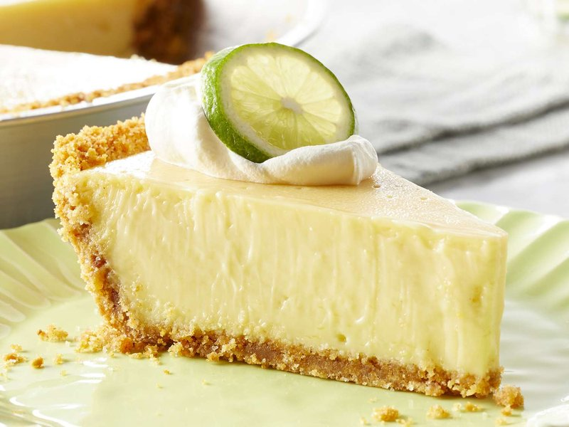

# Key Lime Pie

*Florida's official state pie: a graham-cracker crust holding a filling of just lime juice, sweetened condensed milk, and egg yolks - chemically set, not baked-set, by the acid of the lime reacting with the milk proteins. Brief bake just stabilises the custard. Topped with lightly sweetened whipped cream and lime zest. Defining feature: pale yellow (not green), tart enough to make your jaw clench, sweet enough to come back for a second slice. The "key" in the name refers to Key limes (the small Florida ones) but supermarket Persian limes work fine.*

**Serves:** 8

**Prep Time:** 30 minutes

**Cook Time:** 25 minutes (plus 4 hours chilling)

## Overview
Graham crackers (or digestive biscuits) crush fine, mix with melted butter and sugar, press into a 23 cm pie tin. Bakes 10 minutes till set. Filling: 4 egg yolks whisk with sweetened condensed milk for 3 minutes till pale and thick. Lime juice (lots - about 150 ml) and zest whisk in. The lime acid begins setting the filling immediately. Pour into the crust; bake 15 minutes till the filling has just-set with a tiny wobble. Chills 4 hours. Whipped cream tops at service.

## Ingredients

### Crust
- 200 g graham crackers (or digestive biscuits)
- 80 g unsalted butter (melted)
- 50 g caster sugar
- A pinch of salt

### Filling
- 4 large egg yolks
- 1 tin (400 g) sweetened condensed milk
- 150 ml lime juice (about 8 Persian limes or 18 Key limes)
- Zest of 4 limes

### Topping
- 300 ml double cream (chilled)
- 2 tablespoons icing sugar
- 1 teaspoon vanilla extract
- Extra lime zest for garnish

## Method

### Stage 1 - Crust
1. Heat the oven to 175°C (155°C fan).
1. Crush the graham crackers in a food processor (or in a bag with a rolling pin) to fine crumbs.
1. Mix with the melted butter, sugar and salt until uniformly damp.
1. Press evenly into a 23 cm pie tin, covering the bottom and 4 cm up the sides.
1. Bake 10 minutes till lightly toasted and set.
1. Cool while you make the filling.

### Stage 2 - Filling
1. In a wide bowl, whisk the egg yolks with an electric whisk for 2-3 minutes until pale and thick.
1. Add the condensed milk; whisk 3 more minutes (the mixture should ribbon-trail when the whisk is lifted).
1. Whisk in the lime zest.
1. Pour in the lime juice; whisk gently 30 seconds.
1. The mixture should thicken slightly even before baking - this is the lime acid setting the milk proteins.

### Stage 3 - Bake
1. Pour the filling into the pre-baked crust.
1. Bake 15 minutes at 175°C until the filling has just-set with a slight wobble at the very centre (the size of a 50p coin).
1. The surface should look matte, not glossy.

### Stage 4 - Chill
1. Cool to room temperature on a rack (1 hour).
1. Chill at least 4 hours (overnight is better).

### Stage 5 - Whipped cream
1. In a chilled bowl, whip the cream with icing sugar and vanilla until soft peaks form.

### Stage 6 - Serve
1. Dollop or pipe the whipped cream across the top.
1. Sprinkle extra lime zest.
1. Cut with a hot knife (dipped in hot water, wiped dry) for clean slices.
1. Serve cold.

## Notes
- **Real lime juice, not bottled:** bottled lime juice has off-flavours from preservatives. Fresh juice is the entire dish.
- **Persian or Key limes - both work:** the original is Key lime (smaller, more aromatic, more tart) but Persian (supermarket) limes are perfectly fine. Don't substitute lemons - wrong flavour.
- **Pale yellow, NOT green:** authentic key lime pie has zero food colouring. The natural colour is from egg yolks. Green pies are bakery shortcuts.
- **Wobble at 15 minutes:** over-baked filling cracks and weeps. Pull when the centre still moves slightly.

## Storage
- Keeps 3 days refrigerated.
- The crust softens slightly on day 2-3 (still good).
- Freezes 1 month without the whipped cream; thaw overnight in the fridge; top with fresh cream at service.
