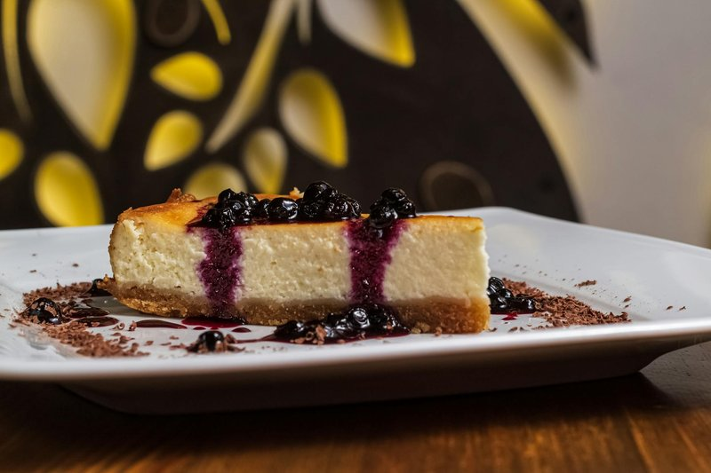

# New York Cheesecake

*Brooklyn's dense baked cheesecake: cream cheese, sour cream and eggs on a graham-cracker base, baked long and slow in a water bath.*

**Serves:** 12

**Prep Time:** 40 minutes

**Cook Time:** 1 hour 20 minutes (plus overnight chilling)

## Overview
A graham-cracker base is pressed into a 23 cm springform tin and pre-baked for 10 minutes. Filling: cream cheese is softened to room temperature (cold cream cheese gives lumpy batter), then beaten with sugar, eggs one at a time, sour cream, vanilla and lemon. The tin is wrapped in foil so the water bath doesn't seep in. Baked at 160°C in a water bath for 60-75 minutes until the edges are set but the centre wobbles a 7 cm circle. Cooled in the oven with the door cracked for 1 hour (avoids cracks). Chilled overnight. Served chilled.

## Ingredients

### Crust
- 250 g graham crackers (or digestive biscuits)
- 80 g caster sugar
- 120 g unsalted butter (melted)
- A pinch of salt

### Filling
- 900 g full-fat cream cheese (Philadelphia or equivalent; room temperature)
- 250 g caster sugar
- 30 g plain flour
- 4 eggs (large, room temperature)
- 1 egg yolk (large)
- 200 g full-fat sour cream
- 2 teaspoons vanilla extract
- 1 lemon (zest)
- 1 tablespoon lemon juice

### To serve (optional)
- Strawberry compote, or fresh berries

## Method

### Stage 1 - Crust
1. Heat the oven to 175°C (155°C fan).
1. Pulse the graham crackers to fine crumbs.
1. Mix with sugar, melted butter and salt.
1. Press evenly into the bottom and 3 cm up the sides of a 23 cm springform tin (lightly buttered).
1. Bake 10 minutes; cool on a rack while you make the filling.

### Stage 2 - Wrap the tin for water bath
1. Wrap the bottom and sides of the springform tin in 2 layers of heavy-duty foil (no gaps - water mustn't seep in during the bath).

### Stage 3 - Filling
1. In a stand mixer or with electric beaters, beat the room-temperature cream cheese on medium for 2 minutes until smooth and lump-free.
1. Add the sugar and flour; beat 2 more minutes.
1. Scrape down the bowl.
1. Add the eggs ONE AT A TIME, beating just until incorporated after each (don't over-aerate - bubbles cause cracks).
1. Add the extra yolk; beat briefly.
1. Mix in the sour cream, vanilla, lemon zest and juice; beat on low until just combined.
1. Scrape down again; mix briefly.

### Stage 4 - Bake in water bath
1. Lower the oven to 160°C (140°C fan).
1. Pour the filling into the prepared crust; smooth the top with a spatula.
1. Place the foil-wrapped tin into a deep roasting tray.
1. Pour boiling water around the tin to a depth of 3 cm (the water bath stabilises the temperature and prevents cracks).
1. Bake 60-75 minutes - the edges should be set and slightly puffed; the centre should jiggle a 7 cm wobble area.

### Stage 5 - Slow cool
1. Turn the oven off; crack the door open 5 cm.
1. Leave the cheesecake in the cooling oven 1 hour (sudden temperature change is the main cause of cracks).

### Stage 6 - Chill
1. Remove from the water bath; remove foil; cool to room temperature on a rack (1 hour).
1. Cover; chill overnight.

### Stage 7 - Serve
1. Run a thin knife around the edge; release the springform.
1. Cut with a hot knife (dipped in hot water, wiped between cuts) for clean slices.
1. Serve chilled, plain or with strawberry compote.

## Notes
- **ROOM-TEMPERATURE cream cheese:** the single most important thing. Cold cream cheese gives lumpy batter and the lumps don't smooth out during baking. Leave the cream cheese on the counter 2+ hours before mixing.
- **Don't overbeat after the eggs:** every air bubble you whip in turns into a crack when baked. Beat on low, scrape often, stop mixing once incorporated.
- **Water bath, not optional:** New York cheesecake's signature dense-but-creamy texture depends on it. Skip and you get a drier, crumbly cake with surface cracks.
- **Slow cool in the oven:** thermal shock cracks the top. The 1-hour gradual cool is what gives the iconic uncracked surface.
- **Overnight chill:** under-chilled cheesecake is too soft to slice. Overnight at fridge temperature is the firmness benchmark.

## Storage
- Keeps 5 days refrigerated.
- The flavour deepens on day 2-3.
- Freezes whole or sliced, 2 months; thaw overnight in the fridge.
