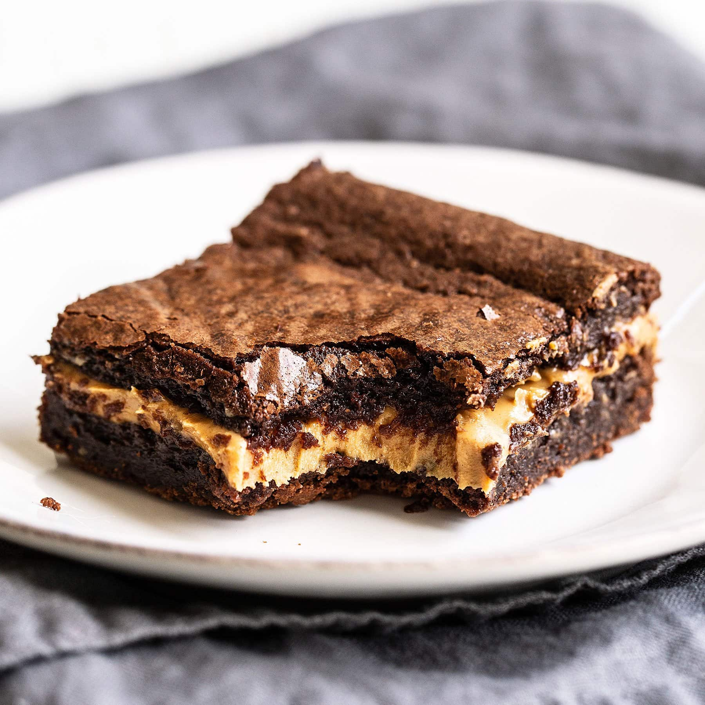

# Peanut Butter Stuffed Brownies

*The frozen peanut butter slab method. A solid disc of peanut butter (frozen until set) gets sandwiched inside a fudgy dark-chocolate brownie batter, baked through together. The PB layer stays gooey and intact at the centre; the brownie is fudgy at the edges. A swirl of warmed peanut butter on top, a scatter of flaky salt.*

**Serves:** 16 brownies

**Prep Time:** 15 minutes (plus 3 hours freezing the peanut butter, plus 3 hours chilling after bake)

**Cook Time:** 32 minutes

## Overview
The construction trick is the frozen peanut butter slab: 1 cup of commercial peanut butter spread (the firm processed kind, not natural) gets warmed, spread into a tin, frozen until solid. That slab tucks inside the brownie batter mid-tin. The frozen state stops the peanut butter from melting into the chocolate during the bake - it warms back to soft-set fudge texture by the time the brownie's done. Topped with a drizzle of more peanut butter swirled across the surface, baked until edges are set with a centre jiggle, cooled and chilled until sliceable.

## Ingredients

### The peanut butter slab
- 1 cup (250 g) smooth peanut butter (commercial spread, not natural - Skippy / Jif / Sun-Pat / similar)
- 1 teaspoon flaky sea salt (divided)

### The brownie batter
- 200 g unsalted butter
- 200 g dark chocolate chips (60-70%)
- 200 g soft light brown sugar (about 1 loosely packed cup)
- 3 large eggs (lightly beaten)
- 1 teaspoon vanilla extract
- 65 g plain flour (½ cup)
- 25 g cocoa powder (¼ cup)
- A pinch of fine sea salt

### To swirl + finish
- 2 tablespoons peanut butter (warmed to drizzling consistency)
- A small pinch of flaky sea salt (for the top)

## Method

### Stage 1 - Freeze the peanut butter slab
1. Line a 20 cm square tin with baking paper.
2. Warm the 1 cup peanut butter in the microwave (15-30 seconds) until pourable.
3. Pour into the lined tin and spread evenly with a spatula. The layer should be about 1 cm thick.
4. Sprinkle with half the flaky salt.
5. Freeze for 2-3 hours, until completely solid.

### Stage 2 - Prepare to bake
1. Heat the oven to 160°C fan / 180°C / 350°F. Re-line the (now-empty) tin with fresh baking paper, or use a second 20 cm square tin lined the same way.

### Stage 3 - Make the brownie batter
1. Combine the butter and dark chocolate chips in a heatproof bowl. Microwave in 30-second bursts, stirring between each, until smooth and glossy. (Or set over a pan of simmering water.)
2. Stir in the brown sugar until uniform.
3. Beat in the eggs and vanilla - stir vigorously for 30 seconds. The mixture should look glossy and slightly thickened.
4. Sift in the flour, cocoa and salt. Fold gently with a spatula until just combined - no streaks.

### Stage 4 - Assemble
1. Pour half the brownie batter into the prepared tin and smooth into an even layer.
2. Lift the frozen peanut butter slab out of the freezer (peel the baking paper off carefully) and place it directly on top of the batter. The slab should fit edge to edge.
3. Pour the remaining brownie batter over the peanut butter slab. Smooth the top with a spatula, sealing the PB layer inside.

### Stage 5 - Swirl
1. Warm the 2 tablespoons of peanut butter in the microwave (10-15 seconds) until pourable.
2. Drizzle in random lines across the top of the batter.
3. Drag a skewer or knife through the drizzle in figure-eights to create a marbled top.

### Stage 6 - Bake
1. Bake for 32 minutes. The edges should be set; the centre should still jiggle slightly when the tin is tapped. A skewer 2 cm from the edge should come out with a few moist crumbs.
2. Cool on the counter for 1 hour.

### Stage 7 - Chill and slice
1. Move the tin to the fridge for at least 3 hours (overnight is better). The PB layer firms; the brownie sets to fudge.
2. Lift the slab out using the baking-paper overhang. Sprinkle with the remaining flaky salt.
3. Cut into 16 squares with a long sharp knife dipped in hot water and wiped dry between cuts.

## Notes
- **Commercial peanut butter only**: natural peanut butter (the kind that separates) doesn't freeze to a clean slab - the oil pools and the solid layer is grainy. Skippy, Jif, Sun-Pat (smooth) or any commercial brand with added stabilisers works.
- **The freeze step is non-negotiable**: a soft PB layer melts into the brownie batter during the bake. You need it solid.
- **Crunchy variant**: replace half the smooth peanut butter in the slab with crunchy. Better texture; same method.
- **Bigger pan**: a 23 cm tin gives thinner brownies with less PB-to-brownie ratio per square. Reduce the bake time to 26-28 minutes.

## Serving
Cold from the fridge, with a glass of cold milk or a strong black coffee. Warm slightly in the microwave (10 seconds) to revive the peanut butter to molten - the molten serve is decadent.

## Storage
- In an airtight container in the fridge for up to 5 days.
- Freeze individual squares wrapped tightly for up to 3 months. Defrost in the fridge overnight.
- Don't store at room temperature for more than a few hours; the PB layer softens.
