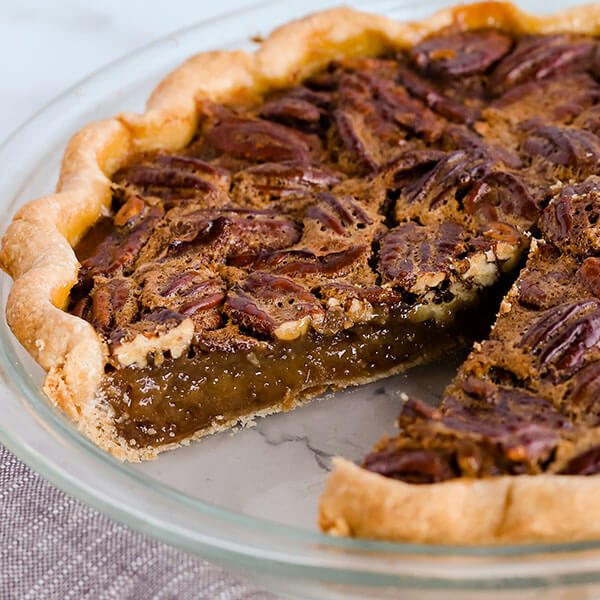

# Pecan Pie

*The Southern Thanksgiving pie: pecans suspended in a glossy filling of corn syrup, eggs and dark brown sugar, baked into a soft custard.*

**Serves:** 8

**Prep Time:** 30 minutes (plus 1 hour pastry rest)

**Cook Time:** 55 minutes

## Overview
The Southern Thanksgiving pie and one of the most American of all desserts: pecans suspended in a glossy filling of corn syrup, eggs and dark brown sugar, baked into a soft custard with a sweet crackling top. Light corn syrup is the canonical American base for the filling (golden syrup the workable UK substitute); the syrup is what gives the glossy translucent body around the pecans, where granulated sugar alone gives a grainy, broken filling. Dark brown sugar brings the molasses depth that distinguishes pecan pie from a generic nut tart, with a slug of bourbon and a teaspoon of vanilla rounding the flavour into the canonical Southern signature. Blind-baking the shortcrust base is non-negotiable; the wet filling soaks straight through an unbaked base into a soggy floor no further baking can rescue. The pecans arranged in concentric rings across the surface are the traditional visual finish. Rested at least 2 hours before slicing; the filling firms as it cools.

## Ingredients

### Pastry
- 200 g plain flour
- 100 g cold unsalted butter (cubed)
- 50 g icing sugar
- 1 egg yolk (large)
- 2 tablespoons ice-cold water
- A pinch of salt

### Filling
- 200 g dark brown sugar
- 250 ml light corn syrup (or golden syrup if corn syrup is unavailable)
- 80 g unsalted butter (melted)
- 4 eggs (large)
- 2 tablespoons bourbon (or rye whiskey)
- 1 tablespoon vanilla extract
- ½ teaspoon fine sea salt
- 300 g pecan halves (the whole halves, not chopped)

### To serve
- Lightly whipped cream OR vanilla ice cream

## Method

### Stage 1 - Pastry
1. Pulse the flour, butter, icing sugar and salt in a food processor until breadcrumb-textured.
1. Add the egg yolk and water; pulse until just bringing together.
1. Tip out; bring together as a disc; wrap; chill 1 hour.

### Stage 2 - Blind-bake
1. Heat the oven to 180°C (160°C fan).
1. Roll the pastry to a 30 cm circle; line a 23 cm pie tin; trim, leaving 1 cm overhang.
1. Prick the base with a fork; line with parchment and fill with baking beans.
1. Bake 15 minutes; lift out beans and parchment; bake 5 more minutes till pale gold.

### Stage 3 - Filling
1. In a wide bowl, whisk the brown sugar, corn syrup, melted butter, eggs, bourbon, vanilla and salt until smooth.
1. Don't aerate (gentle whisk; no electric mixer).

### Stage 4 - Assemble
1. Arrange the pecan halves in concentric circles over the par-baked base, decorative side up.
1. Pour the filling slowly over the pecans (they'll bob up and float into a beautiful pattern).

### Stage 5 - Bake
1. Lower the oven to 175°C (155°C fan).
1. Bake 40-45 minutes - the filling should be set around the edges with a slight wobble in the centre (a 5 cm wobble area is fine).
1. If the crust browns too fast, cover the edges with foil strips.

### Stage 6 - Cool and rest
1. Cool fully at room temperature, at least 2 hours.
1. The filling firms as it cools; slicing hot gives a runny mess.

### Stage 7 - Serve
1. Slice into wedges with a sharp knife.
1. Serve with lightly whipped cream or vanilla ice cream.

## Notes
- **CORN SYRUP, not honey or maple alone:** the structural integrity of pecan pie depends on corn syrup (or golden syrup). Honey is too floral and curdles; maple alone is too thin and doesn't set right. Use the real thing.
- **Don't aerate the filling:** whisking too vigorously creates bubbles that surface during baking and pock the top. Use a fork or a gentle hand whisk.
- **Wobble in the middle:** a slight wobble at 40 minutes means the filling will set perfectly as it cools. A fully-set wobble means it'll be hard and over-baked when cold.
- **Bourbon optional but transformative:** the boozy note balances the sugar. Use the cheaper of two bourbons; subtle quality differences disappear in baking.

## Storage
- Keeps 3 days at room temperature, covered.
- Tastes better on day 2 as the filling sets fully.
- Freezes whole or sliced, 2 months; thaw at room temperature 2 hours.
