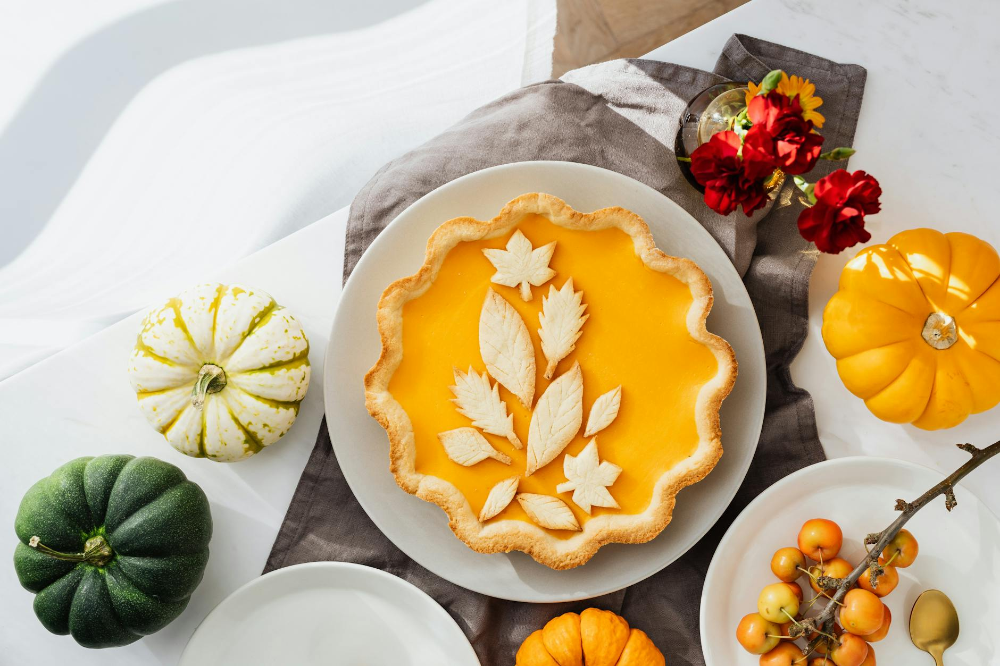

# Pumpkin Pie

*The American holiday pie that bridges Halloween and Thanksgiving. Spiced pumpkin custard in a flaky all-butter shell, baked low and slow until the centre sets with a faint wobble. Eaten cool with a heavy spoon of whipped cream.*

**Serves:** 8

**Prep Time:** 30 minutes (plus 1 hour chilling)

**Cook Time:** 1 hour 15 minutes

## Overview
The custard is a one-bowl mix: roasted pumpkin (or good tinned purée), evaporated milk, eggs, brown sugar, and the four spices that define the pie (cinnamon, ginger, nutmeg, clove). The shell is an all-butter shortcrust, blind-baked briefly so the base does not go soggy under the wet filling. Bakes low to keep the custard silky rather than scrambled. Cools completely in the tin so it slices cleanly.

## Ingredients

### The shortcrust
- 200 g plain flour
- 1 tablespoon caster sugar
- A small pinch of fine sea salt
- 120 g cold unsalted butter (cubed)
- 4-5 tablespoons ice-cold water

### The filling
- 500 g pumpkin purée (from a 425 g tin, topped up with a little fresh; or 750 g raw pumpkin roasted and puréed)
- 200 ml evaporated milk
- 100 ml double cream
- 3 large eggs
- 150 g soft dark brown sugar
- 1 ½ teaspoons ground cinnamon
- 1 teaspoon ground ginger
- ½ teaspoon ground nutmeg
- ¼ teaspoon ground cloves
- 1 teaspoon vanilla extract
- A small pinch of fine sea salt

### To finish
- 200 ml double cream (lightly whipped, for serving)
- A small pinch of ground cinnamon (for dusting)

## Method

### Stage 1 - Make the pastry
1. Tip the flour, sugar and salt into a wide bowl. Rub in the cold butter with your fingertips until the mixture looks like coarse breadcrumbs with a few pea-sized lumps.
2. Add the water a tablespoon at a time, stirring with a butter knife, until the dough just comes together. Press into a flat disc, wrap, and chill for at least 30 minutes.
3. Roll out on a lightly floured surface to a 28 cm round and line a 23 cm pie dish. Crimp the edges. Prick the base lightly with a fork and chill while the oven heats.

### Stage 2 - Blind bake the shell
1. Heat the oven to 180°C fan / 200°C / 400°F.
2. Line the shell with baking paper and fill with baking beans or dried rice. Bake for 15 minutes, then lift out the paper and beans and bake for another 5 minutes until the base looks dry and pale gold. Set aside.

### Stage 3 - Make the filling
1. If roasting pumpkin from scratch: halve a 1 kg pumpkin, scoop out seeds, place cut-side down on a baking tray, and roast at 200°C for 40-45 minutes until tender. Scoop out the flesh, then drain in a sieve set over a bowl for 20 minutes to lose excess water. You need 500 g of well-drained purée.
2. In a wide bowl, whisk the pumpkin purée with the evaporated milk and double cream until smooth.
3. Whisk in the eggs one at a time. Add the brown sugar, all the spices, vanilla and salt. Whisk until uniform.

### Stage 4 - Bake
1. Drop the oven to 160°C fan / 180°C / 350°F.
2. Pour the filling into the part-baked shell. Bake for 50-60 minutes, until the centre has set with a faint wobble at the very middle and the surface looks matte. A skewer pushed 3 cm from the edge should come out clean.
3. Cool in the tin to room temperature, at least 2 hours, then chill for at least another 2 hours before slicing. Trying to slice the pie warm yields a mess.

### Stage 5 - Serve
1. Whip the cream to soft peaks. Spoon onto each slice or pass at the table. Dust the pie with a small pinch of cinnamon just before serving.

## Notes
- Good tinned pumpkin purée (Libby's is the American standard) gives a more consistent result than home-roasted, which varies in moisture content. Either works.
- A spoonful of treacle stirred into the filling gives a deeper, more gingerbread-y note.
- Pre-mixed "pumpkin pie spice" works; if using it, total 2 ½ teaspoons in place of the individual spices.

## Serving
Wedges with whipped cream, cool to barely-cold. Coffee or a hot toddy on the side. On a Halloween table alongside caramel apples; on the Thanksgiving table at the end of the meal.

## Storage
Covered in the fridge for up to 4 days. Do not freeze: the custard weeps on thawing.
