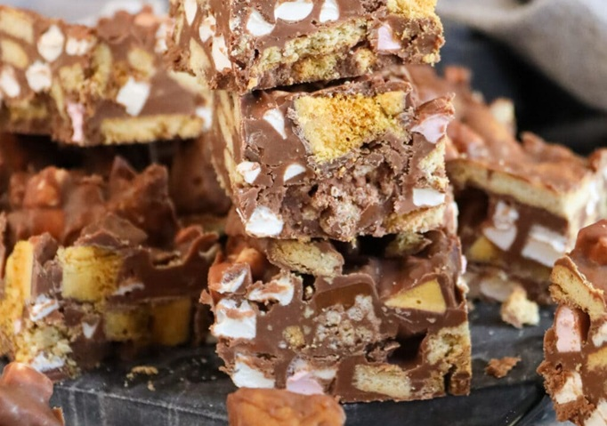

# Rocky Road

*Rocky road is the no-bake chocolate slab where chunks of biscuit and marshmallow sit in a glossy, set-chocolate matrix. Every household has its own version: this one keeps it British, with digestives for the crunch, mini marshmallows for the bounce, and crushed Crunchie bars for the honeycomb hit.*

**Makes:** 16 squares

**Prep Time:** 15 minutes (plus 2 hours chilling)

## Overview
A no-bake fridge slab built on milk chocolate, butter and golden syrup, studded with crushed digestives, mini marshmallows and pieces of honeycomb chocolate bar (Crunchie in the UK; Violet Crumble or Cadbury Crunchie elsewhere). Originally an American boy-scout campfire treat with marshmallow and graham cracker, the rocky road crossed the Atlantic in the 1980s and got reworked into something stranger and sweeter: British digestives instead of graham, honeycomb bar instead of cocoa powder, and golden syrup blended into the chocolate base to keep the slab pliable straight from the fridge rather than splintering when cut. Every household has its own version (some add glacé cherries, some swap the honeycomb for Maltesers, some go for dark chocolate), but the core formula is fixed: a chocolate matrix that sets glossy, three textural contrasts (biscuit crunch, marshmallow bounce, honeycomb crackle), and a slab cut into squares for the lunchbox or the bake sale.

## Ingredients

### Chocolate base
- 400 g milk chocolate (broken into pieces)
- 125 g golden syrup
- 125 g unsalted butter

### Mix-ins
- 100 g mini marshmallows
- 200 g digestive biscuits (roughly chopped)
- 200 g honeycomb chocolate bar (chopped, e.g. Crunchie)

## Method

### Stage 1 - Melt the chocolate
1. Line a 9-inch (23 cm) square tin with parchment paper, leaving an overhang on two sides for easy lift-out later.
1. Combine the chocolate, golden syrup and butter in a heatproof bowl.
1. Set the bowl over a pan of simmering water (don't let the bowl touch the water) and stir gently until everything has melted into a smooth, glossy mixture.
1. Alternatively, microwave in 30-second bursts at medium power, stirring between each, until melted.

### Stage 2 - Fold in the mix-ins
1. Take the bowl off the heat and let the chocolate cool for a couple of minutes so the marshmallows don't immediately melt.
1. Add the mini marshmallows, chopped digestives and chopped Crunchie bars.
1. Fold gently with a spatula until everything is coated in chocolate.

### Stage 3 - Set
1. Tip the mixture into the lined tin and press down with the back of a spoon to level the surface.
1. Refrigerate for at least 2 hours, until firm.
1. Lift out using the parchment overhang, peel off the paper, and cut into 16 squares.

## Notes
- **Cool the chocolate first:** Marshmallows shrink and melt if folded into hot chocolate; let it sit until barely warm to the touch. The biscuits don't care.
- **Honeycomb bar choice:** Crunchie is the classic; Cadbury Daim or any honeycomb-set chocolate works. Avoid soft toffee bars, they go gooey rather than crunchy.
- **Golden syrup, not corn syrup:** Golden syrup brings a buttery caramel note that's the bedrock of British rocky road; light corn syrup makes the slab sweeter and one-note.
- **Don't over-press:** Pressing too firmly compacts the marshmallows and squeezes the chocolate out around the edges. A gentle level is enough.

## Variations
- **Dark chocolate:** Swap the milk chocolate for 70% dark, or use half-and-half for a less sweet, more grown-up version.
- **Glace cherries:** Add 100 g chopped glace cherries with the marshmallows for a kitsch retro twist.
- **Pretzel rocky road:** Replace half the digestives with broken salted pretzels for a sweet/salty version.
- **White chocolate ripple:** Drizzle melted white chocolate over the top before chilling and run a knife through to swirl.

## Storage
- Keeps for up to 2 weeks in an airtight container in a cool place.
- Refrigerate in warmer weather; the chocolate softens above about 22°C.
- Freezes well for up to 3 months wrapped tightly; defrost in the fridge.
