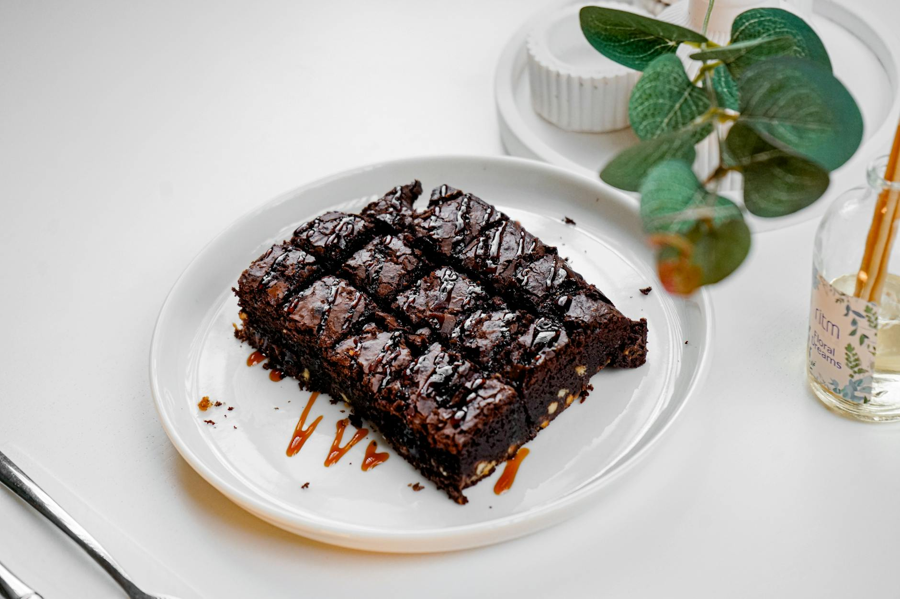

# Salted Caramel Brownies

*The dense, fudgy chocolate brownie with a stovetop salted-caramel rippled through it. Half a tin of soft caramel swirled into the batter just before the bake; a final scatter of flaky sea salt on top. Cut into thick squares; eat warm with vanilla ice cream or cold the next day.*

**Serves:** 16 squares

**Prep Time:** 20 minutes (plus 10 minutes for the caramel)

**Cook Time:** 32 minutes

## Overview
Salted caramel brownies are the American dessert that turned the bakery counter on its ear in the early 2010s, when pastry chefs across the country started rippling stovetop caramel through fudgy brownie batter and the combination spread out into every bake-sale rotation. You build the brownie base on the traditional American formula: dark chocolate and butter melted, sugar and eggs beaten light, the chocolate folded in, flour and cocoa folded just to combine. The caramel is a separate stovetop job (sugar caramelised dry, butter and cream whisked in, salt at the end) and wants to be pourable but thick enough to ribbon, so it sits visible rather than disappearing into the batter. Dollop it on the brownie in the tin and pull a skewer through in figure-eights for the marbled look. Bake until just-set with a tremble in the centre, scatter flaky salt across the top while still warm so it sticks, cool fully before slicing. Eat warm with vanilla ice cream or cold the next day.

## Ingredients

### The brownie batter
- 200 g dark chocolate (70%, broken into pieces)
- 175 g unsalted butter (cubed)
- 280 g caster sugar
- 3 large eggs
- 1 teaspoon vanilla extract
- 100 g plain flour
- 30 g cocoa powder
- A pinch of fine sea salt

### The salted caramel
- 100 g caster sugar
- 60 g unsalted butter
- 60 ml double cream
- ½ teaspoon flaky sea salt

### To finish
- A small pinch of flaky sea salt (extra, to scatter on top)

## Method

### Stage 1 - Make the caramel
1. In a wide heavy-bottomed pan, heat the sugar over a medium heat. Don't stir - let it melt on its own, gently tilting the pan once or twice to even the colour. After 5-7 minutes, the sugar will be a deep amber liquid.
2. Off the heat, add the butter all at once. It will bubble violently; whisk to combine.
3. Pour in the double cream - again it bubbles. Whisk until smooth.
4. Stir in the flaky salt. Pour into a heatproof bowl and set aside to thicken while you make the brownie batter.

### Stage 2 - Prep
1. Heat the oven to 160°C fan / 180°C / 350°F. Line a 23 cm square tin with baking paper, leaving overhang for lift-out.

### Stage 3 - Melt the chocolate
1. Combine the dark chocolate and butter in a heatproof bowl. Set over a pan of barely simmering water (bowl not touching the water) and stir until smooth and glossy.
2. Take off the heat and let cool for 5 minutes.

### Stage 4 - Whisk the eggs
1. In a separate large bowl, whisk the sugar and eggs together with an electric mixer for 4-5 minutes, until the mixture is pale, thick and falls in a slow ribbon from the whisk. This step matters: it gives brownies their characteristic crackly top.
2. Whisk in the vanilla.

### Stage 5 - Combine
1. Pour the cooled chocolate-butter mixture into the eggs in three additions, folding gently with a spatula between each. Don't deflate the mixture.
2. Sift the flour, cocoa and salt over the surface. Fold in until just combined - no streaks of flour. Stop folding the second it's uniform; over-mixing makes cakey brownies.

### Stage 6 - Layer in the caramel
1. Pour the batter into the prepared tin and smooth the top.
2. Dollop half the caramel in spoonfuls across the surface - about 8-10 small piles.
3. Drag a skewer or a butter knife through the caramel in long S-curves to swirl it through the top 1 cm of the batter. Don't over-mix; you want visible swirl ribbons, not a uniform colour. Reserve the other half of the caramel for drizzling later.

### Stage 7 - Bake
1. Bake for 28-32 minutes. The top should look set and slightly crackled, but the centre should wobble very faintly when the tin is tapped. A skewer inserted 2 cm from the edge should come out with a few moist crumbs; the centre will be wetter.
2. Cool in the tin to room temperature, then refrigerate for at least 4 hours (overnight is ideal). The fridge sets the fudgy interior so it slices cleanly.

### Stage 8 - Slice and finish
1. Lift the slab out using the paper. Warm the reserved caramel briefly until pourable. Drizzle in zigzag lines across the top.
2. Scatter with flaky sea salt while the caramel is still wet so it sticks.
3. Cut into 16 squares with a long sharp knife dipped in hot water and wiped dry between cuts.

## Notes
- **Brown sugar vs caster**: caster gives the cleanest crackly top. Light brown sugar deepens the flavour but yields a less shiny finish - use 50/50 if you prefer the molasses note.
- **Under-bake on purpose**: brownies firm up considerably as they cool. Pulling them out when the centre still trembles gives the fudge texture; baking until clean-skewer gives cake.
- **Caramel sets fast**: if the caramel cools too much to dollop and swirl, warm briefly in the microwave or over a low flame to loosen.
- **No-fridge alternative**: cool for 2 hours at room temperature minimum. The slab is tackier and harder to slice but still good.

## Serving
A square on a small plate, with vanilla ice cream or unsweetened crème fraîche to cut the richness. Strong coffee on the side. Warm slightly in the microwave (10 seconds) for the molten-caramel revival.

## Storage
- Airtight tin at cool room temperature for 4 days.
- Refrigerate in warm kitchens; the caramel softens in heat.
- Freeze individual squares wrapped in cling film, then in a bag, for up to 2 months. Defrost in the fridge overnight.
