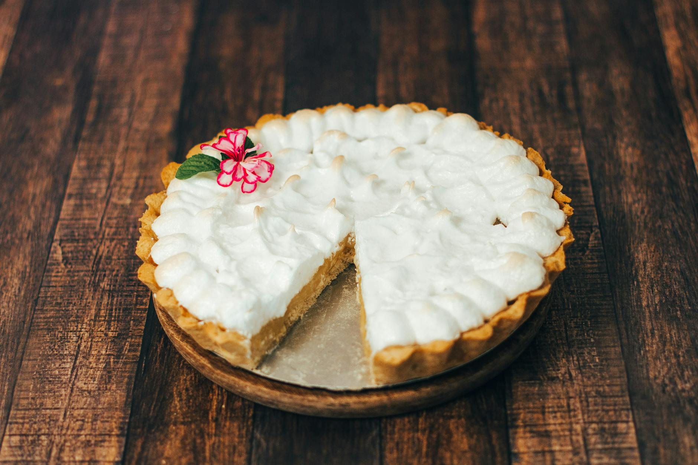

# Sweet Potato Pie

*The Southern Thanksgiving pie that crosses every African-American holiday table, Kwanzaa included. Smoother, lighter and more aromatic than pumpkin: roasted sweet potato whipped with butter, eggs, brown sugar and a quiet handful of spices, in an all-butter shortcrust shell.*

**Serves:** 8

**Prep Time:** 30 minutes (plus 1 hour chilling)

**Cook Time:** 1 hour 15 minutes

## Overview
The sweet potatoes are roasted whole until the flesh collapses and the sugars caramelise around the seam - never boiled, which dilutes them. The flesh is whipped warm with butter, evaporated milk, eggs, brown sugar, cinnamon, nutmeg and a splash of bourbon (optional, but classical). Poured into a chilled all-butter shortcrust shell and baked low and slow until the centre sets with a faint wobble. Cooled to barely-warm and dusted with icing sugar, or topped with whipped cream.

## Ingredients

### The shortcrust
- 200 g plain flour
- 1 tablespoon caster sugar
- A small pinch of fine sea salt
- 120 g cold unsalted butter (cubed)
- 4-5 tablespoons ice-cold water

### The filling
- 700 g sweet potatoes (about 2 medium)
- 60 g unsalted butter (softened)
- 150 g soft dark brown sugar
- 2 large eggs
- 200 ml evaporated milk
- 1 teaspoon vanilla extract
- 1 ½ teaspoons ground cinnamon
- ½ teaspoon ground nutmeg
- ½ teaspoon ground ginger
- ¼ teaspoon ground cloves
- 1 tablespoon bourbon (optional)
- A small pinch of fine sea salt

### To finish
- 1 tablespoon icing sugar (for dusting)

## Method

### Stage 1 - Make the pastry
1. Tip the flour, sugar and salt into a wide bowl. Rub in the cold butter with your fingertips until the mixture looks like coarse breadcrumbs with a few pea-sized lumps still visible.
2. Add the water a tablespoon at a time, stirring with a butter knife, until the dough just comes together. Press into a flat disc, wrap, and chill for at least 30 minutes.
3. Roll out on a lightly floured surface to a 28 cm round and line a 23 cm pie dish. Crimp the edges. Prick the base lightly with a fork and chill while the oven heats.

### Stage 2 - Roast the sweet potatoes
1. Heat the oven to 200°C fan / 220°C / 425°F.
2. Prick the sweet potatoes all over and place on a baking tray lined with foil. Roast for 50-60 minutes, until they collapse when squeezed and a knife slides through with no resistance. The seams should be sticky with darkened sugar.
3. Cool until you can handle them, then slit open and scoop the flesh into a bowl. You should have about 500 g of cooked flesh.

### Stage 3 - Blind bake the shell
1. Drop the oven to 180°C fan / 200°C / 400°F.
2. Line the pie shell with baking paper and fill with baking beans or dried rice. Bake for 15 minutes, then lift out the paper and beans and bake for another 5 minutes until the base looks dry and pale gold. Set aside.

### Stage 4 - Mix the filling
1. While the shell is baking, whip the sweet potato flesh with the butter using a hand whisk or stand mixer for 1-2 minutes - you want light and fluffy, not gluey, so keep it short.
2. Beat in the brown sugar, then the eggs one at a time. Add the evaporated milk, vanilla, all the spices, bourbon if using, and salt. Whisk until smooth and a single colour. The mixture should be the consistency of thick pouring custard.

### Stage 5 - Bake
1. Drop the oven to 160°C fan / 180°C / 350°F.
2. Pour the filling into the part-baked shell. Bake for 50-55 minutes, until the centre has set with a slight wobble at the very middle and the surface looks matte rather than wet. A skewer pushed in 3 cm from the edge should come out clean.
3. Cool in the tin to room temperature, at least 2 hours. Trying to slice the pie warm yields a mess; cooled, it slices cleanly.

### Stage 6 - Serve
1. Dust the top with icing sugar just before serving.

## Notes
- A whipped cream or vanilla ice cream on the side is the conventional finish.
- For a deeper colour and flavour, swap 50 g of the brown sugar for treacle.
- The pie keeps better in the fridge than at room temperature once the filling sets; pull it out 20 minutes before serving so the slice is not fridge-cold.

## Serving
A wedge with a generous spoon of softly whipped cream, slowly. Coffee or sweet tea on the side. On a Kwanzaa karamu table, sliced and passed around alongside pecan pralines and bread pudding.

## Storage
Covered in the fridge for up to 4 days. Do not freeze: the filling weeps on thawing.
