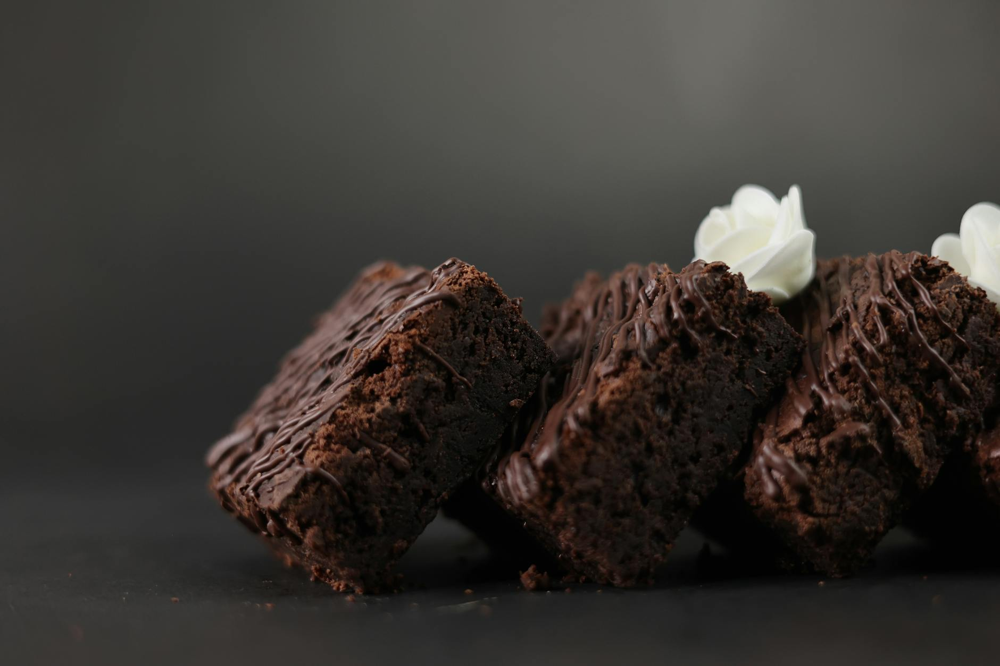

# Triple Chocolate Brownies

*The brownie loaded with three kinds of chocolate. Dark chocolate melted into the batter for depth; milk-chocolate chunks folded through for the meltable pockets; white-chocolate chunks scattered on top so they brown to caramel-flecked nubs. Crackly top, fudgy interior, three textures in one bite.*

**Serves:** 16 squares

**Prep Time:** 15 minutes

**Cook Time:** 30 minutes

## Overview
A fudgy brownie batter built on dark chocolate and butter, lightened with whisked eggs and sugar. The texture comes from chopping each of the three chocolates by hand — different sizes give different melts. Dark chocolate goes into the batter (melted); milk chocolate gets folded through in 1 cm chunks (which stay molten in the centre when warm, set into chewy nuggets when cool); white chocolate gets scattered on top (where it browns at the edges and stays gooey at the centre). Cooled fully before slicing.

## Ingredients

### The batter
- 200 g dark chocolate (70%, broken into pieces)
- 200 g unsalted butter (cubed)
- 250 g caster sugar
- 4 large eggs
- 1 teaspoon vanilla extract
- 100 g plain flour
- 30 g cocoa powder
- A small pinch of fine sea salt

### The chocolate chunks
- 100 g milk chocolate (chopped into 1 cm chunks)
- 100 g white chocolate (chopped into 1 cm chunks)

## Method

### Stage 1 - Prep
1. Heat the oven to 160°C fan / 180°C / 350°F. Line a 23 cm square tin with baking paper, leaving overhang for lift-out.
2. Chop each of the chocolate chunks into rough 1 cm pieces. Uniform sizes are less interesting than varied ones — some bigger, some smaller is what you want.

### Stage 2 - Melt the dark chocolate base
1. Combine the dark chocolate and butter in a heatproof bowl. Set over a pan of barely simmering water (bowl not touching the water). Stir until smooth and glossy. Take off the heat and cool for 5 minutes.

### Stage 3 - Whisk the eggs
1. In a separate large bowl, whisk the sugar and eggs with an electric mixer for 4-5 minutes — until pale, thick, and trailing in a slow ribbon from the whisk. This step is what gives brownies their crackly top.
2. Whisk in the vanilla.

### Stage 4 - Combine
1. Pour the cooled chocolate-butter into the egg mixture in three additions, folding gently with a spatula between each. The batter should be glossy and smooth.
2. Sift the flour, cocoa and salt over the top. Fold in until just combined — stop the second no streaks remain.
3. Fold in three-quarters of the milk chocolate chunks. Reserve the rest for the top.

### Stage 5 - Layer and bake
1. Pour the batter into the prepared tin and smooth the top.
2. Scatter the reserved milk-chocolate chunks and all the white-chocolate chunks across the surface, pressing each one in slightly so they sit half-submerged.
3. Bake for 28-32 minutes. The top should be set with the characteristic crackly sheen; the centre should wobble very faintly when tapped. The white chocolate on top will have started browning at the edges — golden patches on the lighter chunks are the visual cue that the brownies are done.
4. Cool completely in the tin (at least 2 hours; overnight in the fridge is better). Brownies set as they cool — slicing while warm gives a torn mess.

### Stage 6 - Slice
1. Lift out using the baking-paper overhang. Cut into 16 squares with a long sharp knife dipped in hot water and wiped dry between cuts.

## Notes
- **Chunks not chips**: chocolate chips are made to hold their shape in baking. Chopped chocolate (whether from a bar or a block) melts and oozes and gives the gooey pocket texture that defines a good brownie. Chips fight the texture you want.
- **Cocoa solids matter**: 70% dark chocolate in the base gives the dark backdrop. Going lower (50-60%) makes the brownies overly sweet against the chunks; going higher (85%+) gives a bitter edge that some prefer.
- **White chocolate on top, not in the batter**: white chocolate's sugar makes it bake too sweetly when folded through. On top, the heat caramelises the surface and keeps the inside soft — best of both.
- **Under-bake intentionally**: brownies firm considerably as they cool. Pulling them with a faint centre wobble gives the fudge texture; baking to clean-skewer gives cake.

## Serving
Warm with a scoop of vanilla ice cream and a drizzle of cream — the chunks are still slightly molten. Or cold from the fridge with strong coffee — the chunks are chewy nuggets.

## Storage
- In an airtight tin at room temperature for 4 days.
- Refrigerate in warm kitchens to keep the chunks firm.
- Freeze individual squares wrapped tightly for up to 3 months. Defrost in the fridge overnight.
