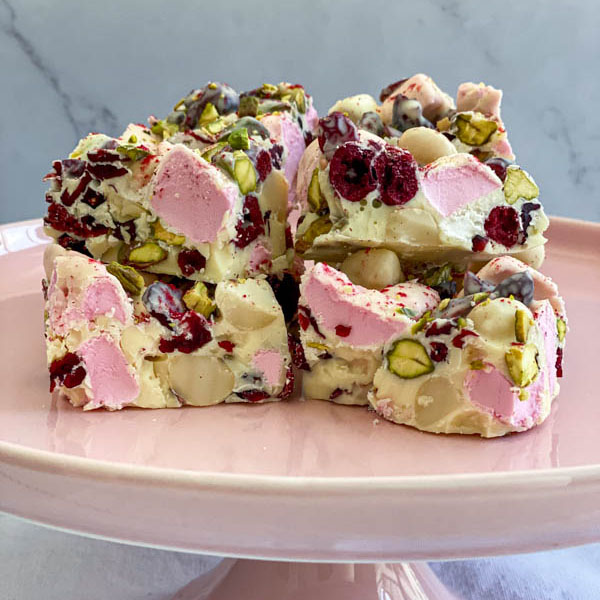

# White Chocolate Rocky Road

*The rocky road gone pale. White chocolate base in place of milk, dried cranberries instead of glace cherries, chopped pistachios for the green flecks, mini marshmallows held throughout. Lighter and fruitier than the classic; festive without trying too hard.*

**Makes:** 16 squares

**Prep Time:** 15 minutes (plus 2 hours chilling)

## Overview
The standard rocky road structure (chocolate-butter-syrup base, biscuit chunks, marshmallows, mix-ins) with the colour palette reversed. White chocolate is sweeter and softer-set than milk, so the proportions tilt slightly: less syrup, a touch of double cream for the set, more biscuit for structure. Dried cranberries replace glace cherries (less sticky, brighter colour); shelled pistachios bring green flecks; mini marshmallows go in as standard. Set in the fridge, drizzled with melted dark chocolate for the contrast, cut into squares.

## Ingredients

### The base
- 350 g good-quality white chocolate (broken into pieces)
- 75 g unsalted butter
- 75 g golden syrup
- 60 ml double cream
- A small pinch of fine sea salt
- 200 g digestive biscuits (roughly chopped, not powdered)
- 80 g mini marshmallows
- 80 g dried cranberries
- 60 g shelled pistachios (roughly chopped)

### The drizzle
- 50 g dark chocolate (70%)

## Method

### Stage 1 - Prep
1. Line a 20 cm square tin with baking paper, leaving overhang on two sides for lift-out.

### Stage 2 - Crush the biscuits
1. Place the digestives in a sealed freezer bag. Bash with a rolling pin to coarse chunks - some pieces should still be 2 cm across, others crushed smaller. Don't reduce to crumbs.

### Stage 3 - Melt the white chocolate base
1. Combine the white chocolate, butter, golden syrup, double cream and salt in a heatproof bowl. Set over a pan of barely simmering water (bowl not touching the water).
2. Stir gently until smooth and glossy. White chocolate scorches faster than milk or dark - keep the heat very low and stir continuously.
3. Take off the heat as soon as the last lumps disappear. Cool for 5 minutes - the mixture should still be pourable but starting to thicken.

### Stage 4 - Combine
1. Add the chopped biscuits, marshmallows, dried cranberries and chopped pistachios to the cooled chocolate mixture.
2. Fold gently with a spatula - turn from the bottom rather than stirring vigorously, to keep the marshmallows whole and the biscuit chunks intact.
3. Once everything is coated, tip into the prepared tin. Press down firmly with the back of a spoon to compact, but leave the surface deliberately uneven - that's the look.

### Stage 5 - Drizzle
1. Melt the dark chocolate in a heatproof bowl over the pan (or 30-second bursts in the microwave).
2. Spoon into a small piping bag (or a sandwich bag with the corner snipped). Pipe in random S-curves and squiggles across the surface.
3. Refrigerate immediately to set the chocolate before it pools.

### Stage 6 - Chill and slice
1. Refrigerate for at least 2 hours, until firmly set.
2. Lift out using the baking-paper overhang. Let the slab come to room temperature for 5 minutes before cutting - fridge-cold white chocolate cracks under the knife.
3. Cut into 16 squares with a long sharp knife dipped in hot water and wiped dry between cuts.

## Notes
- **White chocolate quality matters**: cheap white chocolate is hyper-sweet and scorches at the slightest warmth. A good-quality white (35%+ cocoa butter) sets to a creamier, less aggressive sweetness.
- **Double cream not single**: the cream tightens the set so the bars hold their shape at room temperature. Single cream gives a softer, almost ganache-like consistency that needs constant refrigeration.
- **Pistachio substitution**: chopped toasted almonds work and stay pale; macadamias give a luxurious mouthfeel; hazelnuts skew towards praline. Pistachios are visually best for the colour contrast.
- **Christmas variant**: replace the pistachios with chopped glace cherries and add 2 tablespoons of mince meat (the dried-fruit type used in mince pies) folded in. Skip the dark drizzle and use Christmas sprinkles instead.

## Serving
On a plate at room temperature. The slab is sweeter than the milk-chocolate version - a smaller square per person is plenty. Hot tea cuts through the richness better than coffee.

## Storage
- Airtight tin at cool room temperature for up to 10 days. Refrigerate in warm kitchens; white chocolate softens quickly above 22°C.
- Freezes for 2 months wrapped tightly. Defrost in the fridge to prevent the chocolate from sweating.
