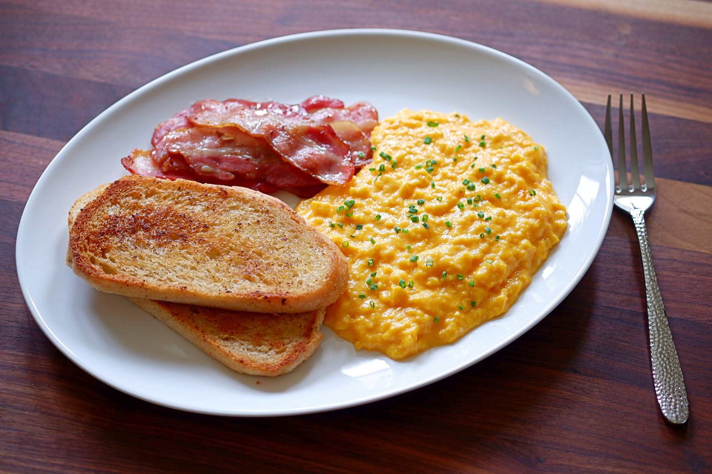

# Fry Bread with Scrambled Eggs and Bacon

*Native American fry bread, hot and crisp from the pan, piled with soft-scrambled eggs and crisp bacon. A weekend breakfast plate that started as Navajo hardship food and became one of the great American breads.*

**Serves:** 2

**Prep Time:** 15 minutes (plus 30 minutes dough rest)

**Cook Time:** 15 minutes

## Overview
Fry bread is the Navajo flatbread born of the forced relocation of the 1860s, when the US government issued flour, lard and baking powder to displaced families with no traditional way to use them. Out of that came a thin yeastless dough, patted out by hand and shallow-fried in hot oil until it puffs deep gold and crisp at the edges. It's the soul of the modern Native American kitchen and the foundation of the Navajo taco. Here it carries a weekend breakfast: scrambled eggs cooked gently in bacon fat, with the crisp bacon slices alongside, all piled on a piece of fry bread torn at the table. The dough rests thirty minutes before frying so the gluten relaxes; the patted-out rounds should be soft and supple, like a marshmallow.

## Ingredients

### Fry bread
- 170 g plain flour, plus extra for dusting
- 1 teaspoon baking powder
- ½ teaspoon kosher salt
- 120 ml warm water (plus more as needed)
- 2 tablespoons rapeseed oil, plus oil for frying

### Scrambled eggs and bacon
- 4 slices thick-cut bacon
- 4 large eggs
- 60 ml whole milk
- Kosher salt and freshly ground black pepper

## Method

### Stage 1 - Mix the fry bread dough
1. In a bowl, whisk the flour, baking powder and salt together.
2. Make a small well in the centre; pour in the warm water and the 2 tablespoons of oil.
3. Stir with your hand until the dough comes together, adding more warm water or flour as needed for a soft dough that isn't sticky.
4. Knead briefly, about 2 minutes; the dough should be soft and supple, like a marshmallow.
5. Cover the bowl with a tea towel and rest 30 minutes at room temperature.

### Stage 2 - Shape the rounds
1. Lightly dust the work surface with flour.
2. Divide the dough into 4 equal pieces (about 70 g each).
3. Pat and pull each piece into a 15 cm round.
4. Cover the rounds with the tea towel while you heat the oil.

### Stage 3 - Fry the bread
1. Line a baking sheet with paper towels.
2. In a 25 cm cast-iron pan over medium heat, warm 1 cm of oil to 180°C on a deep-frying thermometer.
3. Fry one round at a time, turning once or twice with tongs, until deep golden and cooked through - 1 ½ to 2 minutes total.
4. Lift to the lined sheet to drain.
5. Repeat with the remaining rounds.
6. Keep warm in a 95°C oven if you like.

### Stage 4 - Crisp the bacon
1. In a non-stick frying pan over medium-low heat, cook the bacon strips, turning as needed, until crisp - about 6 minutes.
2. Lift to paper towels to drain.
3. Pour off all but 2 tablespoons of the bacon fat from the pan.

### Stage 5 - Soft-scramble the eggs
1. In a bowl, whisk the eggs with the milk, a pinch of salt and a grind of pepper.
2. Reduce the heat under the bacon pan to low.
3. Pour in the eggs.
4. Stir gently with a spatula, drawing the cooked edges into the centre, until the eggs are barely set - about 2-3 minutes. They keep cooking on the plate.

### Stage 6 - Plate
1. Set one or two fry bread rounds on each plate.
2. Spoon the soft eggs over.
3. Lay the bacon alongside.
4. Eat immediately, tearing the fry bread to scoop up the eggs.

## Notes
- **Dough should feel marshmallow-soft:** Too dry and the bread fries up dense; too wet and it spits in the oil. Adjust water by the teaspoon if needed.
- **Oil temperature matters:** Too cool and the bread sucks up oil; too hot and the outside burns before the inside cooks. 180°C on a thermometer.
- **Low heat for the eggs:** Soft scrambled eggs are a low-heat patience job. Pull them just before they look done; carry-over cooking in the pan finishes them.

## Storage
- Fry bread is best fresh and hot. Leftover bread reheats reasonably well in a 200°C oven for 4 minutes.
- Cooked eggs don't keep well; reheating turns them rubbery.
