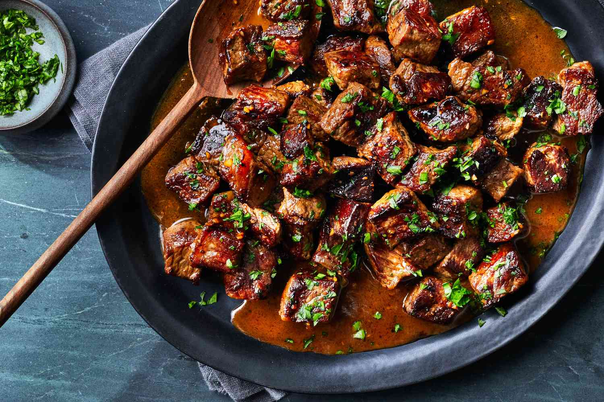

# Garlic Butter Steak Bites

*New York strip cubed and seared hard in foaming butter with crushed garlic; medium-rare in the middle, deep brown crust outside, scattered with parsley. Ten minutes start to finish in a hot cast-iron pan.*

**Serves:** 6-8 as a starter, 4 as a main

**Prep Time:** 5 minutes

**Cook Time:** 10 minutes

## Overview
The fastest steak dinner that delivers on every count: a thick boneless New York strip cut into 2.5 cm cubes, tossed with salt and pepper, dropped into a screaming-hot cast-iron pan with butter and crushed garlic, and stirred just enough to brown all sides while leaving the middle pink. Total cook time is about three minutes from when the meat hits the pan. The butter foams, browns, and bastes the steak as it sears; the garlic perfumes the fat without burning if you add it after the first flip. Parsley scattered over at the end is the only finish needed. Serve straight from the pan with crusty bread, or pile onto a salad, or skewer with cocktail sticks as a passed appetiser at a party.

## Ingredients
- 1 kg New York strip steak (trimmed and cut into 2.5 cm cubes)
- Kosher salt and freshly ground black pepper
- 60 g unsalted butter
- 4 garlic cloves (crushed)
- Chopped fresh flat-leaf parsley, for garnish (optional)

## Method

### Stage 1 - Season the cubes
1. Place the steak cubes in a bowl.
2. Season generously with salt and pepper.
3. Toss to coat each cube.

### Stage 2 - Heat the pan
1. Set a large cast-iron frying pan over medium-high heat for 3-4 minutes until it just begins to smoke.
2. Add half the butter; let it foam.

### Stage 3 - Sear hard, one side
1. Add the steak cubes in a single layer (work in two batches if the pan is small - crowding steams instead of sears).
2. Sear undisturbed 2 minutes until the bottoms are deeply browned.

### Stage 4 - Flip and add the garlic
1. Flip the cubes with tongs.
2. Add the crushed garlic to the pan.
3. Sear the second side 1-2 minutes.

### Stage 5 - Finish with butter
1. Add the remaining butter to the pan.
2. Stir gently, spooning the foaming butter over the cubes, until medium-rare and the butter is nut-brown - 30 to 60 seconds.

### Stage 6 - Serve
1. Transfer the cubes to a warm plate.
2. Spoon over the pan butter.
3. Scatter with parsley if using.
4. Serve immediately - the cubes carry on cooking from residual heat.

## Notes
- **Pan hot enough to smoke:** A cold pan gives grey steamed cubes. The pan should just begin to smoke before the meat goes in.
- **Don't crowd the pan:** Two batches in the same pan beats one crowded batch every time. Crowding drops the temperature and the meat releases water that boils away the sear.
- **Garlic after the flip:** Crushed garlic burns in 90 seconds in a hot dry pan. Adding it at the flip gives just enough time to perfume the butter without going bitter.

## Storage
- Best fresh from the pan.
- Leftover cubes refrigerate 2 days; eat cold in a sandwich or warm gently in the leftover pan butter.
