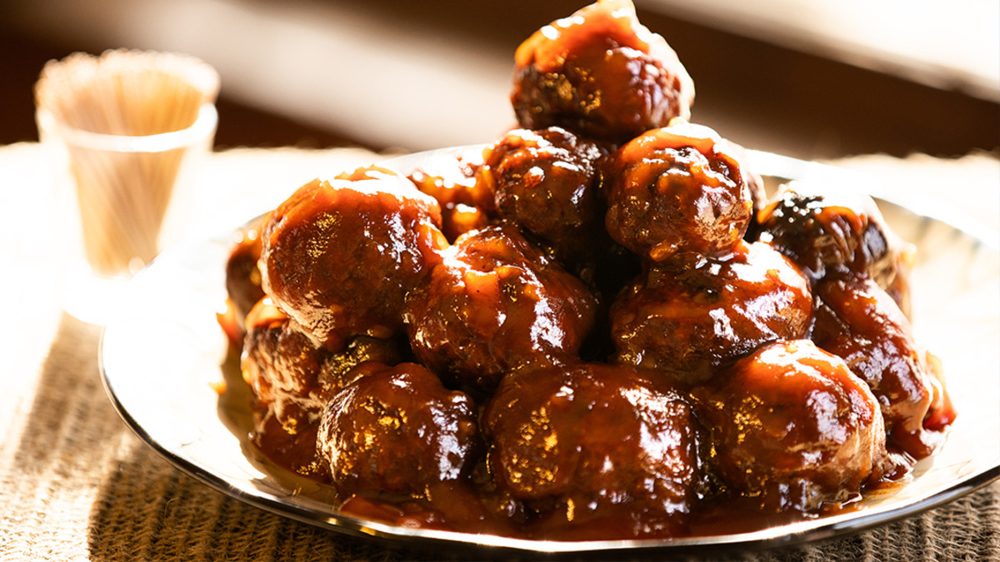

# Glazed Venison Meatballs

*Ground venison meatballs studded with bacon, baked till just done, then rolled in a cranberry-orange-mustard glaze made from pan-reduced stock and red wine sherry. Hunter's-table comfort with a Thanksgiving accent.*

**Serves:** 4-6

**Prep Time:** 30 minutes

**Cook Time:** 30 minutes

## Overview
Venison is leaner than beef and benefits from the fat that streaky bacon brings, so the meatballs here mix ground venison with finely minced thick-cut bacon plus an egg and breadcrumbs to hold it all together. They bake at high heat on an oiled tray until just browned and cooked through; meanwhile a sweet-sharp glaze comes together on the hob from shallot softened in butter, a splash of dry sherry, beef stock, orange juice and zest, cranberry preserve and Dijon mustard. The sauce gets puréed smooth and reduced briefly until it coats the back of a spoon. The baked meatballs go into the warm glaze for a final two minutes of turning so each one picks up a glossy mahogany lacquer. A natural for a holiday platter; equally good as a weeknight main over polenta or buttered noodles.

## Ingredients

### Cranberry-orange glaze
- 2 tablespoons unsalted butter
- 1 large shallot (finely chopped)
- 2 tablespoons dry sherry
- 120 ml beef stock
- Grated zest of ½ orange
- 60 ml fresh orange juice
- 140 g cranberry preserve (or redcurrant jelly)
- 1 teaspoon Dijon mustard
- ¼ teaspoon cayenne pepper (optional)

### Meatballs
- Olive oil, for brushing
- 1 tablespoon unsalted butter
- ½ small yellow onion (finely chopped)
- 450 g ground venison
- 2 slices thick-cut bacon (finely minced)
- 1 large egg (beaten)
- 40 g fresh white breadcrumbs
- 2 tablespoons chopped fresh flat-leaf parsley, plus more for garnish
- Kosher salt and freshly ground black pepper
- A pinch of cayenne pepper (optional)

## Method

### Stage 1 - Build the glaze
1. Melt the butter in a saucepan over medium-low heat.
2. Add the shallot; cook 3 minutes, stirring, until lightly golden.
3. Pour in the sherry; simmer 1 minute.
4. Stir in the stock, orange zest and juice; bring to a boil, then reduce to medium and simmer 3 minutes until slightly reduced.
5. Stir in the cranberry preserve, mustard and cayenne (if using); simmer 1 minute; off the heat.

### Stage 2 - Purée and finish
1. Purée the sauce with an immersion blender (or in a standard blender) until smooth.
2. Return to the saucepan over medium heat; cook 1 minute more, stirring, until the glaze thickens enough to coat the back of a spoon.
3. Off the heat; set aside.

### Stage 3 - Sweat the onion
1. Preheat the oven to 230°C.
2. Line a baking sheet with parchment; brush the parchment generously with olive oil.
3. In a 25 cm cast-iron pan over medium heat, melt the 1 tablespoon butter.
4. Add the chopped onion; cook 5 minutes, stirring, until tender.
5. Tip into a large bowl and cool slightly. Keep the pan handy for the final glazing step.

### Stage 4 - Mix the meatballs
1. Add the ground venison, minced bacon, beaten egg, breadcrumbs and parsley to the bowl with the cooled onion.
2. Season with 1 teaspoon salt, ½ teaspoon black pepper and a pinch of cayenne (if using).
3. Mix gently with your hands; just enough to bring it together.

### Stage 5 - Shape and bake
1. Scoop about 2 tablespoons of mixture (40 g) and roll between your palms into a golf-ball-sized meatball. Don't pack tight - just enough to hold its shape.
2. Place on the oiled parchment, spaced apart. You should get 16 meatballs.
3. Drizzle the meatballs with a little more olive oil.
4. Bake 15 minutes, turning once halfway, until browned and cooked through.

### Stage 6 - Glaze
1. Transfer the baked meatballs to the reserved cast-iron pan.
2. Pour the warm glaze over them.
3. Set the pan over medium heat; turn the meatballs gently in the sauce 2 minutes until each is coated and shiny.

### Stage 7 - Serve
1. Tip onto a warm platter.
2. Scatter with fresh parsley.

## Notes
- **Bacon for fat:** Venison is lean enough to dry out without help. Finely minced bacon distributes the fat through the mixture; lardons would stay in clumps.
- **Bake then glaze:** Cooking the meatballs through in the oven first, then dipping them in the glaze, gives you a clean glossy coating without the sauce thinning out from raw-meat juices.
- **Glaze sweetness:** Cranberry preserves vary in sugar content. Taste the finished glaze; add a teaspoon more mustard or a squeeze of lemon if it's too sweet for your liking.

## Storage
- Refrigerates 3 days; reheat gently in the leftover glaze.
- Freezes 2 months; thaw in the fridge before reheating.
