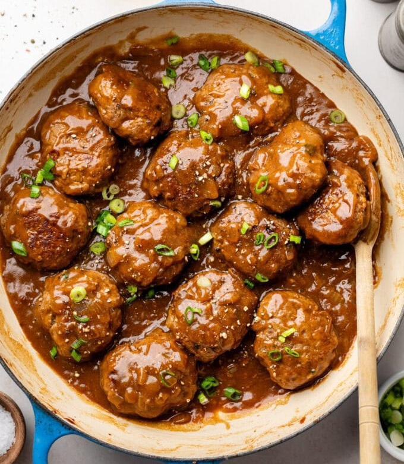

# Hamburger Steaks with Onion Gravy

*Southern comfort food: seasoned ground beef patties browned hard, then simmered in a rich beef-and-onion gravy from a Lipton Beefy Onion soup packet. Pairs with mashed potatoes and peas; a workday "Salisbury steak" that doesn't apologise for being simple.*

**Serves:** 6

**Prep Time:** 15 minutes (plus 1 hour resting)

**Cook Time:** 25 minutes

## Overview
American Southern diner food and a close cousin of "Salisbury steak": browned ground beef patties simmered in a thick brown gravy of slow-cooked onions, beef broth and (the small unembarrassed shortcut) a Lipton Beefy Onion soup packet that does the work of a long-built stock without taking the time. The packet is the dish's signature; carries glutamate depth and dried-onion concentrate that gives the gravy its diner-counter character. Around it, the patties are seasoned bigger than a regular burger, Cajun seasoning, Sazon, garlic paste, Worcestershire, a touch of maple syrup or honey for sweet undertone, so the meat itself carries flavour even before the gravy hits it. The result is salty-savoury-rich, with sweet caramelised onion bite-pieces in the gravy and a meaty depth that just goes on. Smell is browning beef, onions, and gravy. Genuinely easy and a forgiving dinner; the only thing that ruins it is overworking the beef mince (which makes the patties tough). The pairing with mashed potatoes and peas is the Southern Sunday-lunch convention and the way the dish is usually plated.

## Ingredients

### Patties
- 900 g (2 lbs) ground beef (85/15)
- ¼ cup chopped scallions (plus more to garnish)
- 1 tablespoon Cajun seasoning
- 1 packet Sazon seasoning (~1 ½ teaspoons)
- 1 tablespoon garlic paste
- 1 tablespoon Worcestershire sauce
- 1 tablespoon maple syrup (or honey)
- 1 teaspoon dried minced onion

### Onion gravy
- 2 tablespoons olive (or avocado oil)
- 1 yellow onion (medium, roughly chopped)
- 1 packet Lipton Beefy Onion soup mix
- 2 tablespoons plain flour
- 480 ml beef broth

## Method

### Stage 1 - Mix and rest
1. Combine the ground beef with the scallions, Cajun seasoning, Sazon, garlic paste, Worcestershire, maple syrup and dried minced onion.
1. Mix gently with the hands until just combined - don't overwork.
1. Refrigerate 1-24 hours.

### Stage 2 - Form and brown
1. Shape the mix into 12-13 patties.
1. Heat the oil in a large skillet over medium heat.
1. Brown the patties in batches, 3-4 minutes per side, until deeply seared.
1. Transfer to a plate.

### Stage 3 - Gravy
1. Reduce heat to medium-low.
1. Sauté the chopped onion in the same pan 5-6 minutes until golden, scraping up the fond.
1. Sprinkle the soup packet contents and the flour over; stir 1 minute.
1. Slowly pour in the beef broth, whisking constantly.
1. Bring to a gentle boil; the gravy thickens.

### Stage 4 - Finish
1. Return the patties to the gravy.
1. Simmer 5-7 minutes, basting the patties.
1. Taste; adjust salt.
1. Garnish with fresh scallions.
1. Serve with mashed potatoes and peas.

## Notes
- **Lipton Beefy Onion soup mix:** found in the soup aisle. Carries the dish's distinctive umami. Au Jus mix is a workable alternative.
- **Don't overwork the beef:** a tough patty is the most common failure. Mix just to combine; don't knead.
- **Maple syrup / honey:** the subtle sweetness in the seasoning balances the savoury Worcestershire and Sazon.

## Storage
- Keeps 3 days refrigerated; reheats well in a covered pan with a splash of broth.
- Freezes 2 months.
