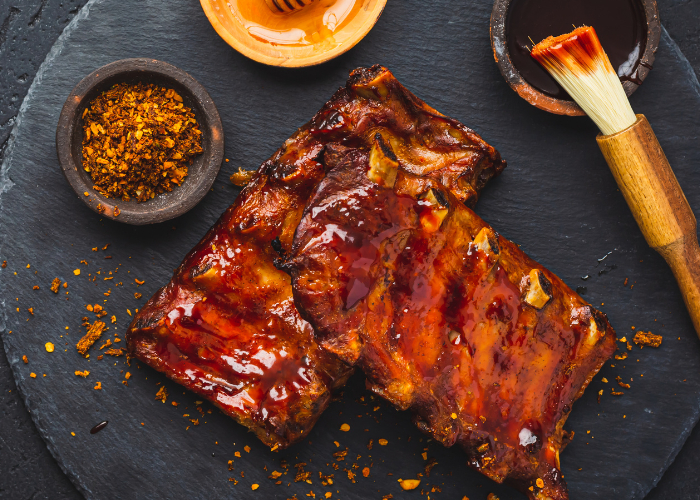

# Honey Bourbon Barbecued Ribs

*Baby back ribs braised tender in lager, vinegar and bourbon, then grilled and lacquered with a honey-bourbon barbecue sauce. The Southern Sunday slow-cook with a small finish on hot coals.*

**Serves:** 4-6

**Prep Time:** 20 minutes

**Cook Time:** 2 hours

## Overview
Baby back ribs the two-step way: braise first, grill second. Cut into sections that fit a Dutch oven, the ribs simmer gently in a bath of lager, apple cider vinegar and bourbon with a teaspoon of salt for about an hour. The braise tenderises the meat all the way through so it pulls cleanly off the bone, and the small dose of bourbon and vinegar prevents the rich sweetness of the finishing glaze from going one-note. Meanwhile, a sticky barbecue sauce reduces on the hob: ketchup, soy, honey, more bourbon, garlic and a spoon of barbecue rub. Once the ribs are tender, you brush them with sauce, rest them 30 minutes, then grill or broil till the edges char and the lacquer sets. The remaining sauce goes to the table with everyone's fingers.

## Ingredients

### Ribs and braising liquid
- 2 racks meaty baby back ribs (about 1.4 kg each)
- 350 ml lager (or ale)
- 120 ml apple cider vinegar
- 60 ml bourbon
- 1 ½ teaspoons kosher salt

### Honey-bourbon barbecue sauce
- 240 ml ketchup
- 120 ml soy sauce
- 140 ml honey
- 60 ml bourbon
- 2 garlic cloves (crushed)
- 1 ½ teaspoons barbecue spice rub
- ½ teaspoon freshly ground black pepper

## Method

### Stage 1 - Prep the ribs
1. Remove the silver membrane from the bone side of each rack: slide a knife tip under it at one end, lift, then peel it off with a paper towel for grip.
2. Cut each rack into sections that fit your Dutch oven.

### Stage 2 - Braise
1. Arrange the rib sections in a large Dutch oven.
2. Pour in the lager, vinegar and bourbon; add the salt.
3. Top up with water if needed so the ribs are just covered.
4. Cover the pot; bring to a simmer over medium-high heat.
5. Reduce to low and simmer gently 1 hour, until the meat is very tender but not falling off the bone.

### Stage 3 - Make the barbecue sauce
1. While the ribs braise, combine the ketchup, soy sauce, honey, bourbon, crushed garlic, barbecue rub and pepper in a saucepan over low heat.
2. Simmer 45 minutes, stirring occasionally, until the sauce has thickened and the flavours have come together.
3. Set aside.

### Stage 4 - Pre-glaze and rest
1. Lift the braised ribs to a baking sheet; rest 2 minutes.
2. Brush both sides liberally with the barbecue sauce.
3. Let stand 30 minutes at room temperature so the lacquer sets.
4. Reserve the remaining sauce for serving.

### Stage 5 - Grill (or broil)
1. Prepare a charcoal or gas grill for direct cooking over low heat (180-200°C). A pellet smoker at 180°C works equally well.
2. Grill the ribs bone-side down 10-15 minutes until slightly charred underneath.
3. Turn; grill the meaty side 10-15 minutes until well browned with a little char.
4. Brush again with sauce on the meaty side just before serving.

### Stage 6 - Serve
1. Cut between the bones at the table.
2. Bring the reserved sauce in a bowl for dipping.

## Notes
- **Pull the membrane:** The thin silver skin on the bone side stays tough and chewy if you don't remove it. A paper towel gives the grip your fingers don't.
- **Don't over-braise:** The ribs should be pull-tender but still have some structure. If they fall off the bone in the pot, they'll shred on the grill before the lacquer sets.
- **Oven finish if no grill:** Heat a grill (broiler) to high. Broil the ribs on the baking sheet, turning once, until nicely charred - about 10 minutes. Watch carefully.

## Storage
- Refrigerate 3 days, glazed; reheat in a 160°C oven 15 minutes, brushing with extra sauce.
- Sauce alone keeps refrigerated 2 weeks; freezes 3 months.
