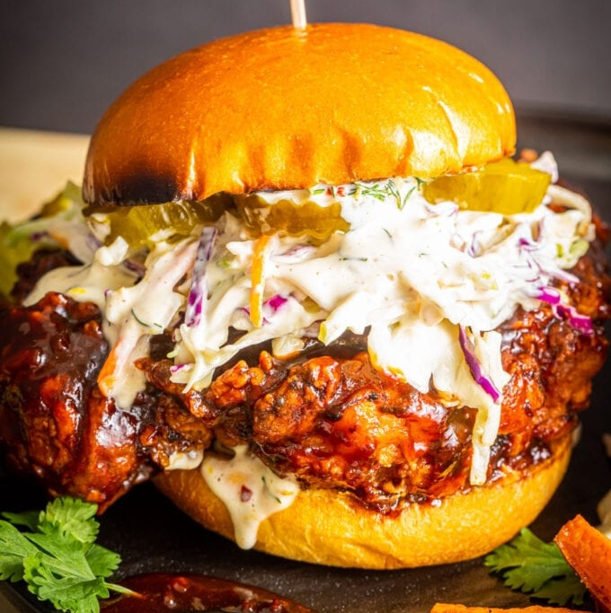

# Honey Chipotle Fried Chicken Sandwich

*Buttermilk-brined thighs fried golden, then glazed with a sweet-and-spicy chipotle-honey-soy sauce, served on toasted brioche with a Cajun-lemon-dill aioli slaw and dill pickle chips. The chipotle-honey is the move - molasses-deep, smoky, with bite. Better than most chain-restaurant fried chicken sandwiches.*

**Serves:** 4

**Prep Time:** 30 minutes (plus 3 hours marinating)

**Cook Time:** 30 minutes

## Overview
Three flavour systems stacked on a single sandwich: a buttermilk-brined fried chicken thigh (the American Southern foundation), a smoky-sweet chipotle-honey-soy glaze (the modern flavour-bomb that took fast-food fried chicken in the 2010s past plain Buffalo), and a Cajun-lemon-dill aioli slaw with dill pickle chips (the cool, acidic, salt-heavy counter that keeps the sandwich from being a sweetness-overload). The chipotle-honey is the dish's identity, molasses-deep, smoky from canned chipotles in adobo, sticky-sweet from honey and brown sugar, savoury from the soy that grounds it. Pickle juice in the buttermilk brine is the small upgrade that pushes the chicken from good to noticeably better; the salt and acid penetrate the meat and tenderise further than buttermilk alone. Smell is fried chicken with a wave of chipotle-and-honey lifting off the warm bun. Easy enough to make at home and genuinely better than most chain-restaurant versions; this isn't traditional Southern cooking, it's the modern American fried-chicken-sandwich-renaissance dish, the kind of build that emerged from food blogs and Black-American chef culture across the 2010s and 2020s.

## Ingredients

### Honey chipotle sauce
- 1 can (210 g) chipotle peppers in adobo
- 120 ml pure honey
- 60 g brown sugar
- 60 ml low-sodium soy sauce

### Slaw and aioli
- 120 ml full-fat mayonnaise
- 1 tablespoon garlic paste
- 1 lemon (small, juice and zest)
- 1 teaspoon Creole Cajun seasoning
- 2 tablespoons fresh chopped dill
- ¼ teaspoon red pepper flakes (optional)
- 2 heaping cups tri-color coleslaw mix

### Chicken
- 4 boneless skinless chicken thighs
- 1 ½ teaspoons salt (divided)
- 1 ½ teaspoons garlic powder (divided)
- 1 teaspoon ground white pepper (divided)
- 1 teaspoon onion powder (divided)
- 1 teaspoon smoked paprika (divided)
- 240 ml buttermilk
- 2 tablespoons dill pickle juice (optional)
- 1 cup plain flour
- Vegetable oil for frying

### To build
- 4 brioche (or potato buns, halved and toasted)
- Dill pickle chips

## Method

### Stage 1 - Sauce
1. Combine the chipotles in adobo, honey, brown sugar and soy sauce in a blender. Pulse until smooth.
1. Transfer to a jar; refrigerate.

### Stage 2 - Slaw
1. Whisk together the mayo, garlic paste, lemon zest, lemon juice, Cajun seasoning, dill and red pepper flakes.
1. Toss with the coleslaw mix.
1. Cover; refrigerate.

### Stage 3 - Marinate the chicken
1. Pat the thighs dry; season with half each of the salt, garlic powder, white pepper, onion powder and paprika.
1. Cover with the buttermilk and pickle juice; toss.
1. Refrigerate at least 3 hours, ideally overnight.

### Stage 4 - Fry
1. Heat oil in a heavy pot to 180°C / 360°F.
1. Whisk the flour with the remaining salt, garlic powder, white pepper, onion powder and paprika.
1. Lift each thigh from the buttermilk; shake off excess; coat thoroughly in the flour.
1. Rest on a baking sheet briefly.
1. Fry two thighs at a time 5-7 minutes until golden and 75°C / 165°F internal.
1. Transfer to a wire rack; rest 10 minutes.

### Stage 5 - Glaze and assemble
1. Brush each warm thigh generously with the honey-chipotle sauce.
1. Build sandwiches: toasted brioche, thigh, slaw, pickle chips, top bun.
1. Serve immediately.

## Notes
- **Make the sauce ahead:** the chipotle-honey can sit for days; the flavours marry.
- **Pickle juice in the brine:** adds salty-acidic complexity and tenderises further. Skip if your hot sauce is enough.
- **Toast the buns:** untoasted brioche goes soggy under the slaw. A quick pass under the grill firms them up.

## Storage
- Sauce and slaw keep 3 days refrigerated.
- Build sandwiches to order; fried chicken alone keeps 2 days, re-crisp in the oven.
