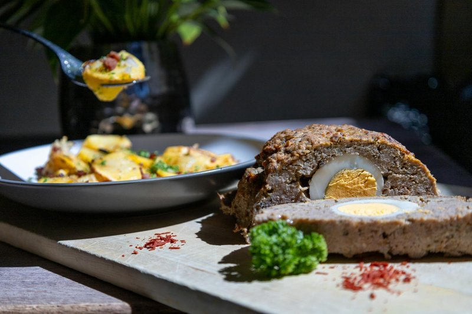

# Meatloaf

*The mid-century Sunday supper: beef and pork bound with bread and milk, packed into a loaf tin, baked under a ketchup-and-brown-sugar glaze.*

**Serves:** 6

**Prep Time:** 20 minutes

**Cook Time:** 1 hour 15 minutes

## Overview
Onion and garlic are softened in butter; cooled. Breadcrumbs soak in milk to a panade. Beef (and pork if using) is mixed with the panade, sautéed onion, egg, Worcestershire, mustard, parsley, thyme, salt and pepper. Packed loosely into a loaf tin. Brushed with glaze (ketchup + brown sugar + Worcestershire). Baked for 50 minutes; glazed again; returned for 15 minutes more.

## Ingredients

### Loaf
- 700 g beef mince (15-20% fat)
- 300 g pork mince (or 300 g more beef)
- 1 onion (large, finely chopped)
- 4 garlic cloves (crushed)
- 2 tablespoons unsalted butter
- 100 g dried breadcrumbs (panko or fine)
- 200 ml whole milk
- 2 eggs (large, lightly beaten)
- 2 tablespoons Worcestershire sauce
- 1 tablespoon Dijon mustard
- 3 tablespoons fresh parsley (chopped)
- 1 teaspoon dried thyme
- 1 ½ teaspoons salt
- 1 teaspoon ground black pepper

### Glaze
- 6 tablespoons tomato ketchup
- 2 tablespoons soft brown sugar
- 1 tablespoon Worcestershire sauce
- 1 teaspoon cider vinegar

## Method

### Stage 1 - Aromatics
1. Melt the butter in a frying pan; soften the onion 8 minutes until pale gold.
1. Add garlic; cook 30 seconds.
1. Tip onto a plate to cool.

### Stage 2 - Panade
1. In a small bowl, combine breadcrumbs and milk; let sit 5 minutes until the breadcrumbs have absorbed all the liquid.

### Stage 3 - Mix
1. In a wide bowl, combine beef, pork, panade, cooled onion-garlic, eggs, Worcestershire, mustard, parsley, thyme, salt, pepper.
1. Mix with hands gently until just combined. Don't overwork - heavy mixing makes a tight, dense loaf.

### Stage 4 - Pack
1. Heat oven to 180°C (160°C fan).
1. Pack loosely into a 23 x 13 cm loaf tin lined with baking paper (or shape free-form on a tray).

### Stage 5 - Glaze
1. Whisk ketchup, brown sugar, Worcestershire and vinegar.
1. Brush half over the top of the loaf.

### Stage 6 - Bake
1. Bake 50 minutes. Brush with the remaining glaze.
1. Return to the oven 15-20 more minutes - internal temperature 70°C in the centre, glaze dark and bubbling.

### Stage 7 - Rest and slice
1. Rest 10 minutes in the tin.
1. Slice thick. Serve with mashed potatoes and gravy.

## Notes
- **Panade not breadcrumbs:** Soaking the crumbs in milk first gives a tender, juicy loaf. Tossing dry crumbs in gives a dry crumbly one.
- **Don't overmix:** Mix until just combined. Heavy kneading toughens the meat.
- **Glaze twice:** Once before, once midway. Single-glaze meatloaf has a thin pale top; double-glazed has the lacquer.

## Storage
- Refrigerate 4 days; meatloaf sandwiches the next day are non-negotiable.
- Freezes 3 months whole or sliced.
