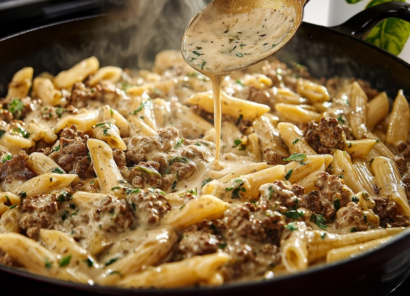

# One-Pot Creamy Beef Pasta

*A 35-minute weeknight pasta where ground beef, dried rigatoni and broth all cook in the same pot, then heavy cream and two cheeses fold in to finish. Sharp white cheddar + parmesan; rigatoni's wide ribbed surface clings to the sauce. Single pot, single wash.*

**Serves:** 6

**Prep Time:** 5 minutes

**Cook Time:** 35 minutes

## Overview
An American weeknight pasta that compresses a Hamburger Helper-style box meal into a single pot, an open package of fresh ingredients, and 35 minutes of low-effort cooking. The trick is that the pasta is cooked directly in the broth (no separate boil, no drain), which means the starch released from the rigatoni stays in the pot and helps thicken the sauce when the cream and cheese are folded in at the end. Flavour is sharp-savoury rather than red-sauce-comforting, sharp white cheddar gives a tangy bite, parmesan adds salty umami, heavy cream binds the lot into something almost like a stovetop mac-and-cheese with ground beef stirred through. Rigatoni's wide ribbed surface clings to the sauce in a way that smoother shapes can't. Smell is browned beef and melted cheese. Genuinely easy and a single pan to wash; the only technical points are using freshly shredded cheese (pre-shredded supermarket bags have anti-caking starches that prevent smooth melting) and letting the off-heat rest do its job. A modern American weeknight staple that emerged from one-pot pasta TikTok and food-blog culture in the 2010s-2020s.

## Ingredients

- 2 tablespoons unsalted butter
- 450 g (1 lb) ground beef (grass-fed)
- salt
- pepper
- 1 teaspoon garlic powder
- 1 shallot (large, finely chopped)
- 450 g (1 lb) dried short pasta (rigatoni recommended)
- 950 ml chicken (or beef broth)
- 240 ml heavy cream
- 225 g sharp white cheddar (shredded)
- 1 cup freshly grated parmesan cheese (plus more to top)

## Method

### Stage 1 - Brown the beef
1. Melt the butter in a large heavy pot over medium-high heat.
1. Add the ground beef; break up with a wooden spoon.
1. Brown 6-7 minutes.
1. Season with salt, pepper and garlic powder.

### Stage 2 - Shallot
1. Add the chopped shallot; cook 4-5 minutes until tender.

### Stage 3 - Pasta in the pot
1. Add the dry pasta and the broth.
1. Stir well; cover.
1. Simmer 10-12 minutes until the pasta is al dente. Stir once or twice to prevent sticking.

### Stage 4 - Finish off heat
1. Remove from heat.
1. Stir in the heavy cream, shredded cheddar and grated parmesan.
1. Cover; rest 10 minutes - the sauce thickens around the pasta as it sits.

### Stage 5 - Serve
1. Plate in deep bowls; top with extra parmesan.

## Notes
- **Pasta + broth ratio:** the pasta cooks in just enough liquid that it absorbs everything by the time it's tender. Use a quality broth; cheap broth = thin sauce.
- **Freshly shredded cheese matters:** pre-shredded supermarket cheese has anti-caking starches that prevent smooth melting. Block cheese, shredded fresh, melts properly.
- **Don't freeze:** the cream-based sauce splits on thaw. Make and eat within a couple of days.

## Storage
- Keeps 3 days refrigerated; reheat with a splash of broth or milk to loosen the sauce.
- Skip freezing.
