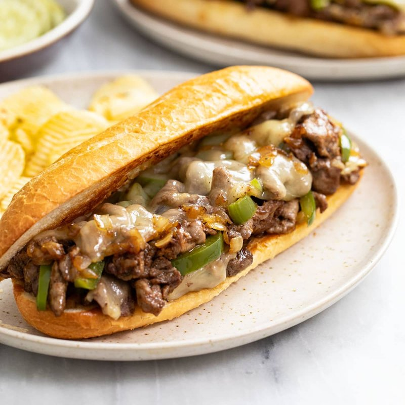

# Philly Cheesesteak

*Philadelphia's sandwich: thinly sliced ribeye chopped on a hot flat-top with sautéed onion, piled into a soft hoagie roll under melted cheese.*

**Serves:** 2

**Prep Time:** 15 minutes (plus 1 hour partial freezing)

**Cook Time:** 12 minutes

## Overview
Philadelphia's defining sandwich, and one of the few American dishes where the technique matters more than the recipe. You start by sticking a good ribeye in the freezer until it firms up, because the dish's identity is in the slicing: paper-thin shavings against the grain that you simply cannot get from room-temperature beef. On a wide hot griddle you sweat down onion (and bell pepper or mushrooms if your South Philly conscience allows them) until just past gold, push them to one side, and lay the shaved beef in a single layer on the cleared steel. Sixty seconds in, you start chopping the meat with the spatula edge as it cooks, folding the onions back in, hitting it with salt and pepper. Cheese goes over the top off the heat (provolone for the crowd-pleaser, American singles for the nostalgic drip, Cheez Whiz if you're going strictly by South Philly), and you cover for half a minute to melt. Scooped straight into a soft hoagie roll that's been toasted in the rendered fat. Wrap, fold in half, eat at the counter while the cheese is still hot.

## Ingredients

- 500 g ribeye steak (partially frozen for 1 hour, then shaved paper-thin against the grain)
- 1 onion (large, sliced thin)
- 1 green bell pepper (sliced thin, optional)
- 100 g chestnut mushrooms (sliced, optional)
- 3 tablespoons vegetable oil
- 2 tablespoons unsalted butter
- 1 teaspoon salt (to taste)
- ½ teaspoon ground black pepper
- 6-8 slices provolone (or American singles, or Cheez Whiz spread)
- 2 long hoagie rolls (12-15 cm, soft inside, lightly crusty)

## Method

### Stage 1 - Slice
1. Take the partially-frozen ribeye from the freezer; with a sharp knife, slice as thin as possible against the grain.
1. (Or use a meat slicer / mandoline.)

### Stage 2 - Onion
1. Heat 1 tablespoon of oil and 1 tablespoon of the butter in a wide heavy frying pan or griddle over medium-high.
1. Add onion (and pepper / mushroom if using); cook 8-10 minutes, stirring, until deep gold and just starting to brown.
1. Sprinkle with a pinch of salt; push to one side of the pan.

### Stage 3 - Beef
1. Add the remaining 2 tablespoons of oil to the cleared half of the pan; turn heat to high.
1. Spread the shaved beef in a single layer. It will cook fast - 60 seconds.
1. With the edge of a spatula, chop the meat into small pieces while it cooks.
1. Flip and chop the pieces 30 seconds more.
1. Sprinkle with salt and pepper.
1. Mix the onion (and pepper / mushroom) into the meat. Cook 30 seconds combined.

### Stage 4 - Cheese
1. Reduce heat to low. Drape the cheese slices over the meat. Cover (or hood with a metal bowl) 30-60 seconds until melted.

### Stage 5 - Assemble
1. Split the hoagie rolls lengthways (not all the way through). Toast cut-side down on the pan 30 seconds in any rendered fat.
1. Scoop the meat and melted cheese straight into the rolls.

### Stage 6 - Eat
1. Wrap in paper or foil halfway up; eat immediately.

## Notes
- **Partially freeze the beef:** The shave-thin slicing is the dish's identity. Room-temperature ribeye refuses to slice thin; partially frozen gives translucent slices.
- **Cheese choice:** Provolone is the safest crowd-pleaser. American singles are nostalgic and pleasingly drippy. Cheez Whiz is divisive but authentic to South Philly.
- **No marinade, no overcrowding:** The beef is meant to taste of beef plus salt plus the onion-soaked pan. A hot griddle and a fast cook.

## Storage
- Eat fresh. Won't keep.
