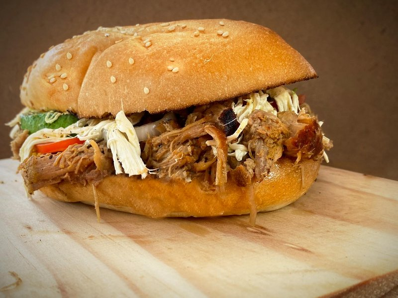

# Pulled Pork

*Mahogany bark crackling against pale, glistening strands of pork, perfumed with smoke, paprika and slow-rendered fat. Splash on the vinegar sauce and the whole thing smells like an afternoon spent watching coals breathe.*

**Serves:** 8

**Prep Time:** 20 minutes (plus overnight rub)

**Cook Time:** 8 hours

## Overview
Pulled pork is the slowest, simplest hero of American Southern barbecue. A whole bone-in pork shoulder: often called a Boston butt despite coming from the front of the pig: is rubbed with salt, sugar and spices and left to absorb seasoning overnight, then smoked low for eight or nine hours till the collagen breaks down and a fork sinks in like wet sand. Two great traditions divide the South: eastern North Carolina dresses whole-hog pulled pork in a thin cider-vinegar-and-chilli sauce; Memphis or Kansas City uses shoulder and leans sweeter, tomato-based. This recipe splits the difference: a Memphis-style sweet-and-savoury rub on the meat, then a sharp Carolina vinegar sauce to dress the pulled strands. Internal temperature is the only thing that really matters, and 95 °C is the target: well past the point where most cookbooks stop, because that last twenty degrees is where the connective tissue finally surrenders. Wrapped in foil with a splash of cider when the bark sets, rested long, pulled warm. Piled onto a soft white bun with cold slaw: the easiest crowd-feeder in the BBQ canon.

## Ingredients

### Pork and rub
- 2 ½ kg bone-in pork shoulder
- 3 tbsp light brown sugar
- 2 tbsp smoked paprika
- 2 tbsp sweet paprika
- 1 tbsp flaky salt
- 1 tbsp ground black pepper
- 1 tbsp garlic powder
- 1 tbsp onion powder
- 1 tsp mustard powder
- 1 tsp cayenne
- 2 tbsp yellow mustard (as binder)

### Carolina vinegar sauce
- 250 ml cider vinegar
- 100 ml water
- 2 tbsp light brown sugar
- 1 tbsp chilli flakes
- 1 tsp salt
- 1 tsp black pepper
- ½ tsp cayenne

### Quick slaw
- ¼ green cabbage, finely shredded
- 1 carrot, grated
- 2 tbsp mayonnaise
- 1 tbsp cider vinegar
- 1 tsp Dijon mustard
- salt
- pepper

### To serve
- 8 soft white burger buns
- Pickle chips

## Method

### Stage 1 - The night before
1. Pat the pork shoulder dry with paper towel. Score the fat cap in a shallow crosshatch.
2. Combine all rub spices in a bowl.
3. Smear the pork all over with mustard, then coat heavily with the rub, pressing it into the scored fat.
4. Wrap loosely and refrigerate overnight, at least 8 hours.

### Stage 2 - Smoke or low oven
1. Bring the pork to room temperature for 1 hour.
2. Set a smoker to 110 degrees or heat an oven to 120 degrees. Place the pork fat-side up on a rack over a tray.
3. Cook for 5 hours undisturbed. The bark should be deep brown and firm to touch.

### Stage 3 - Wrap and finish
1. Lift the pork onto a double layer of foil. Splash 100 ml of cider or apple juice around it, wrap tightly.
2. Return to the smoker or oven and continue cooking until the internal temperature at the thickest part reads 95 degrees and a probe slides in without resistance, roughly 3 more hours.

### Stage 4 - Rest
1. Leave the wrapped pork to rest in a warm spot, ideally inside a cooler box with towels, for at least 1 hour. This step is not optional.

### Stage 5 - Vinegar sauce and slaw
1. Whisk all sauce ingredients together until the sugar dissolves. Leave at room temperature.
2. Toss slaw ingredients in a bowl and chill.

### Stage 6 - Pull
1. Unwrap the pork over a tray to catch juices. Discard the bone (it should slide out clean).
2. Pull the meat with two forks or gloved hands, shredding into long strands. Discard any large lumps of unrendered fat.
3. Pour the resting juices and half the vinegar sauce over the pulled meat and toss to coat.

### Stage 7 - Serve
1. Toast the buns lightly. Pile pulled pork on the base, top with slaw, a few pickle chips and a drizzle of extra vinegar sauce. Cap and eat.

## Notes
- **The stall:** internal temperature will plateau around 70 degrees for an hour or two as moisture evaporates. Wrapping pushes through it.
- **Bone-in vs boneless:** bone-in cooks more evenly and the bone tells you when it is done by sliding out clean.
- **Bark:** if your bark goes soft after wrapping, you can crisp it by unwrapping for the last 20 minutes back on the heat.
- **Probe by feel:** temperature is a guide; texture is the truth. The probe should pass through the muscle with no more resistance than warm butter.

## Storage
- Pulled pork keeps 4 days refrigerated in its juices. It freezes well for 3 months; thaw overnight and reheat gently in a covered pan with a splash of stock. Vinegar sauce keeps indefinitely.
