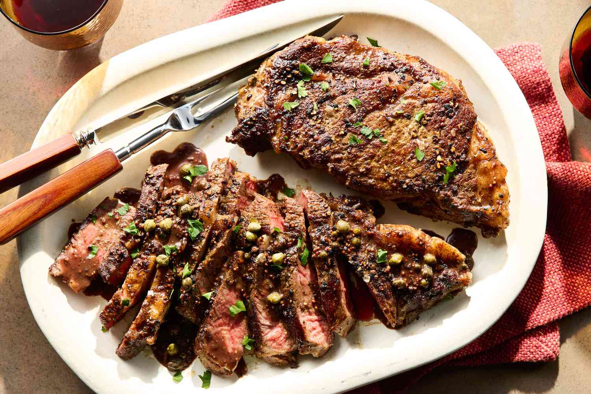

# Cast-Iron Rib Eye Steak

*Thick-cut rib eye seared in a smoking cast-iron pan, finished with foaming butter, hot sauce and a sprig of thyme. The American steakhouse classic at home: ten minutes from fridge to plate.*

**Serves:** 2-4

**Prep Time:** 5 minutes (plus 30 minutes to come to room temperature)

**Cook Time:** 8 minutes

## Overview
The home version of the steakhouse classic, taking advantage of the only piece of kitchen kit that does this job properly: a heavy cast-iron pan you've heated almost to smoking. Two thick boneless rib eyes, tempered for half an hour out of the fridge, get a generous salt cure and hit the screaming pan with just a slick of oil. Two minutes hard sear per side gives a deep mahogany crust; flip them again, scatter on coarse pepper and a little turbinado sugar for caramelisation, then reduce the heat and add butter, a couple of dashes of hot sauce and a sprig of fresh thyme. You spoon the brown butter over the steaks for the final two or three minutes until they reach medium-rare. Rest five minutes on a board (the hardest part) before slicing against the grain.

## Ingredients
- 2 thick-cut boneless rib eye steaks (350 g each, 4 cm thick)
- Kosher salt and coarsely ground black pepper
- 2 tablespoons olive oil
- 2 teaspoons turbinado sugar (for seasoning)
- 2 tablespoons unsalted butter
- 3 dashes hot-pepper sauce (Tabasco or Crystal), or to taste
- Fresh thyme sprigs, for serving

## Method

### Stage 1 - Temper
1. Remove the steaks from the fridge 30-60 minutes before cooking; bring to room temperature.
2. Pat dry with paper towels.

### Stage 2 - Season
1. Season both sides of each steak generously with salt - more than you think.

### Stage 3 - Heat the pan
1. Set a cast-iron pan large enough to hold both steaks over medium-high heat.
2. Heat until it just begins to smoke (3-4 minutes).
3. Drizzle in just enough olive oil to coat the pan; swirl.

### Stage 4 - Hard sear
1. Lay the steaks in the hot pan; raise the heat to high.
2. Cook undisturbed 2-3 minutes until the bottoms are deeply browned.
3. Flip the steaks; cook the second side 2 minutes.

### Stage 5 - Pepper, sugar, butter
1. Sprinkle each steak lightly with turbinado sugar and a generous grind of coarse pepper.
2. Flip the steaks again.
3. Reduce the heat to medium.
4. Add the butter to the pan; let it foam.
5. Dash in the hot sauce.

### Stage 6 - Baste and finish
1. Tilt the pan; spoon the foaming butter over the steaks repeatedly.
2. Cook 3-4 minutes more for medium-rare, basting continuously.
3. The butter should turn nut-brown and smell toasty.

### Stage 7 - Rest and slice
1. Lift the steaks to a board.
2. Rest 5 minutes (essential - this is where the juices redistribute).
3. Slice against the grain; spoon over any board juices.
4. Garnish with fresh thyme.

## Notes
- **Temperature for the pan:** Cast iron needs to be just-smoking before the steak goes in. A cold pan never sears; it stews. Hot enough that water flicked on it bounces and skitters.
- **Rest the meat:** Five minutes on the board. Cut too soon and the juice runs out onto the board instead of staying in the meat.
- **The sugar trick:** A small sprinkle of turbinado sugar before the butter goes in helps the crust caramelise. Don't use refined white; you want the coarse grain that lingers on the surface.

## Storage
- Best straight from the rest.
- Leftover sliced steak refrigerates 2 days; eat cold in a sandwich or warm gently in butter (overcooking thin slices is the main hazard).
