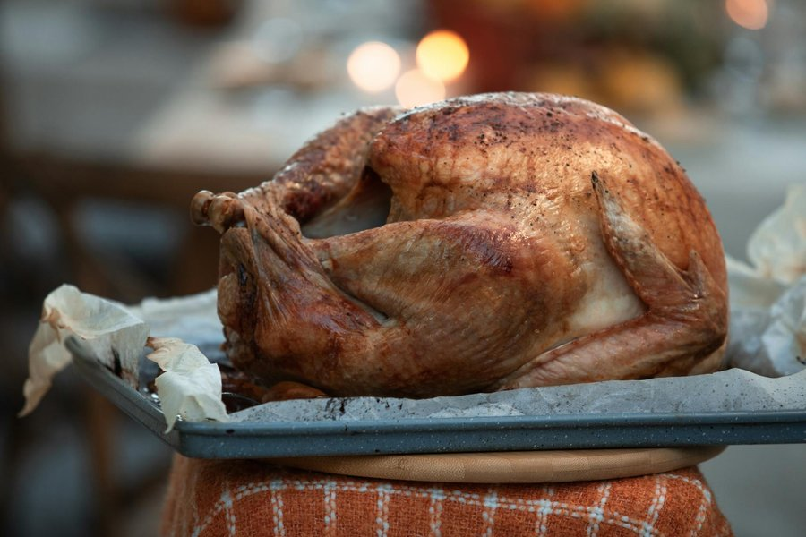

# Roast Turkey

*The Thanksgiving and Christmas centrepiece: a whole turkey dry-brined the night before, slathered with herb butter under and over the skin, then roasted to a deep mahogany with crisp skin and juicy breast meat. Pan drippings turned into a quick gravy at the end. The American holiday table's load-bearing dish.*

**Serves:** 8-10

**Prep Time:** 30 minutes (plus 24 hours dry-brining)

**Cook Time:** 3 hours (for a 5-6 kg bird)

## Overview
A whole roast turkey is the centrepiece of the American Thanksgiving table and most American Christmas tables too. It is one of the simplest large roasts to cook well as long as you accept two truths: a turkey breast is done at 65°C internal while a turkey thigh is done at 75°C, so you cannot cook them both to perfection by clock alone, and the bird benefits enormously from being dry-brined the day before so the skin dries out and the meat seasons through. The recipe below is the standard American home approach: a 24-hour dry brine with salt, then a herb butter loaded under and over the skin, then roasted at moderate heat (initially low to gently cook the thighs, finished hot to crisp the skin and bring the breast up to temperature). The pan drippings become a quick gravy at the end. This version specifically fills a manifest gap on the Thanksgiving editorial collection where Sunday Roast Chicken has been standing in. Use a 5-6 kg bird for 8-10 people with leftovers; scale brine and butter proportionally for a larger or smaller turkey. Difficulty is moderate; the active work is short but you must commit to the overnight brine and to using a meat thermometer.

## Ingredients

### Turkey and dry brine
- 1 whole turkey, 5-6 kg (about 11-13 lbs), neck and giblets reserved
- 60 g (¼ cup) fine sea salt
- 2 tsp freshly ground black pepper
- 1 tbsp soft brown sugar

### Herb butter
- 200 g unsalted butter, softened to room temperature
- 6 garlic cloves (finely grated)
- 2 tbsp finely chopped fresh thyme leaves
- 2 tbsp finely chopped fresh sage leaves
- 2 tbsp finely chopped fresh rosemary leaves
- 2 tbsp finely chopped flat-leaf parsley
- 1 lemon (zest)
- 1 tsp freshly ground black pepper

### Pan aromatics
- 1 onion (large, quartered, skin on)
- 2 carrots (cut in chunks)
- 3 celery sticks (cut in chunks)
- 1 head garlic (halved through the equator)
- 1 lemon (halved)
- 1 large bunch fresh thyme, sage and rosemary
- 500 ml chicken or turkey stock (for the roasting tin)

### Gravy
- 30 g plain flour
- 750 ml chicken or turkey stock (warm)
- 100 ml dry white wine (optional)
- Salt and pepper, to taste

## Method

### Stage 1 - Dry-brine the night before
1. Remove the turkey from its packaging. Pat the bird very dry inside and out with paper towels. Remove the neck and giblets from the cavity and reserve in the fridge.
2. Mix the salt, pepper and brown sugar in a small bowl.
3. Rub the seasoning all over the turkey: across the breast, around the legs, into the cavity. Pay particular attention to the thickest parts of the breast.
4. Place the turkey, breast-side up, uncovered, on a rack set over a tray. Refrigerate uncovered for 24 hours. The skin will dry out and the salt will season the meat right through. This is the single biggest factor in good roast turkey.

### Stage 2 - Make the herb butter
1. In a medium bowl, mash the softened butter with the grated garlic, chopped herbs, lemon zest and pepper until evenly combined. Do not add salt; the bird is already brined.
2. Cover and leave at cool room temperature until needed.

### Stage 3 - Bring out, butter and stuff aromatics
1. Take the turkey out of the fridge 1 hour before roasting. A cold bird straight from the fridge cooks unevenly.
2. Heat the oven to 220°C / 425°F (200°C fan). Place a rack in the lowest third.
3. Slide your hand carefully under the breast skin from the neck end, loosening the skin without tearing it, all the way down to the legs.
4. Push about ⅔ of the herb butter under the skin, distributing it evenly over both breasts and the tops of the thighs. Smooth the skin back down from outside.
5. Rub the remaining ⅓ of the herb butter all over the outside of the skin.
6. Stuff the cavity loosely with the lemon halves, halved garlic head and the bunch of fresh herbs.
7. Tie the legs together with kitchen string (optional, but it helps the bird hold its shape).
8. Scatter the onion, carrots and celery in the bottom of a large roasting tin. Set the turkey on top of the vegetables, breast-side up.

### Stage 4 - Roast
1. Pour 500 ml stock into the bottom of the tin (not over the turkey) to keep the drippings from scorching.
2. Roast at 220°C / 425°F for 30 minutes, breast-side up, to get the skin started.
3. Reduce the oven to 165°C / 325°F (150°C fan). Continue roasting.
4. After another hour, baste the bird with pan juices and rotate the tin. If the breast is browning too fast, loosely tent foil over it.
5. Total cooking time is approximately 30 minutes per kg for a stuffed-with-aromatics bird, so a 5 kg bird needs around 2 ½ hours total and a 6 kg bird around 3 hours. Begin checking internal temperature at the 2-hour mark.
6. Insert an instant-read thermometer into the thickest part of the thigh, not touching the bone. The turkey is done when the thigh reads 75°C / 165°F and the thickest part of the breast reads at least 65°C / 150°F. Pull the bird the moment the thigh hits 75°C.

### Stage 5 - Rest
1. Transfer the turkey carefully to a board or warm platter. Tent loosely with foil.
2. Rest for a full 30 minutes. The breast will carry over to about 70°C and the thigh to nearly 80°C, and the juices will redistribute. This step is non-negotiable; carving early gives you dry meat.

### Stage 6 - Make the gravy
1. While the turkey rests, set the roasting tin over two burners on medium heat.
2. Mash the vegetables in the tin lightly with a wooden spoon to release their flavour.
3. Pour off all but about 4 tbsp of fat from the tin.
4. Sprinkle the flour over the fat and vegetables. Cook 2 minutes, whisking, to make a roux.
5. Pour in the white wine if using and let it bubble away for 1 minute, scraping up the fond.
6. Gradually whisk in the warm stock. Simmer 5-8 minutes until thickened and glossy.
7. Strain through a fine sieve into a saucepan, pressing on the solids. Taste for salt and pepper; keep warm.

### Stage 7 - Carve and serve
1. Remove the legs at the joint where thigh meets body. Separate drumstick from thigh.
2. Slice the thigh meat off the bone in thick pieces.
3. Cut each whole breast off the carcass in one piece by running a sharp knife close to the breastbone. Slice each breast crossways into 1 cm slices.
4. Arrange dark and white meat on a warm serving platter. Pour over a little of the gravy; serve the rest in a jug.

## Notes
- **Dry brine, not wet:** a dry brine seasons the meat just as effectively as a wet brine, without the waterlogged texture or the need to find a vessel large enough to submerge a turkey. 24 hours is the sweet spot; 36-48 hours will not hurt.
- **Use a thermometer:** the only reliable way to roast a turkey. A 5-6 kg bird varies in shape, fat cover and fridge temperature; a thermometer is the only honest answer to "is it done?"
- **Pull at 75°C thigh, not breast:** if you wait until the breast hits 75°C the thigh will be at 85°C and the breast meat will be dry. Pulling on the thigh and resting brings the breast up to a perfect 70°C.
- **Aromatics not stuffing:** roast stuffing separately. A bird stuffed with bread-based stuffing takes much longer to cook through and the breast dries out by the time the stuffing hits a safe 75°C.
- **Save the carcass:** simmer overnight with onion, carrot and celery for the best stock you will make all year.

## Variations
**Smaller bird (3-4 kg):** Use a 30 g salt brine, scale the butter to 120 g, and cook 1 ½ - 2 hours total at the same temperatures.
**Spatchcocked:** Remove the backbone and flatten the bird. Skip the cavity aromatics. Roast at 220°C / 425°F skin-side up the whole time, around 75-90 minutes for a 5 kg bird. Faster, crispier skin, slightly less dramatic for the table.
**No-herb butter:** Plain salted butter rubbed under and over the skin with a tablespoon of cracked black pepper. Simpler but still excellent.

## Serving
The American holiday platter: roast turkey with gravy, bread stuffing or cornbread dressing, mashed potatoes, candied sweet potatoes or sweet potato casserole, green bean casserole or buttered green beans, cranberry sauce and dinner rolls. A glass of pinot noir, riesling or beaujolais alongside.

## Storage
- Carved turkey keeps 3-4 days refrigerated in a sealed container. Reheat gently with a splash of stock to avoid drying.
- The carcass and bones make excellent stock; simmer 4 hours with vegetables.
- Cooked turkey freezes 2 months. Reheat from frozen in stock or use straight in soup, sandwiches or turkey pot pie.
