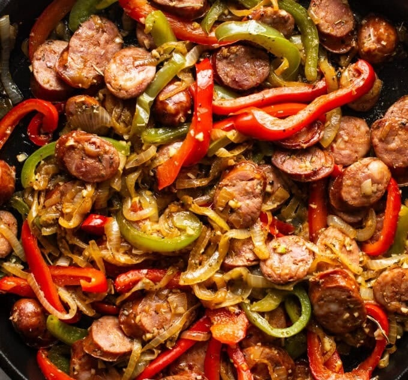

# Sausage and Peppers

*An Italian-American skillet basic: sliced peppers and onion caramelised, pre-cooked sausage browned, garlic and herbs in at the end. Over rice or in a hoagie.*

**Serves:** 4-6

**Prep Time:** 5 minutes

**Cook Time:** 25 minutes

## Overview
The Italian-American skillet basic that nearly everyone forgets about and then rediscovers: the kind of dish you can make on a Tuesday with whatever sausage is in the fridge and have dinner on the table twenty-five minutes later. The flavour leans on three things: pre-cooked smoked sausage (kielbasa is the gentle option, andouille turns it Cajun, sweet Italian is the traditional Sunday-supper-in-Bensonhurst choice), peppers and onion caramelised till they're sweet and slightly tacky, and a generous amount of fresh garlic added at the end so it scents the dish without burning. Italian seasoning rounds the herbal note. Easy enough to cook when you're tired; honest enough that it doesn't suffer for it. Strongest roots in Southern Italian immigrant kitchens of the early 20th century in New York and New Jersey, where bulk sausage and peppers were both cheap and the leftovers shoved into a hoagie roll became the next day's lunch.

## Ingredients

- 1 tablespoon unsalted butter
- 1 tablespoon olive oil
- 1 green bell pepper (sliced into strips)
- 1 red bell pepper (sliced into strips)
- 1 white onion (large, sliced into half-moons)
- 340-370 g pre-cooked sausage (kielbasa, andouille, smoked sausage), sliced into rounds
- 8 garlic cloves (finely minced)
- 2 teaspoons Italian seasoning (or [herbes de Provence](../../base-ingredients/spices/herbes-de-provence.md))
- salt
- pepper
- Fresh chopped parsley, to garnish

## Method

### Stage 1 - Peppers and onion
1. Heat the butter and olive oil in a large skillet over medium-high heat.
1. Add the peppers and onion.
1. Cook 10-12 minutes, stirring occasionally, until tender and lightly caramelised.

### Stage 2 - Sausage
1. Add the sliced sausage rounds.
1. Cook 3-4 minutes until golden brown.

### Stage 3 - Garlic and seasoning
1. Stir in the garlic, Italian seasoning, salt and pepper.
1. Cook 1-2 minutes until fragrant.

### Stage 4 - Serve
1. Plate hot; scatter parsley.
1. Serve over steamed rice, in a hoagie roll, or as-is.

## Notes
- **Sausage choice is the dish:** smoked kielbasa gives a comfortable smoke; andouille turns it Cajun; sweet Italian sausage is lighter and traditional.
- **A 25-26 cm skillet works:** wider keeps the peppers in a single layer for caramelisation. Crowded = steamed.

## Storage
- Keeps 3-4 days refrigerated; freezes 2 months.
- Reheats well in a hot pan or microwave.
