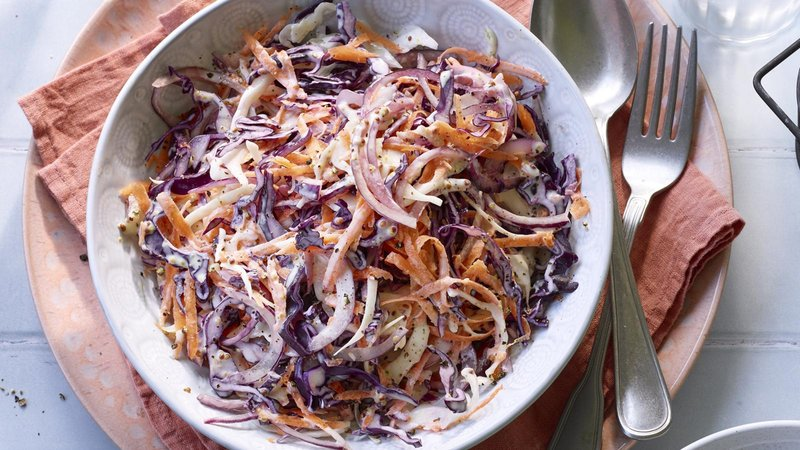

# American Coleslaw

*The American picnic side: shredded green and red cabbage with carrot in a mayonnaise-and-cider-vinegar dressing seasoned with mustard and sugar.*

**Serves:** 6 as a side

**Prep Time:** 20 minutes (plus 30 minutes resting)

**Cook Time:** 0 minutes

## Overview
Cabbage shreds very fine; carrot grates; both rest with a generous pinch of salt for 20 minutes to draw out water (squeeze before dressing). A dressing of mayo, sour cream (or buttermilk), Dijon, cider vinegar, sugar, celery seed, salt and pepper whisks. Toss; rest at least 30 minutes before serving, flavours need time to mingle.

## Ingredients

- 500 g green cabbage (very finely shredded)
- 200 g red cabbage (very finely shredded)
- 2 medium carrots (grated)
- 1 tablespoon salt (for sweating)
- 4 spring onions (sliced thin, optional)

### Dressing
- 6 tablespoons mayonnaise
- 3 tablespoons sour cream (or buttermilk for a tangier version)
- 2 tablespoons cider vinegar
- 1 tablespoon Dijon mustard
- 2 tablespoons caster sugar
- 1 teaspoon celery seed (optional, classic American)
- ½ teaspoon salt
- ½ teaspoon ground black pepper

## Method

### Stage 1 - Sweat the cabbage
1. Toss the green and red cabbage with the carrot and the tablespoon of salt in a colander.
1. Leave over the sink 20 minutes - water drips out.
1. Squeeze handfuls hard. Pat dry.

### Stage 2 - Dressing
1. Whisk all dressing ingredients in a wide bowl until smooth.

### Stage 3 - Combine
1. Add the squeezed cabbage, carrot, and spring onions (if using) to the dressing.
1. Toss thoroughly.

### Stage 4 - Rest
1. Cover; refrigerate at least 30 minutes.

### Stage 5 - Serve
1. Stir again; taste; adjust salt, sugar or vinegar.
1. Serve cold alongside burgers, fried chicken, pulled pork or brisket.

## Notes
- **Sweat the cabbage:** Skipping this step gives watery, weepy slaw within hours. Twenty minutes is enough.
- **Cider vinegar + sugar:** The classic American sweet-sour balance. Don't use white vinegar (too sharp) or balsamic (wrong colour).
- **Make ahead:** Coleslaw is better the next day; keeps 4 days. Don't dress more than 24 hours ahead - it weeps after that.

## Storage
- Refrigerate 4 days. Stir before serving.
- Doesn't freeze.
