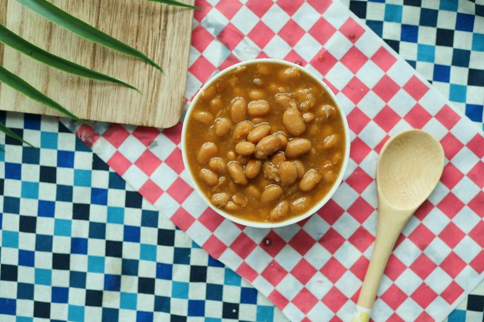

# Baked Beans

*American smoked-pork baked beans: navy beans slow-baked for hours in a sticky molasses-and-tomato sauce with bacon, onion and brown sugar.*

**Serves:** 6 as a side

**Prep Time:** 15 minutes (plus 12 hours soaking)

**Cook Time:** 3 hours 30 minutes

## Overview
Navy beans soak overnight. Bacon and onion render in a wide pot; cooked beans go in with a sauce of molasses, tomato puree, brown sugar, mustard, cider vinegar and beef stock. Bake covered at 150°C for 3 hours, uncovering for the last 30 minutes so the sauce reduces and sets sticky. The beans hold shape but the sauce thickens to glaze them.

## Ingredients

- 400 g dried navy beans (or haricot, soaked 12 hours, drained)
- 200 g smoked streaky bacon (or pancetta - cut into 1 cm pieces)
- 1 onion (large, chopped)
- 4 tablespoons molasses (blackstrap if you have it; black treacle works)
- 4 tablespoons tomato puree
- 3 tablespoons soft dark brown sugar
- 2 tablespoons cider vinegar
- 2 tablespoons English mustard (or Dijon)
- 1 tablespoon Worcestershire sauce
- 1 teaspoon smoked paprika
- 1 teaspoon salt (to taste)
- ½ teaspoon ground black pepper
- 700 ml hot beef stock (or chicken stock, more as needed)

## Method

### Stage 1 - Par-cook beans
1. Place drained beans in a pot; cover with cold water by 5 cm.
1. Bring to a boil; reduce to simmer; cover.
1. Cook 45 minutes until just tender. Drain, reserving 300 ml of the cooking liquor.

### Stage 2 - Bacon and onion
1. Heat oven to 150°C (130°C fan).
1. In a wide heavy ovenproof pot, render the bacon over medium heat 6-7 minutes until fat releases and bacon is just turning gold.
1. Add the onion; cook 8 minutes until soft.

### Stage 3 - Sauce
1. Stir in molasses, tomato puree, brown sugar, vinegar, mustard, Worcestershire, paprika, salt, pepper.
1. Add the par-cooked beans; pour over the hot stock (and reserved bean liquor if needed) - the beans should be just covered.
1. Bring to a simmer.

### Stage 4 - Bake
1. Cover with the lid; transfer to the oven.
1. Bake 2 hours 30 minutes. Check every 45 minutes; top up with hot stock if the beans are uncovered.
1. Uncover; bake 30 minutes more - the sauce reduces to a glaze; the top crisps lightly.

### Stage 5 - Rest and serve
1. Rest 10 minutes. Sauce thickens as it sits.
1. Taste; adjust salt and vinegar.
1. Serve hot with cornbread, fried eggs, or alongside ribs and brisket.

## Notes
- **Molasses is the signature:** Don't substitute golden syrup or honey. Blackstrap molasses gives the dark, slightly bitter depth. Black treacle is the UK equivalent; equivalent results.
- **Salt timing:** Adding salt at the start with hard beans toughens the skins. Wait until they're tender.
- **Make ahead:** Baked beans are better the next day. Cool fully, refrigerate; reheat gently in a covered pan.

## Storage
- Refrigerate 5 days.
- Freezes 3 months.
