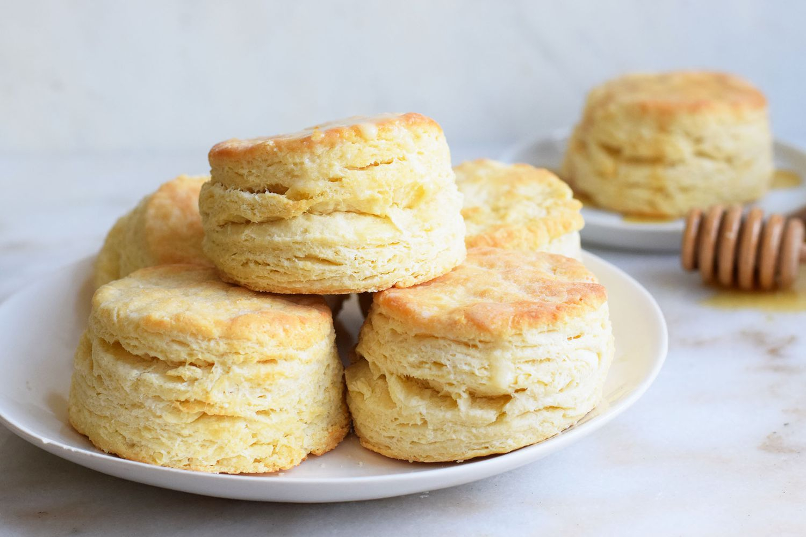

# Buttermilk Biscuits

*Southern buttermilk biscuits: cold butter pulsed into self-raising flour, brought together with cold buttermilk, folded to layer, cut and baked till tall and golden. Brush with melted butter the moment they come out.*

**Serves:** Makes about 8 biscuits

**Prep Time:** 15 minutes

**Cook Time:** 12 minutes

## Overview
The Southern biscuit is the bread that sits next to fried chicken, gets split for breakfast sandwiches and turns up under sausage gravy at every roadside diner. The trick is in three things: very cold butter, very cold buttermilk and a light hand. Pulsing diced butter into the dry mix in a food processor keeps it cold and means each fleck stays distinct in the dough; those flecks melt into steam pockets in the hot oven and lift the biscuit into tall layers. The dough gets a few gentle folds (not kneaded - kneaded means tough) before being cut. A blast at 230°C is what makes them rise rather than slump. The minute they come out, you brush the tops with melted butter so the crust shines.

## Ingredients
- 250 g plain flour, plus extra for dusting
- 2 tablespoons baking powder
- ¼ teaspoon bicarbonate of soda
- 1 teaspoon kosher salt
- 115 g very cold unsalted butter (diced)
- 240 ml cold buttermilk
- 1 tablespoon unsalted butter (melted, for brushing)

## Method

### Stage 1 - Prep
1. Preheat the oven to 230°C.
2. Have a baking sheet ready (no need to grease - the biscuits release on their own).

### Stage 2 - Cut the butter in
1. Sift the flour, baking powder, bicarbonate of soda and salt into the bowl of a food processor.
2. Add the cold diced butter.
3. Pulse just until the butter is the size of peas (don't process to crumbs - the chunks are the point).

### Stage 3 - Pour in the buttermilk
1. Pour the cold buttermilk into the processor.
2. Pulse just until the dough starts to come together. Don't over-process.

### Stage 4 - Fold and cut
1. Lightly dust the work surface with flour.
2. Tip the dough out; press it together with your hands into a rough disc about 1 cm thick.
3. Fold the dough over itself 5 times (this is what creates the layers; each fold makes the biscuit rise higher).
4. Press the dough out again into a 1 cm thick disc.
5. Using a 7.5 cm round cutter (or a clean tin can), stamp out as many biscuits as you can.
6. Press the scraps together gently; cut out as many more as possible.

### Stage 5 - Bake
1. Arrange the biscuits on the baking sheet, spaced just slightly apart.
2. Bake 10-13 minutes until golden brown and risen tall. Don't overbake.

### Stage 6 - Butter and serve
1. Lift onto a wire rack.
2. Brush the tops immediately with the melted butter.
3. Serve warm.

## Notes
- **Everything cold:** Butter, buttermilk, even the bowl if you can spare the freezer space. Cold fat is the difference between a biscuit and a hockey puck.
- **Pulse, don't process:** The butter should stay in pea-sized lumps. Process to crumbs and you've made a scone.
- **Fold, don't knead:** Kneading develops the gluten and the biscuit turns tough. Five gentle folds is all the structure they need.

## Storage
- Best fresh and warm.
- Room temperature in a paper bag: 1 day.
- Freezes 2 months baked; reheat from frozen in a 180°C oven for 8 minutes.
- Freezes 2 months unbaked (after cutting); bake from frozen, adding 3-4 minutes to the time.
