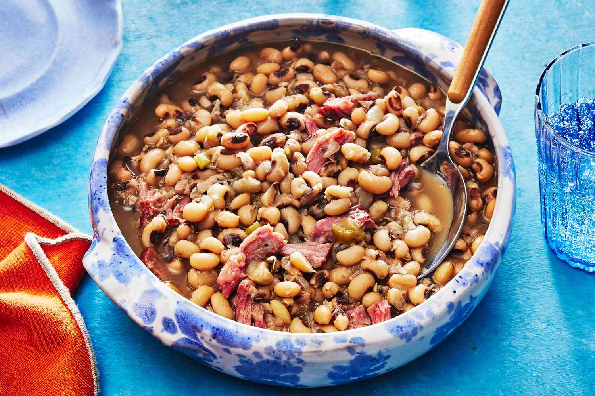

# Black-Eyed Peas

*The Southern good-luck bean. Slow-simmered with smoked ham hock, onion, garlic and a bay leaf until the broth turns silky and faintly smoky. Eaten on New Year's Day for luck, and on the Kwanzaa table as one of the ancestral African-diaspora dishes.*

**Serves:** 6 as a side

**Prep Time:** 10 minutes (plus overnight soaking)

**Cook Time:** 1 hour 30 minutes

## Overview
Dried black-eyed peas, soaked overnight, simmered low and slow with a smoked ham hock and aromatics. The hock seasons the broth and gives up its meat at the end of the cook. Finished with a splash of cider vinegar to brighten and a pinch of cayenne for warmth. Eaten in shallow bowls with the broth, often spooned over rice.

## Ingredients

- 400 g dried black-eyed peas
- 1 smoked ham hock (about 700 g; or 200 g smoked bacon lardons)
- 1 large onion (diced)
- 4 garlic cloves (crushed)
- 1 green pepper (diced)
- 1 celery stick (diced)
- 2 tablespoons olive oil (or 1 tablespoon bacon fat)
- 2 bay leaves
- 1 teaspoon smoked paprika
- ½ teaspoon dried thyme
- ¼ teaspoon cayenne (or to taste)
- 1.5 litres chicken stock (or water, if the hock is well-seasoned)
- 1 tablespoon cider vinegar
- Fine sea salt and black pepper

## Method

### Stage 1 - Soak
1. Tip the peas into a wide bowl, cover with cold water by 5 cm, and leave to soak overnight (or 8 hours). Drain.

### Stage 2 - Build the base
1. Warm the oil in a heavy pot or Dutch oven over a medium heat. Add the diced onion, green pepper and celery and cook for 6-8 minutes until soft and just starting to colour at the edges.
2. Add the garlic, smoked paprika, thyme and cayenne. Stir for 1 minute until the kitchen smells of toasted spice.

### Stage 3 - Slow simmer
1. Add the drained peas, ham hock, bay leaves and stock to the pot. The hock should be more or less submerged; top up with water if needed.
2. Bring to a gentle simmer and skim any grey foam from the surface.
3. Cover and cook on a low heat for 1 ½ hours, until the peas are tender and the broth has thickened slightly from the released starch. Check at 1 hour and 1 ¼ hours; pea-to-pea variation in age makes the cook time variable.

### Stage 4 - Finish
1. Lift the hock out onto a board. When cool enough to handle, pull the meat off the bone in shreds and return to the pot. Discard the bone, skin and any fatty bits you do not want.
2. Stir in the cider vinegar. Taste: the broth needs salt (the hock varies wildly in saltiness) and a good grind of black pepper. The cayenne should sit gently in the background; add a pinch more if you want more heat.

## Notes
- For a vegetarian version, skip the hock and use vegetable stock; brown a heaping tablespoon of smoked paprika in the oil at the start, add 1 tablespoon of soy sauce and ½ teaspoon of liquid smoke at the simmer, and finish with a knob of butter for richness.
- A small handful of chopped collard greens (or kale) stirred in during the last 15 minutes turns this into a one-pot meal.
- Some Southern cooks add a pinch of sugar to soften the cayenne; experiment with ¼ teaspoon if your peas are tasting sharp.

## Serving
In shallow bowls over hot rice (the dish becomes "Hoppin' John" once the rice is included). Hot sauce on the table. A skillet of cornbread for mopping up the broth.

## Storage
In the fridge for up to 4 days; in the freezer for up to 3 months. The dish improves overnight as the peas drink up more of the broth.
